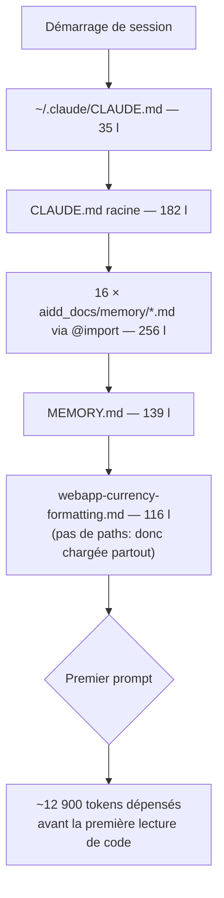

# Instruction: Baseline toujours injectée

Les fichiers touchés ici sont chargés **à chaque tour, avant toute lecture de code** : 728 lignes / ~12 900 tokens. Chaque correction rapporte sur toutes les sessions futures. C'est aussi la seule phase qui contient un item non négociable (données personnelles).

## Architecture projection

> Tree of the final files. ✅ create · ✏️ modify · ❌ delete

```txt
.
├── CLAUDE.md                                                    ✏️ 7 faits faux + 34 lignes de scaffolding legacy
├── .claude/rules/03-frameworks-and-libraries/
│   └── webapp-currency-formatting.md                            ✏️ frontmatter paths: + § Why faux
├── aidd_docs/memory/
│   ├── project-brief.md                                         ✏️ retirer la table Domain language (dupliquée)
│   ├── coding-assertions.md                                     ✏️ retirer le rappel pnpm quality (lefthook)
│   └── testing.md                                               ✏️ retirer la ligne bug-repro (dupliquée 3×)
└── ~/.claude/CLAUDE.md                                          ✏️ 1 contradiction avec le projet
```

Hors arbre, même phase :

```txt
~/.claude/projects/-Users-maximedesogus-workspace-perso--projets-pulpe-workspace/memory/
└── project_retention_diagnosis_2026_07.md                       ✏️ purge du roster nominatif
```

## User Journey



## Tasks to do

### `1)` Purger les données personnelles

> Aucun rapport avec la qualité du corpus. À faire en premier, quoi qu'il advienne du reste du plan.

1. Ouvrir `project_retention_diagnosis_2026_07.md`, ligne 22 et alentours.
2. Supprimer le roster nominatif : ~25 utilisateurs réels (noms, prénoms, handles email) et le mapping multi-comptes d'une personne.
3. Conserver les compteurs et ratios — toutes les conclusions du fichier reposent dessus, aucune sur un nom.
4. Vérifier qu'aucune autre mémoire ne contient de handle email d'utilisateur réel.

### `2)` Corriger les 7 faits faux du CLAUDE.md racine

> Chaque item est vérifié contre le repo ; ne pas re-dériver, appliquer.

1. Ligne 30 : `bun test path/to/file.test.ts` → `.spec.ts`. Le repo a 136 `*.spec.ts` contre 2 `*.test.ts` dans `backend-nest/src`.
2. Lignes 32-34 : `supabase start` / `supabase stop` → préfixer `cd backend-nest &&`. Il n'y a pas de projet Supabase à la racine ; depuis root la CLI cherche `supabase_db_pulpe-workspace`, qui n'existe pas.
3. Ligne 21 : la description de `pnpm quality` est fausse sur deux points — elle lance aussi `test:ci-security` et `test:public-surface`, et `pulpe-frontend#type-check` / `pulpe-shared#lint` / `pulpe-shared#type-check` résolvent `<NONEXISTENT>` dans le graphe turbo. Décrire la vraie portée et préciser « depuis la racine uniquement » : le script `quality` n'existe ni dans `frontend/` ni dans `shared/`.
4. Ligne 78 : `budget_lines` → `budget_line`. La table est au singulier ; le champ wire est `budgetLines`.
5. Ligne 81 : retirer « Épargne prévue » de la liste des labels webapp — 0 occurrence dans `frontend/projects/webapp/public/i18n/fr.json`. Le label n'existe qu'en iOS. Garder « Disponible à dépenser » et « Fréquence », tous deux vérifiés dans `fr.json`.
6. Ligne 71 : retirer le rappel `pnpm quality` avant commit — `lefthook.yml` le lance déjà en pre-commit. Garder **une** mention en section Commands, et y noter les deux limites réelles du hook : il scope par `--filter="...[HEAD^]"` et il est **skippé sur merge et rebase**.
7. Ligne 113 vs `ios/CLAUDE.md:36` : le seuil d'extraction reste 3+ côté racine. La correction du côté iOS est en phase 4.

### `3)` Retirer le scaffolding de vérification legacy

> La doc officielle Opus 5 le nomme explicitement : « remove them […] reduces wasted tokens with no loss in quality ».

1. Lignes 130-153, section « Workflow modification » : 24 lignes pour une règle déjà énoncée ligne 112 (« Reuse over create. Read 3+ existing files first »). Supprimer la section, garder la ligne 112.
2. Au passage disparaissent les artefacts qu'elle porte : le mojibake `CRITICAL RULE•- ALWAYS • FOLLOW• THIS`, `NON-NEGOTIABLE. Never skip.`, et la phrase cassée « imports you not 100% sure how to use ».
3. Lignes 57-66, section « Rules Files » : documente le format frontmatter des règles. Claude n'écrit jamais ce format et n'opère pas le mécanisme de chargement — c'est le harness. Supprimer.
4. Lignes 126-128, section « Bug Reporting » : doublon de Scope Discipline #4. Supprimer la section, garder #4.
5. **Ne pas toucher** à la section Scope Discipline : la doc Opus 5 recommande exactement cette contrainte (« Deliver what was asked, at the scope intended »), et Opus 5 élargit le périmètre plus que 4.8.

### `4)` Ajouter le plafond de délégation subagent

> Seul ajout du plan. Opus 5 délègue plus volontiers que 4.8 et rien dans le corpus ne le borne.

1. Une ligne dans Scope Discipline, dans l'esprit de la formulation officielle : déléguer seulement pour un travail large et réellement parallélisable ; jamais pour vérifier son propre travail ; un agent plutôt que plusieurs quand un seul suffit.

### `5)` Réparer `webapp-currency-formatting.md`

1. Frontmatter : remplacer `alwaysApply: false` (sans effet) par `paths: "frontend/**/*.{ts,html}"`. C'est la seule des 48 règles sans `paths:`, donc la seule chargée sur chaque édition backend, iOS et landing.
2. Ligne 110, § « Why » : l'affirmation « Angular's `CurrencyPipe` with `style: 'symbol'` […] already outputs `€ / CHF` correctement » est fausse. `shared/src/currency-format.ts:14-16` documente l'inverse : le pattern natif `de-CH` place le symbole en **préfixe**, et `getCurrencyFormatter` le concatène à la main pour l'avoir en suffixe. Réécrire le paragraphe sur cette base.

### `6)` Dégonfler les `@imports` de `aidd_docs/memory/`

> Les imports ne réduisent pas le contexte : ils sont chargés au lancement. 256 lignes payées à chaque tour.

1. `project-brief.md` : retirer la table « Domain language » — mêmes six mappings que la section Vocabulary du CLAUDE.md racine, tous deux toujours chargés.
2. `coding-assertions.md` : retirer la ligne `pnpm quality` avant commit (troisième copie, et lefthook l'applique).
3. `testing.md` : retirer la ligne « a bug fix starts with a failing reproduction » — troisième copie de Scope Discipline #4.
4. Ne pas toucher aux 6 fichiers jugés sains : `vcs.md`, `package.md`, `auth.md`, `integration.md`, `deployment.md`, `README.md` (ce dernier n'est pas dans le bloc `@import`, il ne coûte rien).

### `7)` Résoudre la contradiction global ↔ projet

1. `~/.claude/CLAUDE.md:21` dit « note it in one line and keep going » ; `CLAUDE.md:115` impose un bloc `### Follow-up suggestions` en fin de réponse. Deux formats pour la même situation, tous deux chargés. Aligner sur le format projet et retirer la règle du global — le global doit rester sans détail projet.

### `8)` Réparer le gate plutôt que le documenter

> Ajouté en cours d'exécution. Un gate cassé se corrige ; l'écrire dans `CLAUDE.md` ne fait que payer le défaut à chaque tour.

1. `frontend/package.json` expose `typecheck: "tsc --noEmit"`. Or `frontend/tsconfig.json` est un tsconfig *solution-style* (`files: []` + `references`) : sans `-b`, `tsc` ne compile **aucun fichier**. Le script passe au vert sur un `const x: number = "s"` planté dans le source applicatif. Il ment, et `frontend/README.md` le présente comme « Vérification des types ».
2. Renommer en `type-check` (le nom que `turbo.json` attend dans le `dependsOn` de `quality`) et le faire pointer sur `tsc -b --noEmit`. Le nœud `pulpe-frontend#type-check` cesse d'être `NONEXISTENT` dans le graphe turbo.
3. Répercuter le nom dans `frontend/README.md`.
4. **Ne pas** ajouter `ng build` au gate : les templates (`strictTemplates`) ne sont vérifiés que par le compilateur Angular, et le job CI `🏗️ Build all projects` le fait déjà. Les mettre dans le pre-commit coûterait un build complet par commit pour un trou déjà couvert. Le noter dans `CLAUDE.md` en une ligne, ça oui.
5. Ne rien conclure sur `pulpe-shared#type-check -> NONEXISTENT` : `shared` est type-check par son propre `build` (`tsc -p tsconfig.esm.json`), qui tourne en `^build`. Et `shared` n'a pas de config eslint, donc `lint -> NONEXISTENT` est correct, pas un trou.

## Test acceptance criteria

| Task | Acceptance criteria                                                                                                                                                     |
| ---- | ------------------------------------------------------------------------------------------------------------------------------------------------------------------------- |
| 1    | Aucun nom, prénom ou handle email d'utilisateur réel dans `memory/*.md` ; les conclusions du fichier restent lisibles sans eux                                            |
| 2    | Les 7 items sont corrigés ; chaque commande du bloc Commands s'exécute sans erreur depuis le répertoire indiqué ; `budget_lines` n'apparaît plus dans le fichier          |
| 3    | Les sections « Workflow modification », « Rules Files » et « Bug Reporting » ont disparu ; Scope Discipline est intacte ; `CLAUDE.md` racine ≤ 150 lignes                 |
| 4    | Scope Discipline porte une règle de délégation subagent en une ligne                                                                                                     |
| 5    | `webapp-currency-formatting.md` a un `paths:` ; une session ouverte sur un fichier `.swift` ne charge plus cette règle (`/context`) ; le § Why décrit le mécanisme réel   |
| 6    | Les 3 fichiers `aidd_docs/memory/` sont allégés ; aucun n'énonce une règle déjà présente dans le `CLAUDE.md` racine                                                       |
| 7    | Un seul format de remontée hors-scope existe dans le corpus                                                                                                              |
| 8    | `pnpm --filter pulpe-frontend run type-check` échoue sur une erreur de type injectée dans le source applicatif ; `turbo quality --dry` ne montre plus `pulpe-frontend#type-check -> NONEXISTENT` ; `pnpm quality` sort en 0 |
| —    | Baseline totale (global + racine + `@imports` + `MEMORY.md`) à **564 lignes**, contre 728 au départ. Le passage sous 400 est porté par la phase 5 (`MEMORY.md`, 139 l) et non par cette phase, qui protège les 13 `@imports` jugés sains |
