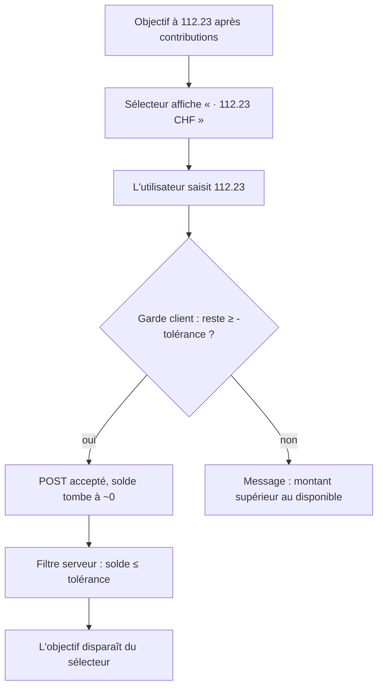

# Instruction: Le reliquat cesse de piéger le retrait

Observé en QA : le serveur annonce `availableAmount: 112.22999999999999`, l'écran l'affiche
`112 CHF`, l'aperçu promet « → 0 CHF », le retrait de 112 laisse `0.22999999999998977` sur
l'objectif. L'objectif réapparaît alors dans le sélecteur, étiqueté « 0 CHF », toujours
sélectionnable, et refuse tout montant significatif. Le reliquat exact n'est affiché nulle part :
l'utilisateur ne peut pas vider son objectif sans le deviner.

Une seule cause de fond : le sélecteur formate un plafond actionnable avec les décimales d'un
agrégat. La garde côté client est correcte (elle compare la valeur brute, dans la même bande que le
serveur) — c'est l'affichage qui ment. S'y ajoute un piège permanent distinct : le filtre serveur des
objectifs retirables teste `> 0` et laisse donc passer un solde résiduel qu'aucun client ne pourra
jamais retirer.

## Architecture projection

```txt
backend-nest/src/modules/savings-goal/application/
├── get-savings-goal-withdrawal-options.use-case.ts       ✏️ filtre sur la tolérance partagée
└── get-savings-goal-withdrawal-options.use-case.spec.ts  ✏️ cas reliquat sous la tolérance

frontend/projects/webapp/src/app/pattern/savings-goal-picker/
├── savings-goal-picker-field.ts                          ✏️ 3 digitsInfo → '1.0-2'
└── savings-goal-picker-field.spec.ts                     ✏️ assertion sur le texte rendu

ios/Pulpe/Shared/Components/
└── SavingsGoalPickerField.swift                          ✏️ 3 sites → asCurrency
```

## User Journey



## Tasks to do

### `1)` Fermer le piège permanent côté serveur

> Un solde qu'on ne peut plus retirer ne doit plus être proposé.

1. Dans `get-savings-goal-withdrawal-options.use-case.ts`, remplacer `option.availableAmount > 0` par
   une comparaison à `WITHDRAWAL_BALANCE_TOLERANCE` importée de `pulpe-shared`.
2. Ne pas toucher au contrat : `availableAmount` reste `z.coerce.number().positive()`, la borne plus
   haute le satisfait toujours.
3. Ajouter au spec un cas de solde résiduel sous la tolérance, absent de la liste retournée.

### `2)` Dire la vérité sur le plafond retirable

> Trois `digitsInfo` sur le même écran, une seule décision.

1. Dans `savings-goal-picker-field.ts`, passer les trois rendus à `'1.0-2'` : l'étiquette d'option, le
   solde courant de l'aperçu, et le reste après retrait.
2. `'1.0-2'` et non `'1.2-2'` : un solde rond doit rester `5 500 CHF`, seul un reliquat fait
   apparaître les centimes. La règle monétaire du projet prévoit déjà cette forme adaptative pour un
   écho de saisie.
3. Ne rien changer à la garde `hasInsufficientBalance` : elle compare déjà la valeur brute.

### `3)` Refléter le changement sur iOS

> Web et iOS affichent le même plafond, sinon les deux apps donnent deux montants.

1. Dans `SavingsGoalPickerField.swift`, remplacer `asCompactCurrency` par `asCurrency` sur les trois
   sites du menu et de l'aperçu.
2. Vérifier qu'aucun autre appelant de ces vues n'attend la forme compacte.

### `4)` Verrouiller par des tests

> Les specs existants n'assertent que des booléens : c'est pour ça que personne n'a vu l'arrondi.

1. Côté webapp, dans le `describe('withdrawal balance')` existant, asserter le TEXTE rendu de
   l'aperçu pour un solde à `112.22999999999999` retiré de `112` : il contient `0.23`, pas `0`.
2. Côté backend, le cas ajouté en tâche 1.
3. Côté iOS, aligner le test jumeau s'il asserte un format.

## Test acceptance criteria

| Task | Acceptance criteria                                                                                                                     |
| ---- | ----------------------------------------------------------------------------------------------------------------------------------------- |
| 1    | Un objectif dont le solde confirmé est un résidu flottant sous la tolérance n'apparaît plus dans `GET /savings-goals/withdrawal-options`. |
| 2    | Un solde de `112.22999999999999` s'affiche `112.23 CHF` ; un solde de `5500` s'affiche toujours `5 500 CHF` sans décimales.               |
| 3    | Le sélecteur iOS affiche le même montant que le webapp pour le même solde.                                                                |
| 4    | Les tests passent, et remettre `'1.0-0'` sur l'aperçu fait échouer le nouveau test webapp.                                                |
