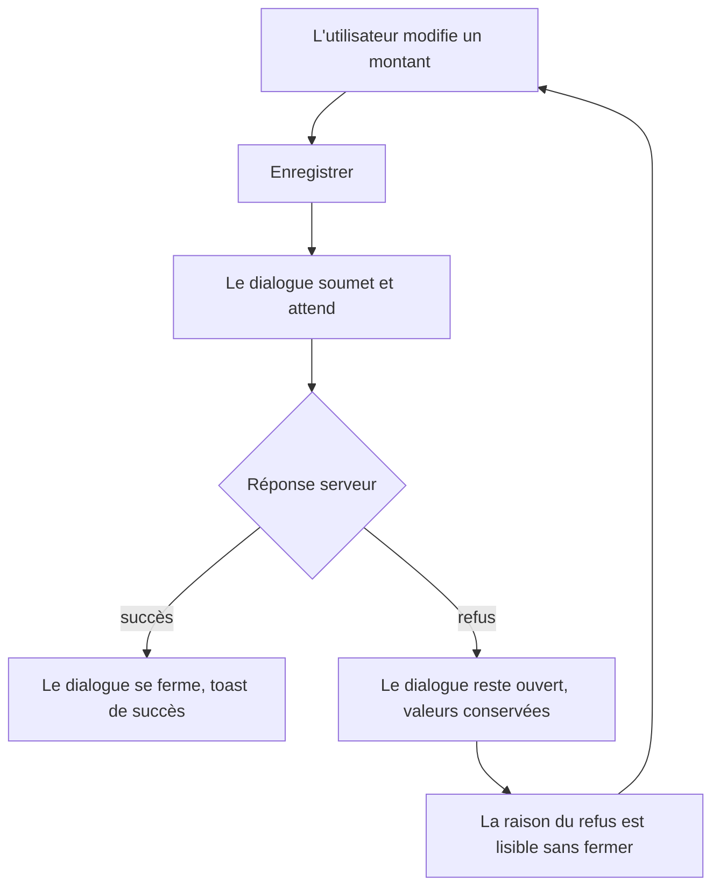

# Instruction: Un refus serveur ne coûte plus la saisie

Observé en QA : une édition de transaction refusée par le serveur (422
`ERR_SAVINGS_GOAL_WITHDRAWAL_INSUFFICIENT_BALANCE`) ferme le dialogue et efface ce que
l'utilisateur venait de taper. Il ne reste qu'un toast, devant un formulaire disparu, et tout est à
ressaisir.

Ce n'est pas un oubli de garde : la fermeture est structurellement la condition d'envoi. Le dialogue
se ferme en portant le DTO, l'appelant récupère ce DTO via `afterClosed()`, et c'est seulement là
qu'il lance la mutation. Le correctif consiste donc à inverser cet ordre — le dialogue soumet
lui-même et ne se ferme que sur succès.

Le commit `a40c29d3f` déjà sur la branche améliore le message du toast ; il ne touche ni le dialogue
ni le moment de la fermeture. Il ne couvre pas ce défaut.

## Architecture projection

```txt
frontend/projects/webapp/src/app/feature/budget/budget-details/
├── budget-details-dialog.service.ts                       ✏️ le service porte la soumission
├── budget-details-dialog.service.spec.ts                  ✏️ câblage de la soumission
├── components/
│   ├── edit-transaction-form/
│   │   └── edit-transaction-dialog.ts                     ✏️ attend la réponse, ferme sur succès
│   ├── budget-items-container.ts                          ✏️ fournit la soumission, garde le toast
│   └── budget-items-container.spec.ts                     ✏️ régression sur 422
└── budget-details-page.ts                                 ✏️ même câblage pour le lien profond
```

## User Journey



## Tasks to do

### `1)` Faire porter la soumission par la couche dialogue

> Les deux points d'entrée passent par ce service : le corriger là les couvre tous les deux.

1. Dans `budget-details-dialog.service.ts`, ajouter à l'ouverture du dialogue d'édition une fonction
   de soumission qui rend l'erreur localisée ou `null` — c'est déjà exactement ce que renvoie
   `updateTransaction` du store.
2. La transmettre dans les données du dialogue ; ne pas y décider de la navigation ni des toasts,
   cela reste à l'appelant.

### `2)` Ne fermer que sur succès

> Le dialogue devient responsable de son propre sort.

1. Dans `edit-transaction-dialog.ts`, attendre la soumission ; ne fermer qu'en l'absence d'erreur.
2. En cas de refus, garder le formulaire ouvert avec les valeurs saisies et rendre la raison lisible.
3. Vérifier que l'état d'envoi du formulaire est bien relâché, sinon les champs restent gelés.

### `3)` Recâbler les deux appelants

> Aucun appelant ne doit plus lancer la mutation après la fermeture.

1. Dans `budget-items-container.ts`, fournir la soumission et ne garder après fermeture que le
   retour de succès.
2. Faire de même dans `budget-details-page.ts` pour le lien profond `?transactionId=`.
3. La restauration optimiste du store reste inchangée : elle fait déjà son travail sur échec.

### `4)` Verrouiller par un test

> Le test doit prouver que le dialogue survit au refus.

1. Dans le spec du conteneur, répondre 422 avec le code d'insuffisance de solde et asserter que le
   dialogue n'a pas été fermé.
2. Compléter le spec du service dialogue pour le nouveau câblage.

## Test acceptance criteria

| Task | Acceptance criteria                                                                                                     |
| ---- | ------------------------------------------------------------------------------------------------------------------------- |
| 1    | Les deux points d'entrée ouvrent le dialogue par le même service, sans dupliquer la logique de soumission.                |
| 2    | Sur un refus serveur, le dialogue reste ouvert et les valeurs saisies sont toujours présentes dans les champs.             |
| 3    | Sur un succès, le dialogue se ferme et le toast de succès s'affiche — comportement inchangé pour l'utilisateur.            |
| 4    | Les tests passent, et refermer le dialogue avant la réponse fait échouer le nouveau test.                                  |
