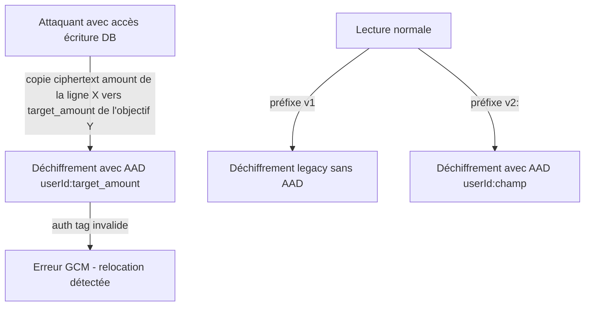

# Instruction: Format ciphertext v2 avec AAD

## Architecture projection

```txt
backend-nest/src/modules/encryption/
├── domain/
│   └── encryption-field.ts                         ✅ union type des champs sémantiques ('amount' | 'target_amount' | ...)
├── infrastructure/crypto/
│   ├── aes-gcm.crypto-service.ts                   ✏️ format v2 `v2:` + AAD, déchiffrement rétrocompatible v1
│   └── aes-gcm.crypto-service.spec.ts              ✏️ tests v2, legacy v1, anti-relocation
└── infrastructure/persistence/
    └── supabase-encryption-key.repository.ts       ✏️ contexte champ sur wrap/unwrap DEK
backend-nest/src/modules/
├── budget/infrastructure/persistence/supabase-budget.repository.ts                ✏️ passer le champ au déchiffrement
├── budget-line/.../supabase-budget-line.repository.ts                             ✏️ idem
├── transaction/.../supabase-transaction.repository.ts                             ✏️ idem
├── budget-template/.../supabase-budget-template.repository.ts                     ✏️ idem
├── savings-goal/.../supabase-savings-goal.repository.ts                           ✏️ idem
└── tag/.../supabase-tag.repository.ts                                             ✏️ idem (agrégats)
docs/
└── ENCRYPTION.md                                                                   ✏️ documenter le format v2 et l'AAD
```

## User Journey



## Contexte technique (lu avant de coder)

- Implémentation actuelle : `aes-gcm.crypto-service.ts:77-117` (encrypt/decrypt, format `base64(IV‖tag‖ct)`), wrap/unwrap DEK `:331-364`, rekey `:976-1047`, fallback `tryDecryptAmount :119-147`.
- L'AAD est `{userId}:{champ sémantique}` — **pas** la table ni l'id de ligne : les RPC SQL propagent les ciphertexts `amount` de `template_line` vers `budget_line` (même utilisateur, même champ) ; une liaison à la table casserait ce flux (décision plan).
- Les points d'appel de déchiffrement sont dans les repositories listés ci-dessus — chacun connaît son champ (`amount`, `original_amount`, `target_amount`, `ending_balance`, `initial_amount`).
- Règle repo : montants toujours via `ENCRYPTION_PORT` ; crypto **serveur uniquement** (iOS/web ne font que dériver la clientKey PBKDF2 — inchangé, pas de mirror TS↔Swift requis).
- ~200 LOC + tests : sous le seuil des 300 LOC mais rester minimal — pas de migration batch, pas de refactor adjacent.

## Tasks to do

### `1)` Définir les champs sémantiques et le format v2

> Un ciphertext v2 est lié à son propriétaire et à son rôle, détectable à la relocation.

1. Créer `encryption-field.ts` (domain) : union `'amount' | 'original_amount' | 'target_amount' | 'original_target_amount' | 'initial_amount' | 'ending_balance'` et type `EncryptionField`.
2. Dans `aes-gcm.crypto-service.ts` : préfixe `v2:` ; `encryptAmount(plain, dek, userId, field)` → `v2:` + base64(IV‖tag‖ct) avec `cipher.setAAD(Buffer.from(`${userId}:${field}`))`.
3. `decryptAmount` : détecte le préfixe — `v2:` exige `userId`+`field` (AAD), sinon déchiffrement legacy v1 (comportement actuel inchangé).
4. Propager le même versionnement à `wrapDek`/`unwrapDek` (AAD `{userId}:wrapped_dek`) et `generateKeyCheck` reste inchangé (canary indépendant).
5. `tryDecryptAmount` : signature étendue avec `userId`+`field`, fallback-0 conservé.

### `2)` Propager le contexte champ dans les repositories

> Chaque appel encrypt/decrypt connaît le champ qu'il manipule.

1. Mettre à jour les signatures du port `ENCRYPTION_PORT` (domain) puis les 6 repositories : chaque appel `encryptAmount`/`decryptAmount`/`tryDecryptAmount` reçoit le champ correspondant à la colonne lue/écrite.
2. Chemins d'écriture : toujours v2. Chemins de lecture : v1 ou v2 selon le préfixe stocké.
3. Rekey (`#buildRekeyPayloads` + `reEncryptAllUserData`) : déchiffre v1/v2 avec l'ancienne DEK et son AAD, ré-écrit en v2 avec la nouvelle DEK.

### `3)` Tests de non-régression et anti-relocation

> Reproduire l'attaque de l'audit, prouver qu'elle échoue en v2.

1. Roundtrip v2 pour chaque champ.
2. Legacy : un ciphertext v1 (fixture générée avec l'ancien format) se déchiffre toujours.
3. Anti-relocation champ : ciphertext `amount` déchiffré comme `target_amount` (même userId) → erreur GCM.
4. Anti-relocation utilisateur : ciphertext de l'utilisateur A déchiffré avec l'userId de B → erreur GCM.
5. Rekey : données mixtes v1+v2 re-chiffrées, toutes lisibles après.

### `4)` Documenter le format v2

1. `docs/ENCRYPTION.md` : section format — v1 legacy, v2 avec AAD `{userId}:{field}`, justification de la granularité (propagation template→budget), politique de migration paresseuse.

## Test acceptance criteria

| Task | Acceptance criteria                                                                                                        |
| ---- | ------------------------------------------------------------------------------------------------------------------------- |
| 1    | Tout nouvel ciphertext écrit commence par `v2:` ; un ciphertext v1 existant reste déchiffrable sans erreur                  |
| 2    | Les 6 repositories compilent et passent leurs tests avec le champ explicite                                                |
| 3    | Permuter un ciphertext `amount` vers une colonne `target_amount` du même utilisateur → échec de déchiffrement (tag GCM) ; l'inverse v1 → v2 au rekey conserve les montants |
| 3    | `bun test` backend vert, dont les scénarios change-pin/recover de `encryption.e2e.spec.ts`                                  |
| 4    | `ENCRYPTION.md` décrit v1/v2 et l'AAD sans contradiction avec le code                                                       |
