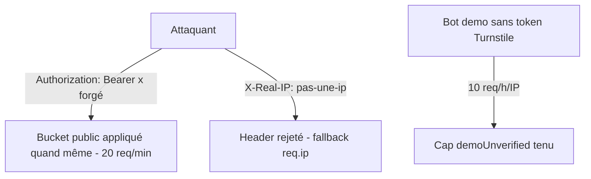

# Instruction: Durcissement throttler et flux démo

## Architecture projection

```txt
backend-nest/src/
├── app.module.ts                              ✏️ retirer le skipIf Bearer non validé du bucket `public`
├── config/throttler.config.ts                 ✏️ ajustements éventuels + spec
└── common/guards/
    ├── user-throttler.guard.ts                ✏️ validation stricte du format de X-Real-IP
    ├── dev-only.guard.ts                      ✏️ aligner sur isProductionLike (NODE_ENV + RAILWAY_ENVIRONMENT_NAME)
    └── user-throttler.guard.spec.ts           ✏️ cas Bearer forgé, IP malformée
```

## User Journey



## Contexte technique (lu avant de coder)

- Fail-open Turnstile **conservé** : `turnstile.service.ts:57-66` interdit explicitement le fail-closed (Safari/iOS). Cette phase durcit uniquement les contrôles compensatoires.
- `app.module.ts:276-282` : le bucket `public` est sauté dès qu'un header `Bearer ` existe, sans validation — tout client forgé passe de 20 à 200 req/min.
- `user-throttler.guard.ts:192-213` : `X-Real-IP` est délibérément préféré à XFF (Railway l'écrase toujours) — on garde ce modèle, on ajoute seulement une validation de format.
- `dev-only.guard.ts:30-32` teste seul `NODE_ENV`, contrairement à `isProductionLike()` (`config/environment.ts:96-104`).
- Throttler en mémoire : risque résiduel accepté (single replica Railway) — documenté en commentaire, pas de storage externe.

## Tasks to do

### `1)` Fermer le contournement Bearer du bucket public

> Un header Bearer invalide ne doit pas sortir la requête du bucket 20 req/min.

1. Dans `app.module.ts`, retirer le `skipIf` basé sur la seule présence de `Bearer ` : le `UserThrottlerGuard` résout déjà l'utilisateur et bascule sur `user:{id}` quand le token est valide (`getTracker`) — le bucket `public` doit s'appliquer dès que la résolution échoue, sans raccourci au niveau config.
2. Vérifier que `GET /api/v1/app/version` (endpoint public intentionnel) reste fonctionnel et throttlé.
3. Mettre à jour `config/throttler.config.ts` et sa spec si le skip y est référencé.

### `2)` Valider le format de `X-Real-IP`

> Une valeur malformée ne doit pas devenir une clé de bucket jetable.

1. Dans `#getClientIpTracker` : n'accepter le header que s'il matche une IP v4/v6 valide, sinon fallback `super.getTracker(req)`.
2. Conserver le commentaire expliquant le choix `X-Real-IP` vs XFF, complété par la justification de la validation.

### `3)` Aligner `DevOnlyGuard` sur `isProductionLike`

> Un environnement Railway `preview` avec `NODE_ENV=development` ne doit pas exposer `POST /demo/cleanup`.

1. Réutiliser `isProductionLike(nodeEnv, railwayEnvironmentName)` dans `dev-only.guard.ts` au lieu du test sur `NODE_ENV` seul (injection `ConfigService`, pattern des autres guards).
2. Test : `NODE_ENV=development` + `RAILWAY_ENVIRONMENT_NAME=preview` → guard refuse.

## Test acceptance criteria

| Task | Acceptance criteria                                                                                                   |
| ---- | --------------------------------------------------------------------------------------------------------------------- |
| 1    | Une requête avec `Authorization: Bearer garbage` vers un endpoint public consomme le bucket `public` (429 après 20 req/min) ; un token valide consomme le bucket utilisateur |
| 2    | `X-Real-IP: not-an-ip` est ignoré (clé = IP socket) ; `X-Real-IP: 203.0.113.7` est utilisé comme clé                   |
| 3    | `POST /demo/cleanup` retourne 403 dès que l'environnement est production-like, quelle que soit la valeur de `NODE_ENV` |
| —    | `bun test` backend vert                                                                                                |
