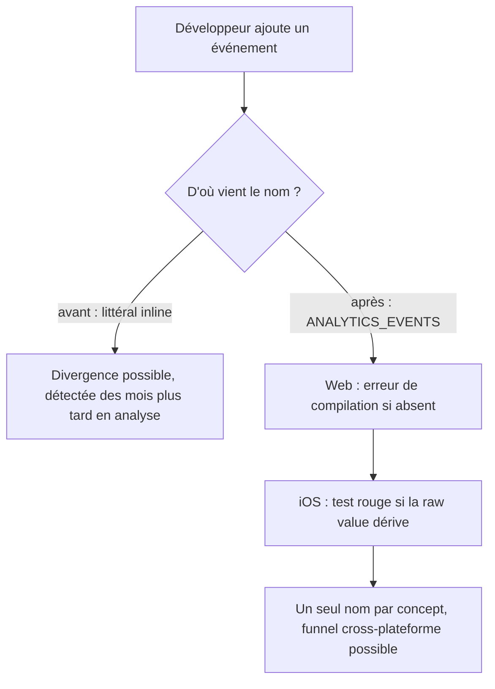

# Instruction: Source unique et noms unifiés

## Architecture projection

```txt
.
├── shared/src/
│   └── feature-flags.ts                                    ✏️ ANALYTICS_EVENTS étendu à toute la taxonomie
├── frontend/projects/webapp/src/app/
│   ├── core/analytics/
│   │   ├── posthog.ts                                      ✏️ captureEvent typé AnalyticsEventName
│   │   └── analytics.ts                                    ✏️ même signature, façade
│   └── feature/
│       ├── welcome/welcome-page.ts                         ✏️ littéraux → constante
│       ├── auth/signup/signup.ts                           ✏️ idem
│       ├── auth/enter-vault-code/enter-vault-code.ts       ✏️ idem
│       ├── auth/setup-vault-code/setup-vault-code.ts       ✏️ idem
│       └── complete-profile/complete-profile-page.ts       ✏️ idem + passage à onboarding_step_completed
├── ios/Pulpe/Core/Analytics/
│   └── AnalyticsEvent.swift                                ✏️ raw values alignées
├── ios/PulpeTests/Core/Analytics/
│   └── AnalyticsEventNamingTests.swift                     ✅ verrouille les raw values
└── .claude/rules/05-workflows-and-processes/
    └── posthog-events.md                                   ✏️ catalogue mis à jour
```

## User Journey



## Tasks to do

### `1)` Trancher les quatre concepts divergents

> Un concept, un nom. Trois arbitrages sur quatre sont déjà tranchés par les preuves ci-dessous ; seul le premier demande un choix.

1. Écran d'accueil vu — `welcome_screen_viewed` (iOS) contre `welcome_page_viewed` (web). Seul arbitrage réellement ouvert : « screen » et « page » sont tous deux justes sur leur plateforme. Retenir un terme neutre, `welcome_viewed`, plutôt que d'imposer le vocabulaire d'une plateforme à l'autre.
2. Code PIN saisi et créé — **iOS a raison, le web s'aligne** sur `pin_entered` / `pin_setup_completed`. Les deux interfaces disent « code PIN » à l'utilisateur, et `docs/ENCRYPTION.md` emploie « PIN » 40 fois contre 7 « vault ». Le `vault_code_*` web ne survit que dans les noms de fichiers et de routes, jamais à l'écran.
3. Étape d'onboarding — le web abandonne `profile_step1_completed` / `profile_step2_completed` / `profile_step2_skipped` au profit de `onboarding_step_completed { step }`, la forme iOS. Une propriété, pas un événement par variante. L'insight `t8swMkM8` exploite déjà cette forme.
4. Consigner chaque arbitrage et son perdant : la liste des noms abandonnés sert d'entrée à la phase 2.

### `2)` Étendre la source unique

> `ANALYTICS_EVENTS` se déclare déjà source de vérité cross-plateforme pour deux événements. L'honorer.

1. Ajouter à `ANALYTICS_EVENTS` tous les événements produit des deux plateformes, sous les noms tranchés en tâche 1.
2. Garder le commentaire par clé qui dit quand l'événement part et quelles propriétés il porte, comme les deux entrées existantes.
3. Ne pas y mettre les événements auto-captés PostHog (`$pageview`, `$autocapture`) : ils ne sont pas émis par le code applicatif.

### `3)` Rendre la divergence impossible côté web

> Le typage remplace la discipline.

1. Typer le paramètre `event` de `captureEvent` sur `AnalyticsEventName`, dans `posthog.ts` et dans la façade `analytics.ts`.
2. Remplacer les littéraux des 6 fichiers appelants par la constante importée.
3. Le compilateur signale les restants — la liste des erreurs est la liste du travail.

### `4)` Aligner iOS et verrouiller

> Aucun lien compilé n'existe entre le TypeScript et le Swift ; un test tient lieu de garde-fou.

1. Aligner les raw values de `AnalyticsEvent` sur les noms tranchés.
2. Ajouter un test qui assert les raw values attendues, une par cas — il rougit si quelqu'un renomme d'un seul côté.
3. Mettre à jour le catalogue `posthog-events.md` : tables iOS et Web, et la mention des noms abandonnés.

## Test acceptance criteria

| Task | Acceptance criteria                                                                                                        |
| ---- | ---------------------------------------------------------------------------------------------------------------------------- |
| 1    | Chaque concept divergent a un nom unique retenu et son perdant listé, prêt à être masqué en phase 2.                          |
| 2    | Tout événement produit émis par l'une ou l'autre plateforme figure dans `ANALYTICS_EVENTS` avec son commentaire d'usage.       |
| 3    | Écrire `captureEvent('typo_event')` dans un composant web fait échouer le build.                                              |
| 3    | Plus aucun littéral d'événement dans `frontend/projects/webapp/src`, hors auto-capture PostHog.                               |
| 4    | Renommer une raw value de `AnalyticsEvent` sans toucher au partagé fait échouer la suite iOS.                                 |
| 4    | Le catalogue décrit la taxonomie effectivement émise — aucun événement documenté qui n'existe pas, aucun émis non documenté.  |
