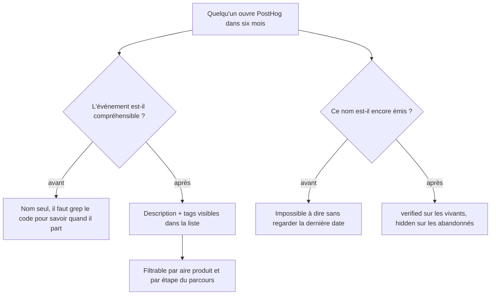

# Instruction: Documentation PostHog

## Architecture projection

> Aucun fichier du dépôt n'est touché. La phase agit sur les métadonnées PostHog via le MCP.

```txt
.
└── (aucun fichier modifié — Data Management PostHog, projet 87621)
```

## User Journey



## Tasks to do

### `1)` Décrire chaque événement vivant

> Un nom sans description est une devinette pour celui qui lira le dashboard plus tard.

1. Pour chaque événement retenu en phase 1, écrire une description qui dit **quand** il part, pas ce qu'il signifie en théorie.
2. Reprendre les commentaires déjà écrits dans `ANALYTICS_EVENTS` : ils sont la source, PostHog en est le reflet.
3. Marquer `verified` ceux dont l'émission a été constatée dans les données.

### `2)` Taguer par aire produit et par étape du parcours

> Le tag est ce qui rend une taxonomie de plusieurs dizaines d'événements navigable.

1. Poser un tag d'aire produit : onboarding, budget, transaction, épargne, authentification, réglages.
2. Poser un tag d'étape de parcours : acquisition, activation, rétention.
3. Garder les deux axes indépendants — un événement porte un tag de chaque, pas une taxonomie hiérarchique inventée.

### `3)` Masquer les noms abandonnés et préserver la continuité

> Un renommage sans filet coupe l'historique à la date du déploiement.

1. Marquer `hidden` chaque nom perdant listé en phase 1 : il disparaît de l'UI, les données restent.
2. Créer **une** Action, celle de l'écran d'accueil, unissant `welcome_page_viewed` et `welcome_screen_viewed` au nom retenu. C'est le seul concept renommé dont un insight dépende.
3. Repointer les deux funnels concernés sur cette Action : `llNtbtMN` (Funnel Web, 1ʳᵉ étape) et `hy17GAOj` (Funnel iOS, 2ᵉ étape).
4. Les autres perdants — `pin_*`, `profile_step1_completed`, `profile_step2_completed`, `profile_step2_skipped` — n'alimentent aucun insight sauvegardé : `hidden` suffit, pas d'Action.
5. Une fois les deux funnels sur le même nom d'étape, vérifier s'ils ne doivent pas fusionner en un seul insight segmenté par `$lib`.

## Test acceptance criteria

| Task | Acceptance criteria                                                                                             |
| ---- | ----------------------------------------------------------------------------------------------------------------- |
| 1    | Chaque événement de la taxonomie porte une description qui énonce sa condition de déclenchement.                   |
| 2    | La liste des événements PostHog est filtrable par aire produit et par étape de parcours, sans recours au code.     |
| 3    | Les noms abandonnés n'apparaissent plus dans les sélecteurs d'événements, et leurs données historiques restent interrogeables. |
| 3    | `llNtbtMN` et `hy17GAOj` traversent la date du renommage sans rupture sur leur étape d'accueil.                   |
