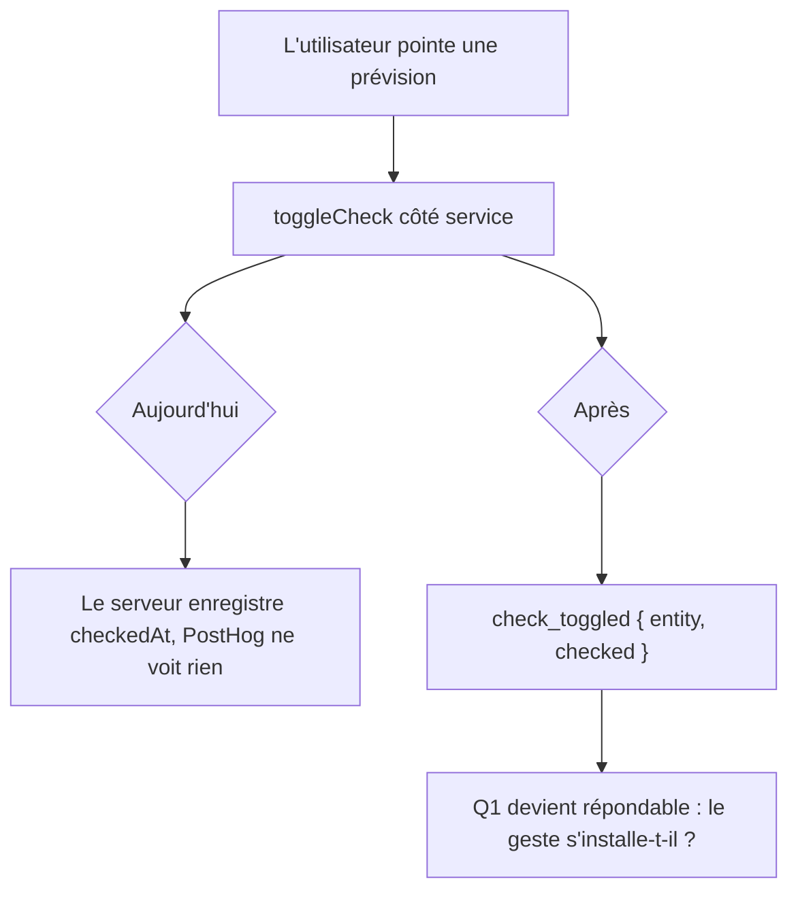

# Instruction: Instrumenter le geste et le cycle

## Architecture projection

```txt
.
├── shared/src/
│   └── feature-flags.ts                                       ✏️ check_toggled + budget_created dans ANALYTICS_EVENTS
├── frontend/projects/webapp/src/app/
│   ├── core/
│   │   ├── budget/budget-api.ts                               ✏️ toggle ligne (l.349) + pointage groupé (l.357)
│   │   └── transaction/transaction-api.ts                     ✏️ toggle transaction (l.65)
│   └── feature/budget/budget-list/create-budget/services/
│       └── template-store.ts                                  ✏️ budget_created, absent du web
├── ios/Pulpe/
│   ├── Core/Analytics/AnalyticsEvent.swift                    ✏️ case checkToggled
│   └── Domain/Services/
│       ├── BudgetLineService.swift                            ✏️ toggleCheck (l.106)
│       └── TransactionService.swift                           ✏️ toggleCheck (l.73)
└── .claude/rules/05-workflows-and-processes/
    └── posthog-events.md                                      ✏️ catalogue
```

## User Journey



## Tasks to do

### `1)` Émettre depuis la couche service, jamais depuis les écrans

> Huit sites déclenchent le pointage, quatre fonctions les portent toutes. Instrumenter les écrans, c'est signer pour un oubli au prochain écran qui pointe.

1. Côté web, poser la capture dans le `tap` de succès de `toggleBudgetLineCheck$` (`budget-api.ts:349`) et de `toggleCheck$` (`transaction-api.ts:65`). Le second couvre à lui seul le tableau de bord et le détail de budget, puisque `budget-api.ts:384` le délègue.
2. Côté iOS, poser la capture au retour de `BudgetLineService.toggleCheck` (l.106) et de `TransactionService.toggleCheck` (l.73).
3. Lire l'état depuis la réponse, jamais depuis l'intention : `checked` vaut `checkedAt != null` sur l'entité renvoyée. C'est ce qui distingue un pointage d'un dépointage sans ajouter d'événement.
4. N'émettre qu'en cas de succès. Un pointage refusé n'est pas un geste accompli.

### `2)` Traiter le pointage groupé de façon symétrique

> Sans ça, iOS compte N pointages là où le web en compte zéro, et toute comparaison entre plateformes devient fausse.

1. Sur iOS, `BudgetDetailsCoordinator.swift:301` boucle sur `transactionService.toggleCheck` : la tâche 1 lui donne déjà un événement par transaction, rien à ajouter.
2. Sur le web, `checkBudgetLineTransactions$` (`budget-api.ts:357`) est un appel unique qui renvoie la liste : émettre un événement par transaction de la réponse, pour retomber sur le même compte qu'iOS.
3. Vérifier après coup sur un même scénario que les deux plateformes produisent le même nombre d'événements.

### `3)` Combler `budget_created` sur le web

> iOS émet cet événement, le web ne l'émet pas. Le zéro observé n'est pas un usage nul, c'est un angle mort — et c'est l'acte qui ouvre un nouveau cycle mensuel, donc le pivot de Q2.

1. Émettre `budget_created` au succès de la création dans `template-store.ts:166`.
2. Garder `first_budget_created` intact : il marque l'activation, pas le cycle. Les deux coexistent, comme sur iOS.

### `4)` Nommer depuis la source partagée

> `ANALYTICS_EVENTS` se déclare source de vérité cross-plateforme. Un événement ajouté ailleurs recrée la divergence que l'autre plan est en train de supprimer.

1. Déclarer `check_toggled` dans `ANALYTICS_EVENTS`, avec le commentaire d'usage qui dit quand il part et quelles propriétés il porte.
2. Ajouter le cas correspondant à `AnalyticsEvent` côté iOS, raw value identique.
3. Étendre le catalogue `posthog-events.md`.
4. Aucune propriété ne porte de montant, ni de nom de ligne ou de transaction — ces libellés sont saisis par l'utilisateur.

## Test acceptance criteria

| Task | Acceptance criteria                                                                                                                  |
| ---- | ---------------------------------------------------------------------------------------------------------------------------------------- |
| 1    | Pointer puis dépointer une prévision produit deux `check_toggled`, `checked` à `true` puis à `false`, sur chacune des deux plateformes. |
| 1    | Un pointage qui échoue côté serveur ne produit aucun événement.                                                                        |
| 1    | Les trois chemins web (tableau de bord, détail ligne, détail transaction) émettent, sans capture ajoutée dans un composant.             |
| 2    | Pointer une enveloppe de N transactions d'un coup produit N événements sur iOS comme sur le web.                                        |
| 3    | Créer un budget mensuel depuis le web produit `budget_created`, et `first_budget_created` reste réservé au tout premier.                |
| 4    | `check_toggled` porte le même nom des deux côtés, et aucune propriété ne contient de montant ni de libellé saisi.                       |
