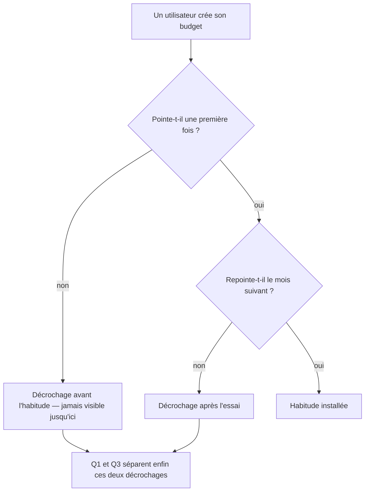

# Instruction: Construire les trois mesures

## Architecture projection

```txt
.
└── (aucun fichier modifié — insights et Actions PostHog, projet 87621)
```

## User Journey



## Tasks to do

### `1)` Rendre le retour comparable entre plateformes

> iOS émet `app_opened`, le web s'appuie sur `$pageview` — 619 vues, 155 personnes, 31 jours actifs sur 30 jours. Les deux disent la même chose, sous deux noms.

1. Créer une Action « Retour dans l'app » unissant `app_opened` et `$pageview`.
2. Construire toute mesure de retour sur cette Action, jamais sur l'un des deux événements bruts.
3. Ne pas ajouter d'`app_opened` web : ce serait dupliquer un signal déjà auto-capté pour le seul confort d'un nom.

### `2)` Répondre aux trois questions

> Une mesure par question, et rien de plus. Un insight qui ne répond à aucune des trois n'a pas à exister.

1. **Q1 — le geste s'installe-t-il** : funnel `first_budget_created` → Action de retour → `check_toggled`. C'est la chaîne de la marche bloquante, avec le maillon qui manquait au milieu.
2. **Q2 — reviennent-ils au mois suivant** : rétention mensuelle dont l'événement de départ et l'événement de retour sont tous deux `check_toggled`. Ancrer sur le geste et non sur l'ouverture, sinon on mesure la curiosité, pas l'habitude.
3. **Q3 — combien de temps tiennent-ils** : répartition du délai entre `first_budget_created` et le premier `check_toggled`, puis entre le premier et le dernier.
4. Exclure TestFlight de chacune, comme le fait déjà `JSF0dx5J` — sinon le testing de Maxime compte comme de la rétention.

### `3)` Documenter à la mise en service

> La dette de documentation ne se rouvre pas : ce qui est ajouté est décrit le jour où il est ajouté.

1. Décrire `check_toggled` et le `budget_created` web dans PostHog : quand ils partent, pas ce qu'ils signifient en théorie.
2. Les taguer sur les deux axes de l'autre plan — aire produit et étape de parcours.
3. Marquer `verified` une fois l'émission constatée dans les données réelles des deux plateformes.

### `4)` Lire, et écrire ce qu'on a appris

> Le plan ne s'arrête pas à l'émission. Une mesure qu'on ne lit pas est une dette de plus.

1. Laisser couler assez de temps pour que le cycle mensuel produise une deuxième observation.
2. Trancher la question restée ouverte du diagnostic : décrochage par friction du pointage, ou par absence de déclencheur de retour. Q1 et Q3 les distinguent — un utilisateur qui pointe puis s'arrête n'a pas le même problème qu'un utilisateur qui ne pointe jamais.
3. Consigner la réponse, y compris si elle contredit le diagnostic actuel.

## Test acceptance criteria

| Task | Acceptance criteria                                                                                                        |
| ---- | ------------------------------------------------------------------------------------------------------------------------------ |
| 1    | Une même mesure de retour couvre iOS et web sans que le nom d'événement diffère selon la plateforme.                          |
| 2    | Chacune des trois questions se répond depuis un insight sauvegardé, sans écrire de SQL.                                       |
| 2    | Aucune des trois mesures ne compte les sessions TestFlight.                                                                  |
| 3    | Les deux événements portent description et tags avant d'être utilisés dans un insight.                                       |
| 4    | La question « friction ou déclencheur » a une réponse écrite, appuyée sur Q1 et Q3.                                          |
