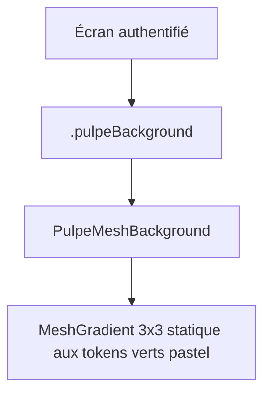

# Instruction: Tokens couleurs mesh + composant PulpeMeshBackground

## Architecture projection

```txt
ios/Pulpe/
├── Shared/
│   ├── Extensions/
│   │   └── Color+Pulpe.swift            ✏️  ajoute les tokens mesh (pairs light/dark dynamiques)
│   └── Components/
│       └── PulpeMeshBackground.swift    ✅  vue MeshGradient 3×3 statique, canvas authentifié
ios/PulpeTests/
└── Shared/
    └── Components/
        └── PulpeMeshBackgroundTests.swift  ✅  tests source-based (pattern HomeHeroCardTests)
```

## User Journey



## Tasks to do

### `1)` Tokens couleurs dans `Color+Pulpe.swift`

> Ajouter une section `// MARK: - App Mesh Canvas` avec les 9 couleurs du mesh en pairs light/dark dynamiques, dérivées du #006E25 sur base #EFF3EE — zéro hex en dehors de ce fichier (No Magic Values Rule).

1. Ajouter 9 `static let appMesh<Role> = Color(light: Color(hex: ...), dark: Color(hex: ...))` avec rôles nommés (`TopLeading`, `Top`, `TopTrailing`, `Leading`, `Center`, `Trailing`, `BottomLeading`, `Bottom`, `BottomTrailing`).
2. Palette light proposée (subtile, base #EFF3EE) : sauge pâle `#E4EFE4`, near-white `#F4F8F2`, menthe pâle `#DCEBDC`, lime pâle `#EAF3E2`, base `#EFF3EE`, sauge `#E2EFE0`, near-white `#F6F9F3`, menthe `#D9E9D5`, sauge claire `#E9F2E6`.
3. Palette dark (base #121611) : `#16241A`, `#101810`, `#1A2C1F`, `#142016`, `#121611`, `#17251B`, `#0F150F`, `#1D3323`, `#14211A`.
4. Documenter en commentaire la dérivation depuis `pulpePrimary` et la règle de subtilité (écart max avec la base ≈ contraste < 1.2:1 entre voisins).

### `2)` Composant `PulpeMeshBackground.swift`

> Vue unique qui rend le canvas : MeshGradient 3×3, points fixes, `smoothsColors: true` (défaut), `background: Color.appBackground`, aucune animation.

1. Créer la vue `struct PulpeMeshBackground: View` dans `Shared/Components/`.
2. Points 3×3 fixes (grille régulière SIMD2, éventuellement léger décalage du centre façon screenshot, ex. centre à (0.45, 0.55)).
3. Colors = les 9 tokens dans l'ordre row-major.
4. Doc comment : canvas authentifié, statique par motion restraint, jamais utilisé dans le scope pre-auth.
5. Ajouter un `#Preview` light + dark.

### `3)` Tests `PulpeMeshBackgroundTests.swift`

> Suivre le pattern source-based existant (HomeHeroCardTests lit le source Swift et assert des chaînes) — pas de snapshot.

1. Le composant contient exactement un `MeshGradient(` et zéro `LinearGradient(`.
2. Le composant référence les 9 tokens `appMesh` et `Color.appBackground`.
3. Le composant ne contient aucun hex brut (`Color(hex:` interdit hors Color+Pulpe).

## Test acceptance criteria

| Task | Acceptance criteria                                                                                          |
| ---- | ------------------------------------------------------------------------------------------------------------ |
| 1    | `Color+Pulpe.swift` compile ; les 9 tokens existent en variantes light ET dark dynamiques.                     |
| 2    | Le preview du composant montre un mesh vert pastel subtil en light, des taches vertes sombres en dark.        |
| 3    | `xcodebuild test -only-testing:PulpeTests/PulpeMeshBackgroundTests` passe avec un count de tests exécutés > 0. |
