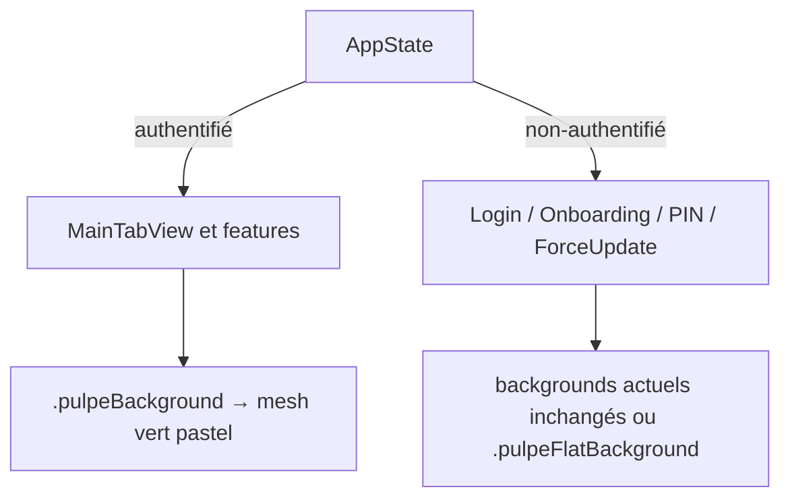

# Instruction: Câbler le mesh comme canvas authentifié + exclusions du scope non-authentifié

## Architecture projection

```txt
ios/Pulpe/
├── Shared/Extensions/
│   └── View+Extensions.swift                    ✏️  PulpeBackgroundModifier → PulpeMeshBackground ; ajoute .pulpeFlatBackground()
├── Features/
│   ├── Auth/Pin/
│   │   ├── PinEntryView.swift                   ✏️  .pulpeBackground() → .pulpeFlatBackground() (lock = non-authentifié)
│   │   └── PinRecoveryView.swift                ✏️  idem
│   ├── ForceUpdate/
│   │   └── ForceUpdateView.swift                ✏️  idem (écran bloquant pre-auth)
│   ├── CurrentMonth/
│   │   └── CurrentMonthView.swift               ✏️  dashboardBackground : base Color.appBackground → PulpeMeshBackground
│   └── Budgets/BudgetDetails/
│       └── BudgetDetailsStickyPagerLayer.swift  ✏️  bridge gradient : réévaluer le stop opaque appBackground sur mesh
ios/PulpeTests/
└── Shared/Extensions/
    └── PulpeBackgroundModifierTests.swift       ✅  le modifier authentifié rend le mesh, le flat reste plat
```

## User Journey



## Wireframe

```txt
┌─────────────────────────────┐
│  Août 2026            (ava) │ 1
│┌───────────────────────────┐│
││  HERO — surface menthe    ││ 2
││  solde estimé + metrics   ││
│╰───────────────────────────╯│
│  ░ mesh vert pastel ░       │ 3
│  ┌───────────────────────┐  │
│  │ Section card (rows)   │  │ 4
│  └───────────────────────┘  │
│  ░ mesh ░   ┌───────────┐   │
│             │ card      │   │
│             └───────────┘   │
└─────────────────────────────┘
```

1. Navigation bar native — inchangée, le mesh passe dessous (safe area ignorée).
2. Hero dashboard : gradient menthe borné existant, posé **sur** le mesh (remplace le plat `appBackground` actuel).
3. Canvas : `PulpeMeshBackground` statique, visible entre les cards.
4. Cards/surfaces existantes : inchangées, c'est le mesh derrière qui change.

## Tasks to do

### `1)` Modifier `PulpeBackgroundModifier` + variante flat

> Un seul point de changement propage le mesh aux 49 call sites ; le scope non-authentifié bascule sur la variante flat explicite.

1. `PulpeBackgroundModifier.body` : remplacer `Color.appBackground.ignoresSafeArea()` par `PulpeMeshBackground().ignoresSafeArea()`.
2. Ajouter `func pulpeFlatBackground()` (ancien comportement, `Color.appBackground`) avec doc comment : réservé au scope non-authentifié (lock, force-update) et aux cas où le mesh nuit à la lisibilité.
3. Mettre à jour le doc comment de `pulpeBackground()` : canvas authentifié = mesh pastel.

### `2)` Exclure les écrans non-authentifiés

> PIN entry/recovery et force-update sont visibles hors session : ils gardent le canvas plat pour rester dans la famille visuelle pre-auth.

1. `PinEntryView.swift` : `.pulpeBackground()` → `.pulpeFlatBackground()`.
2. `PinRecoveryView.swift` : idem.
3. `ForceUpdateView.swift` : idem.
4. Ne PAS toucher `ChangePinView.swift` (réglages, authentifié → mesh) ni login/onboarding (n'utilisent pas `.pulpeBackground()`, déjà hors périmètre).

### `3)` Dashboard : poser le hero sur le mesh

> La base `Color.appBackground` du `dashboardBackground` devient le mesh ; la surface menthe bornée du hero reste telle quelle au-dessus.

1. `CurrentMonthView.dashboardBackground` : remplacer la base `Color.appBackground` du ZStack par `PulpeMeshBackground()` (états idle/loading/loaded).
2. États failed/empty : `PulpeMeshBackground()` aussi (ce sont des états du dashboard authentifié).
3. Vérifier `HomeHeroCardTests.loadedDashboardUsesOneFullScreenGradientBackground` — l'assertion `LinearGradient(` count ne change pas (le mesh n'en ajoute pas) ; ajuster si l'assertion sur la base casse.
4. `BudgetDetailsStickyPagerLayer` : le bridge gradient `appBackground → clear` au sommet se fondra dans le mesh au lieu du plat ; si l'écart est visible en review visuelle, adoucir (stop opaque raccourci) — décision prise sur device, pas de changement spéculatif.

### `4)` Tests + vérification visuelle

> Tests source-based sur le modifier ; validation visuelle simulateur light/dark sur dashboard, budget detail, settings.

1. `PulpeBackgroundModifierTests` : `View+Extensions.swift` référence `PulpeMeshBackground` dans le modifier ; `pulpeFlatBackground` référence `Color.appBackground` ; PinEntryView/PinRecoveryView/ForceUpdateView utilisent `.pulpeFlatBackground()`.
2. Build `PulpeLocal` + run simulateur : dashboard (hero sur mesh), une liste, un réglage, light ET dark.
3. Vérifier contraste/lisibilité des cards sur le mesh (subtilité : le mesh ne doit pas "bouger" sous l'œil).

## Test acceptance criteria

| Task | Acceptance criteria                                                                                                     |
| ---- | ----------------------------------------------------------------------------------------------------------------------- |
| 1    | Toutes les pages authentifiées affichent le mesh ; aucune feature n'a été modifiée hors des 5 fichiers de la projection. |
| 2    | PIN entry, PIN recovery et force-update affichent le canvas plat `appBackground`, identique à avant.                     |
| 3    | Dashboard : la surface menthe du hero est posée sur le mesh sans couture visible ; tests HomeHeroCard verts.             |
| 4    | `PulpeBackgroundModifierTests` passe (count > 0) ; run simulateur light + dark sans régression de lisibilité constatée.  |
