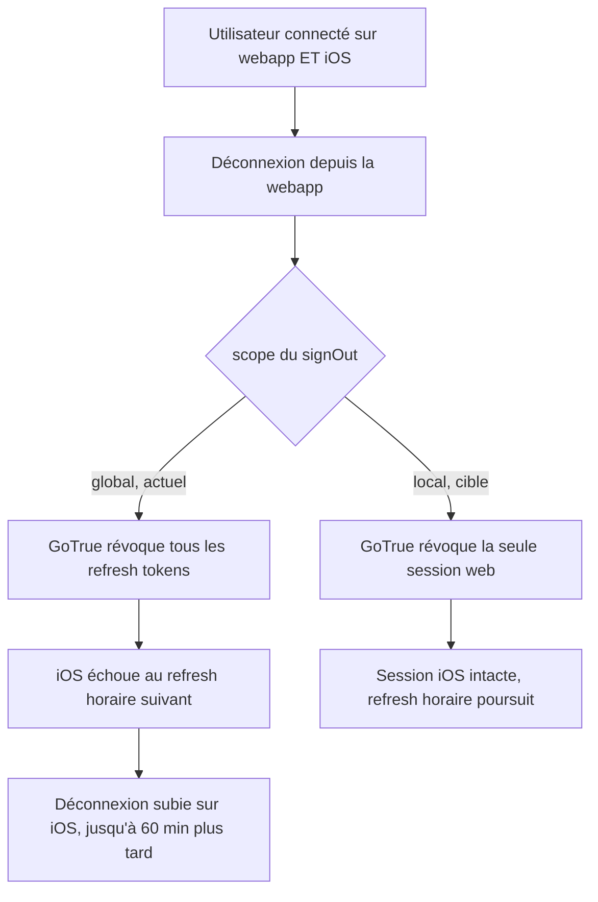

# Instruction: Portée locale du signOut webapp

## Architecture projection

```txt
.
└── frontend/projects/webapp/src/app/core/auth/
    ├── auth-session.service.ts        ✏️ signOut() passe scope: 'local'
    └── auth-session.service.spec.ts   ✏️ verrouille le scope (aucun test ne l'assert aujourd'hui)
```

## User Journey



## Tasks to do

### `1)` Passer le signOut en portée locale

> La webapp ne doit révoquer que la session du navigateur courant.

1. Dans `#performSignOut`, remplacer `auth.signOut()` par `auth.signOut({ scope: 'local' })`.
2. Ajouter un commentaire court qui dit pourquoi : le global révoque les sessions iOS ; la révocation multi-appareils légitime est déjà faite serveur par `signOutGlobally`.
3. Ne toucher aucun des 8 appelants — ils passent tous par cette méthode.

### `2)` Verrouiller la portée par un test

> Le scope ne doit plus pouvoir repasser en global sans qu'un test rougisse.

1. Dans `auth-session.service.spec.ts`, étendre le test de déconnexion existant pour asserter l'argument, pas seulement l'appel : `toHaveBeenCalledWith({ scope: 'local' })`.
2. Un seul test suffit — tous les chemins convergent sur `#performSignOut`.

## Test acceptance criteria

| Task | Acceptance criteria                                                                                                        |
| ---- | ---------------------------------------------------------------------------------------------------------------------------- |
| 1    | Une déconnexion depuis la webapp laisse la session iOS active : aucun `refresh_token_not_found` sur le refresh horaire suivant. |
| 1    | La déconnexion web elle-même reste complète — stockage local vidé, `SIGNED_OUT` émis, redirection vers login inchangée.        |
| 2    | Remettre `auth.signOut()` sans argument fait échouer la suite `auth-session.service.spec.ts`.                                 |
