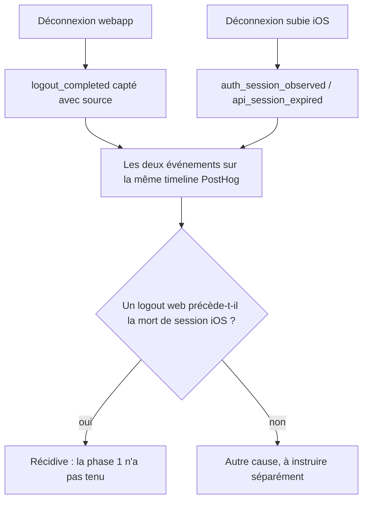

# Instruction: Événement de logout webapp

## Architecture projection

```txt
.
├── frontend/projects/webapp/src/app/core/auth/
│   ├── auth-session.service.ts        ✏️ émet logout_completed sur le chemin de déconnexion
│   └── auth-session.service.spec.ts   ✏️ couvre l'émission
└── .claude/rules/05-workflows-and-processes/
    └── posthog-events.md              ✏️ déclare l'événement dans la colonne Web du catalogue
```

## User Journey



## Tasks to do

### `1)` Émettre l'événement de déconnexion web

> Le web n'émet aujourd'hui aucun événement de logout : la déconnexion du 2026-08-05 n'a pu être reconstituée qu'indirectement, via une chute d'identité `$set` et trois `welcome_page_viewed` anonymes.

1. Dans `#performSignOut`, capter `logout_completed` — même nom que l'événement iOS existant, pour que les deux plateformes soient comparables.
2. Porter une propriété `source` distinguant les déclencheurs : déconnexion volontaire, écrans vault-code, sortie de démo, suppression de compte programmée, compte bloqué.
3. Capter **avant** que PostHog ne réinitialise son identité, comme le fait déjà `session_reset` côté iOS.
4. Nom d'événement statique, `snake_case`, jamais interpolé.

### `2)` Déclarer l'événement au catalogue

> Le catalogue est la source de vérité de la taxonomie ; un événement non déclaré est un événement qu'on ne saura pas relire dans six mois.

1. Dans `posthog-events.md`, ajouter `logout_completed` à la table Web avec ses propriétés.
2. Documenter l'espace de valeurs de `source`.

### `3)` Observer

> Vérifier que la phase 1 tient dans la durée.

1. Après déploiement, surveiller `auth_session_observed` avec `outcome = refresh_token_not_found` sur iOS.
2. Se déconnecter depuis la webapp, puis vérifier que la session iOS survit à son refresh horaire suivant — c'est le test de non-régression grandeur nature.
3. À toute nouvelle occurrence, chercher un `logout_completed` web dans les 60 minutes précédentes : présent ⇒ le scope a régressé ; absent ⇒ cause distincte, à instruire à part.

## Test acceptance criteria

| Task | Acceptance criteria                                                                                                          |
| ---- | ------------------------------------------------------------------------------------------------------------------------------ |
| 1    | Une déconnexion depuis la webapp produit un `logout_completed` visible en PostHog avec une `source` renseignée.                 |
| 1    | L'événement part avant la réinitialisation d'identité — il reste attribué à la bonne personne, pas au profil anonyme suivant.   |
| 2    | Le catalogue liste `logout_completed` côté Web avec l'espace de valeurs de `source`.                                            |
| 3    | À la prochaine déconnexion subie iOS, la présence ou l'absence d'un logout web dans les 60 min précédentes est établie sans ambiguïté. |
