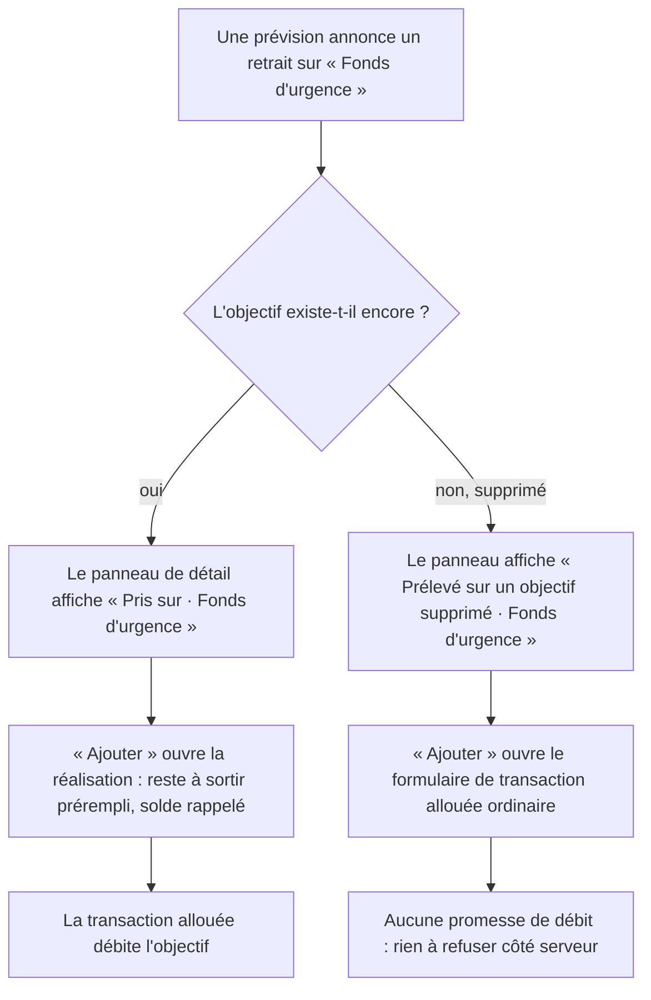

# Instruction: La source orpheline ne se déguise plus, et le détail dit d'où vient l'argent

Deux surfaces web contredisent aujourd'hui la règle « un objectif supprimé rend le retrait
non réalisable, mais son nom subsiste » : l'une propose une réalisation que le serveur refuse
toujours, l'autre ne dit rien de la source.

## Architecture projection

> Tree of the final files. ✅ create · ✏️ modify · ❌ delete

```txt
frontend/projects/webapp/src/app/feature/budget/budget-details/
├── components/
│   ├── budget-items-container.ts             ✏️  la garde passe du nom à l'identifiant
│   ├── budget-items-container.spec.ts        ✏️  + le cas orphelin sur le chemin « Ajouter »
│   └── budget-grid/
│       ├── budget-detail-panel.ts            ✏️  + la ligne de source sous l'objectif alimenté
│       └── budget-detail-panel.spec.ts       ✏️  + les deux états, actif et orphelin
└── allocated-transactions/create-dialog/
    └── form.ts                               ✏️  `goalId` devient non-nullable
```

## User Journey



## Wireframe

```txt
Panneau de détail d'une prévision — source ACTIVE

┌──────────────────────────────────────────────┐
│ ● Apport cuisine                        [X]  │
│   Revenu                                     │
│   [🏦 Objectif : Fonds d'urgence]            │  ← existant (objectif alimenté)
│   🏦 Pris sur · Fonds d'urgence               │  ← ajouté (objectif source)
├──────────────────────────────────────────────┤
│ Prévu          Dépensé          Reste        │
│ 500.00 CHF     300 CHF          200 CHF      │
└──────────────────────────────────────────────┘

Panneau de détail — source ORPHELINE (objectif supprimé)

┌──────────────────────────────────────────────┐
│ ● Apport cuisine                        [X]  │
│   Revenu                                     │
│   🔗̸ Prélevé sur un objectif supprimé ·       │  ← même composant, icône link_off,
│      Fonds d'urgence                          │     ton neutre, infobulle explicative
└──────────────────────────────────────────────┘
```

## Tasks to do

### `1)` La garde de réalisation lit l'identifiant, pas le nom

> Le nom survit à l'objectif ; seul l'identifiant dit qu'un débit est encore possible.

1. Dans `budget-items-container.ts`, `#withdrawalRealizationContext` retourne `null` sur
   `!budgetLine.sourceSavingsGoalId`, plus sur `!budgetLine.sourceSavingsGoalName`.
2. `goalId` n'est alors plus jamais `null` : retirer le `?? null` et le repli.
   Aligner le commentaire du bloc — une source orpheline ne produit plus de contexte, elle
   retombe sur le formulaire de transaction allouée ordinaire, comme le geste de pointage
   (`handleToggleCheck`) et le CTA de la carte le font déjà.
3. Dans `form.ts`, `WithdrawalRealizationContext.goalId` devient `string` et perd son
   commentaire de nullité. Vérifier que `pulpe-savings-goal-source-line` accepte la valeur
   resserrée sans changement (son `goalId` est déjà `string | null | undefined`).

### `2)` Le panneau de détail affiche l'objectif source

> C'est aujourd'hui la seule surface qui ne dit pas d'où vient l'argent.

1. Importer `SavingsGoalSourceLine` dans `budget-detail-panel.ts` et le placer sous le bloc
   `budget-detail-panel-linked-goal`, gardé par `@if (envelope.data.sourceSavingsGoalName; as sourceName)`.
2. Lire les deux champs sur `envelope.data` (pas sur le store : la ligne les porte
   elle-même), avec `class="text-label-small max-w-full"` et un
   `[attr.data-testid]="'detail-panel-source-goal-' + envelope.data.id"`, comme
   `budget-grid-card.ts` le fait.
3. Ne pas la rendre cliquable et ne pas ajouter de libellé i18n : le composant porte déjà
   son texte, son icône et son infobulle pour les deux états.

### `3)` Les specs fixent le comportement des deux surfaces

> Un test qui échoue avant le correctif, un par surface.

1. `budget-items-container.spec.ts` : sur une ligne source orpheline
   (`sourceSavingsGoalId: null`, nom conservé), `openCreateAllocatedTransactionDialog`
   reçoit `null` en 5ᵉ argument. Ce test échoue avant le correctif.
2. `budget-detail-panel.spec.ts` : une prévision avec source active rend
   `pulpe-savings-goal-source-line` avec le nom complet ; une source orpheline le rend
   aussi, en état cassé ; une ligne sans source n'en rend aucun.

## Test acceptance criteria

| Task | Acceptance criteria                                                                                                                                                    |
| ---- | ------------------------------------------------------------------------------------------------------------------------------------------------------------------------ |
| 1    | Sur une prévision dont l'objectif a été supprimé, « Ajouter une transaction » ouvre le formulaire ordinaire : ni « Pris sur · … », ni « Montant restant prévu », ni solde. |
| 1    | Sur une prévision dont l'objectif existe, le formulaire de réalisation est inchangé : nom, reste à sortir et solde confirmé s'affichent comme avant.                       |
| 2    | Ouvrir le panneau de détail d'un retrait annoncé montre « Pris sur · <objectif> » ; l'objectif supprimé donne le libellé cassé et l'icône `link_off`, sans couleur d'erreur. |
| 2    | Le panneau d'une prévision sans source est inchangé — aucune ligne vide, aucun espacement ajouté.                                                                          |
| 3    | `pnpm exec vitest run` passe sur les deux specs, et chacun échoue si l'on remet la garde sur le nom ou si l'on retire la ligne du panneau.                                 |
