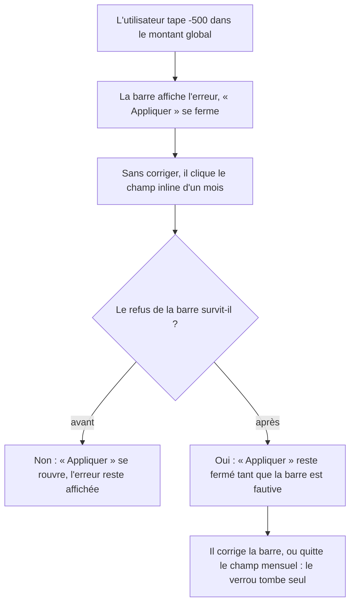

# Instruction: Le verrou de saisie du simulateur distingue ses deux champs

Le simulateur de plan possède un seul booléen « une saisie est refusée », écrit par deux
champs indépendants : le montant global de la barre et le champ inline d'un mois. Ouvrir
l'éditeur d'un mois efface le refus que la barre affiche encore — « Appliquer » redevient
actif alors qu'un `role="alert"` reste à l'écran, exactement ce que le commentaire du verrou
dit empêcher.

## Architecture projection

> Tree of the final files. ✅ create · ✏️ modify · ❌ delete

```txt
frontend/projects/webapp/src/app/feature/savings-goals/detail/
├── services/
│   ├── goal-plan-simulator-store.ts          ✏️  un drapeau par champ, `hasInvalidAmount` dérivé
│   └── goal-plan-simulator-store.spec.ts     ✏️  + l'indépendance des deux sources
├── components/
│   └── goal-plan-simulator-toolbar.ts        ✏️  écrit le drapeau global
└── savings-goal-detail-page.ts               ✏️  la timeline écrit le drapeau mensuel
```

## User Journey



## Tasks to do

### `1)` Chaque champ porte son propre refus

> Un verrou partagé par deux serrures n'en ferme aucune.

1. Dans `goal-plan-simulator-store.ts`, remplacer `#hasInvalidAmount` par
   `#isGlobalAmountInvalid` et `#isMonthAmountInvalid`.
2. `hasInvalidAmount` devient un `computed` : l'un **ou** l'autre. `canApply` ne change pas
   de forme, il lit ce dérivé.
3. Remplacer `setAmountInvalid(isInvalid)` par `setGlobalAmountInvalid(isInvalid)` et
   `setMonthAmountInvalid(isInvalid)`. Reformuler le commentaire du verrou : il dit
   maintenant pourquoi les deux sources ne se recouvrent pas.
4. `#reset()` remet les deux à `false` — `enter()`, `exit()` et `revert()` passent déjà par
   lui, rien d'autre à toucher.

### `2)` Les deux appelants nomment leur champ

> Un appel, une source, aucune ambiguïté.

1. `goal-plan-simulator-toolbar.ts` : `#clearInputRefusal` et `onInputChange` écrivent
   `setGlobalAmountInvalid`.
2. `savings-goal-detail-page.ts` : `(invalidChange)` de `pulpe-goal-plan-timeline` écrit
   `setMonthAmountInvalid`.
3. Ne rien changer à `goal-plan-timeline.ts` : le composant possède déjà son `hasEditError`
   local et n'émet que son propre état.

### `3)` Le spec prouve l'indépendance

> Le cas rapporté, puis les deux sens.

1. Refus global posé, puis `setMonthAmountInvalid(false)` : `canApply` reste `false`. Ce
   test échoue avant le correctif.
2. Le symétrique : refus mensuel posé, `setGlobalAmountInvalid(false)` ne le lève pas.
3. Les deux levés : `canApply` suit `hasChanges` comme avant.

## Test acceptance criteria

| Task | Acceptance criteria                                                                                                                                              |
| ---- | ------------------------------------------------------------------------------------------------------------------------------------------------------------------ |
| 1    | Un montant global négatif ferme « Appliquer », et ouvrir l'éditeur inline d'un mois ne le rouvre pas tant que le champ global reste fautif.                        |
| 1    | Corriger le montant global rouvre « Appliquer » immédiatement, sans avoir à toucher un mois.                                                                       |
| 2    | Le comportement d'un seul champ fautif est inchangé : erreur affichée, plan non muté, `Appliquer` fermé — dans les deux champs pris séparément.                    |
| 2    | Quitter le mode simulation puis y revenir repart sans aucun refus en mémoire.                                                                                     |
| 3    | `pnpm exec vitest run` passe sur `goal-plan-simulator-store.spec.ts`, et les deux tests d'indépendance échouent si l'on revient à un booléen unique.               |
