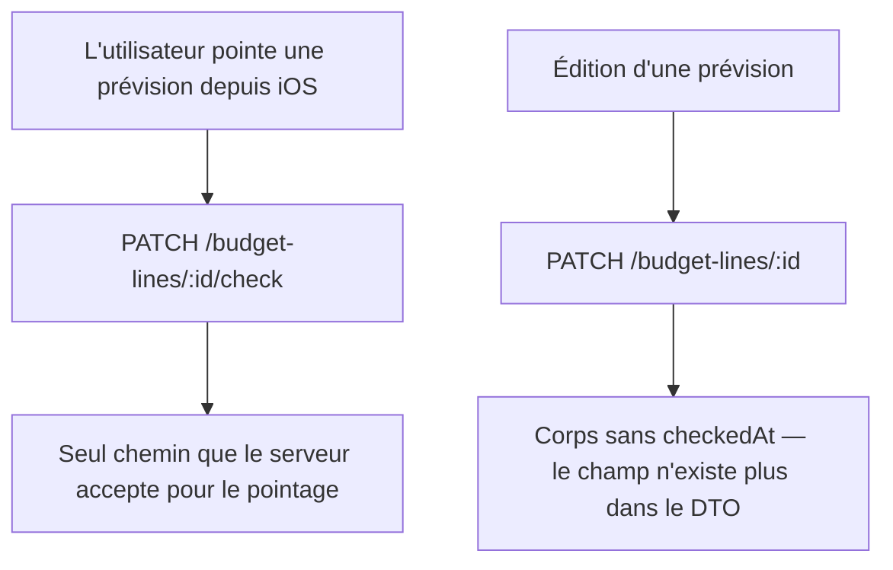

# Instruction: Le contrat de mise à jour iOS perd son champ mort

`BudgetLineUpdate.checkedAt` n'a plus aucun site d'écriture côté iOS, et
`budgetLineUpdateSchema` l'`omit()` sous `z.strictObject` (`shared/schemas.ts:988`) : un
`PATCH` qui le porterait recevrait un 400. Le champ contredit aussi le commentaire voisin de
`BudgetLineCreate`, qui explique pourquoi la mise à jour ne porte pas la source.

## Architecture projection

> Tree of the final files. ✅ create · ✏️ modify · ❌ delete

```txt
ios/Pulpe/Domain/Models/
└── BudgetLine.swift                          ✏️  `BudgetLineUpdate.checkedAt` supprimé
```

Aucun spec à modifier : les trois suites qui construisent un `BudgetLineUpdate`
(`EditBudgetLineSheetTests`, `SavingsGoalCodableTests`, `TagCodableTests`) passent toutes par
des arguments nommés et n'en fournissent aucun.

## User Journey



## Tasks to do

### `1)` Supprimer la propriété

> Un champ que personne n'écrit et que le serveur refuse n'est pas un contrat, c'est un piège.

1. Retirer `var checkedAt: Date?` de `BudgetLineUpdate` dans `BudgetLine.swift`.
2. Ne pas toucher `BudgetLine.checkedAt` ni `BudgetLineCreate.checkedAt` : la lecture et la
   création restent légitimes, seule la mise à jour perd le champ.
3. Vérifier que l'initialiseur memberwise reste satisfait à ses deux sites d'appel
   (`EditBudgetLineSheet.buildUpdate`), qui passent déjà des arguments nommés.

## Test acceptance criteria

| Task | Acceptance criteria                                                                                                        |
| ---- | -------------------------------------------------------------------------------------------------------------------------- |
| 1    | `xcodebuild build -scheme PulpeLocal` compile : aucun site n'écrivait le champ.                                            |
| 1    | La suite `PulpeTests` passe, encodage des DTO compris — un `BudgetLineUpdate` sérialisé ne contient toujours aucune clé de trop. |
| 1    | Éditer puis pointer une prévision depuis l'app produit les mêmes deux requêtes qu'avant, sans 400.                          |
