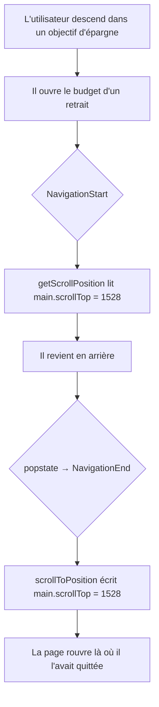

# Instruction: La position se lit et se repose sur le conteneur qui défile vraiment

## Architecture projection

> Tree of the final files. ✅ create · ✏️ modify · ❌ delete

```txt
frontend/projects/webapp/src/app/core/
├── routing/
│   ├── page-viewport-scroller.ts        ✅  ViewportScroller visant <main> ou la fenêtre
│   ├── page-viewport-scroller.spec.ts   ✅
│   └── index.ts                         ✏️  + un export
└── core.ts                              ✏️  + le provider, sous provideRouter
```

`core/routing/` héberge déjà les greffons du routeur (`withChunkReloadRecovery`,
`PulpeTitleStrategy`) : pas de nouveau dossier.

## User Journey



## Tasks to do

### `1)` Le service vise le conteneur qui défile

> Une seule question à chaque appel : qui défile ici, `<main>` ou la fenêtre ?

1. Créer `PageViewportScroller extends ViewportScroller`, injecté avec `DOCUMENT`.
2. Résoudre le conteneur à chaque appel : `document.querySelector('main')`, retenu seulement si son `getComputedStyle(...).overflowY` vaut `auto` ou `scroll`. Sinon `null`.
3. `getScrollPosition()` → `[el.scrollLeft, el.scrollTop]` quand un conteneur répond, `[window.scrollX, window.scrollY]` sinon.
4. `scrollToPosition(position, options)` → `el.scrollTo({ left, top, behavior })` ou `window.scrollTo(...)`, en écrivant la position **telle quelle**. Vérifié dans `@angular/common/fesm2022/common.mjs` : `scrollToPosition` y écrit `position` sans rien soustraire, et seul `scrollToElement` applique l'offset. La soustraire ici serait asymétrique avec `getScrollPosition`, qui ne l'ajoute pas — chaque restauration serait décalée de la hauteur de l'offset.
5. `setOffset(offset)` stocke le tuple ou la fonction ; un getter privé le résout. `setHistoryScrollRestoration(mode)` écrit `history.scrollRestoration` — sans lui, le navigateur restaure par-dessus.
6. `scrollToAnchor(anchor)` : retrouver la cible par `id` puis par `name`, et convertir en position **relative au conteneur** (`el.scrollTop + cibleRect.top - conteneurRect.top - offsetY`) — la formule de la fenêtre y donnerait un mauvais résultat.

### `2)` Le remplacement est branché

> Angular doit demander la position à ce service, pas au sien.

1. Dans `core.ts`, ajouter `{ provide: ViewportScroller, useClass: PageViewportScroller }` juste sous `provideRouter(...)`, avec le commentaire disant pourquoi.
2. Ne rien changer à `withInMemoryScrolling` : le comportement voulu est déjà celui-là, seul le service visé était faux.
3. Exporter depuis `core/routing/index.ts`.

### `3)` Le spec fixe le comportement, pas l'implémentation

> Deux mondes : `<main>` défile, `<main>` ne défile pas.

1. Un `<main>` avec `overflow-y: auto` et un contenu plus grand : écrire une position puis la relire rend la même valeur.
2. Le même `<main>` en `overflow-y: visible` : la lecture retombe sur la fenêtre et ne renvoie pas le `scrollTop` du `<main>`.
3. Aucun `<main>` dans le document : la lecture répond sans lever.
4. `setOffset([0, 64])` puis `scrollToPosition([0, 500])` place le conteneur à 500 : la repose d'une position ignore l'offset, seul l'ancrage le retranche.
5. Sans conteneur qui défile, la lecture et l'écriture passent par la fenêtre — le chemin du mobile, qui doit rester couvert.

## Test acceptance criteria

| Task | Acceptance criteria                                                                                                                                                       |
| ---- | ------------------------------------------------------------------------------------------------------------------------------------------------------------------------- |
| 1    | À 1280 px, descendre dans une page longue puis ouvrir une autre page et revenir rend la position d'origine à quelques pixels près, au lieu de 0.                            |
| 1    | À 375 px, la même manipulation garde le comportement actuel : la position revient comme avant, sans régression.                                                             |
| 2    | La barre d'action de page, la `mat-toolbar` et le fil d'Ariane occupent exactement les mêmes positions qu'avant le changement, aux deux largeurs — aucun style n'a bougé.    |
| 2    | Un lien interne ordinaire (non-retour) ouvre toujours la nouvelle page en haut.                                                                                             |
| 3    | `pnpm test` passe, et le spec échoue si le service lit la fenêtre alors que `<main>` défile.                                                                                |
