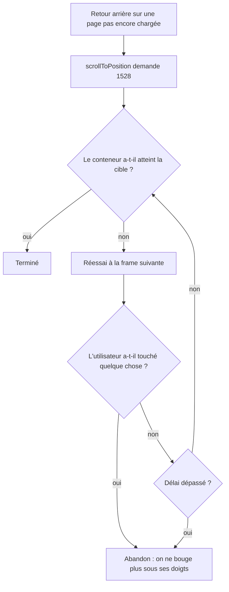

# Instruction: La restauration attend que la page ait retrouvé sa hauteur

## Architecture projection

> Tree of the final files. ✅ create · ✏️ modify · ❌ delete

```txt
frontend/projects/webapp/src/app/core/routing/
├── page-viewport-scroller.ts        ✏️  la repose réessaie tant que la page grandit
└── page-viewport-scroller.spec.ts   ✏️  + le cas contenu tardif, + le cas geste utilisateur
```

## Le défaut que cette phase traite

`RouterScroller` repose la position un `requestAnimationFrame` après `NavigationEnd`. Une
page dont les données arrivent après ce délai n'a pas encore sa hauteur : le navigateur
plafonne le `scrollTop` demandé à ce que le conteneur peut offrir, et l'écriture se perd —
la phase 1 seule marche sur une page déjà en cache et échoue sur un chargement froid.

## User Journey



## Tasks to do

### `1)` La repose réessaie tant que la cible n'est pas atteinte

> Une cible manquée n'est pas un échec, c'est une page qui n'a pas fini de grandir.

1. Après l'écriture, comparer la position atteinte à la cible. Égales, ou cible à `0` : rien à armer.
2. Sinon relancer l'écriture à chaque `requestAnimationFrame`, jusqu'à ce que la cible soit atteinte.
3. Borner par une constante nommée (`SETTLE_TIMEOUT_MS`, de l'ordre de la seconde) : une page qui ne grandira jamais jusque-là s'arrête au lieu de tourner en boucle.
4. Une nouvelle demande de repose annule la précédente — deux navigations rapprochées ne doivent pas se disputer le conteneur.

### `2)` Le premier geste de l'utilisateur gagne

> Reposer un défilement sous quelqu'un qui a déjà commencé à lire est pire que ne rien restaurer.

1. Pendant la fenêtre de réessai, écouter `wheel`, `touchstart`, `pointerdown` et `keydown` en `passive`, et abandonner au premier.
2. **Ne pas écouter `scroll`** : nos propres écritures en émettent, l'abandon se déclencherait sur le premier réessai et la correction ne servirait à rien.
3. Retirer les écouteurs à la fin, quelle que soit la sortie — cible atteinte, délai dépassé, geste, ou nouvelle demande.

### `3)` Le spec couvre les deux sorties

> Le contenu tardif et le geste utilisateur sont les deux seules choses que cette phase ajoute.

1. Conteneur trop court au moment de la repose, agrandi ensuite : la position finit par atteindre la cible.
2. Même scénario, mais un `wheel` est émis entre-temps : la position n'est plus retouchée après le geste.
3. Le conteneur ne grandit jamais : les réessais s'arrêtent après le délai et plus rien n'est écrit.

## Test acceptance criteria

| Task | Acceptance criteria                                                                                                                                       |
| ---- | ----------------------------------------------------------------------------------------------------------------------------------------------------------- |
| 1    | Retour arrière sur une page rechargée à froid, réseau ralenti : la position est retrouvée une fois les données affichées, pas laissée en haut.                |
| 1    | Deux retours arrière enchaînés rapidement laissent la page à la position du dernier, sans va-et-vient.                                                        |
| 2    | Un retour arrière suivi immédiatement d'un geste de défilement laisse la page là où l'utilisateur l'a mise : plus aucun saut après son geste.                 |
| 2    | Une navigation ordinaire vers une page longue reste en haut : aucun réessai n'est armé pour une cible à `0`.                                                  |
| 3    | `pnpm test` passe, et le spec échoue si l'abandon écoute `scroll` — le cas « contenu tardif » ne se restaurerait plus.                                        |
