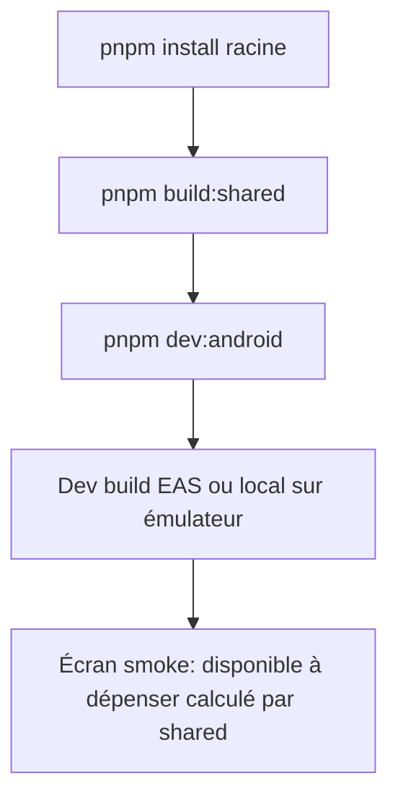

# Instruction: Fondations Expo dans le monorepo

Scaffold de l'app `android/`, intégration pnpm/Turbo, consommation de `pulpe-shared`, toolchain qualité et projet EAS. À la fin : un shell vide qui build sur device/émulateur et affiche un écran calculé avec `BudgetFormulas`.

## Architecture projection

```txt
.
├── android/                              ✅ nouveau package Expo (name: pulpe-android)
│   ├── app/                              ✅ Expo Router (file-based)
│   │   ├── _layout.tsx                   ✅ racine : providers (QueryClient, theme, gesture-handler)
│   │   └── index.tsx                     ✅ écran smoke test (calcul via shared)
│   ├── src/
│   │   └── smoke/shared-smoke.ts         ✅ appelle BudgetFormulas.calculateAvailable + un schema Zod
│   ├── metro.config.js                   ✅ minimal : expo/metro-config (auto-config monorepo SDK 52+), NE PAS ajouter watchFolders/nodeModulesPaths
│   ├── babel.config.js                   ✅ preset Expo + plugin reanimated
│   ├── app.json / app.config.ts          ✅ slug, scheme pulpe://, package android, plugins
│   ├── eas.json                          ✅ profils development / preview / production
│   ├── package.json                      ✅ Expo SDK, RN, expo-router, zustand, @tanstack/react-query, react-native-mmkv, zod, pulpe-shared (workspace:*)
│   ├── tsconfig.json                     ✅ strict, extends expo/tsconfig.base
│   └── jest.config.js                    ✅ jest-expo + test smoke
├── package.json                          ✏️ ajout scripts dev:android / build:android (turbo)
├── turbo.json                            ✏️ pipeline android (dependsOn shared build)
├── pnpm-workspace.yaml                   ✏️ ajout android/
├── AGENTS.md                             ✏️ miroir de formules : préciser qu'Android consomme shared directement (reste 2 sens)
└── .github/workflows/                    ✏️ job CI android (typecheck + jest) minimal
```

## User Journey



## Tasks to do

### `1)` Scaffold Expo SDK

> App Expo TS strict fonctionnelle dans `android/`.

1. `pnpm create expo-app` dans un dossier temp puis déplacer dans `android/` (template tabs minimal, puis nettoyer)
2. Installer : expo-router, zustand, @tanstack/react-query, react-native-mmkv, react-native-reanimated, react-native-gesture-handler, zod
3. TS strict + `tsc --noEmit` vert
4. `app.config.ts` : name Pulpe, scheme `pulpe`, package `app.pulpe.android`, plugins (router, secure-store, local-authentication en prévision)

### `2)` Intégration monorepo pnpm/Turbo/Metro

> `pnpm install` racine installe l'app, Metro résout `pulpe-shared`. Workspace pnpm **isolé conservé** (défaut actuel du repo, pnpm 10) : Expo supporte l'isolé depuis SDK 54, l'autolinking aligné Metro est actif par défaut pour les monorepos depuis SDK 55.

1. `pnpm-workspace.yaml` += `android/` — **aucun `nodeLinker: hoisted`** : ne pas toucher à la stratégie d'installation (zéro impact sur frontend/backend-nest/landing)
2. `metro.config.js` : repartir du `expo/metro-config` par défaut (monorepo auto-configuré depuis SDK 52) ; ne pas configurer watchFolders à la main ; résolution `pulpe-shared` (consommer `dist/esm` buildé, export maps via `unstable_enablePackageExports` si nécessaire)
3. Escalade seulement si erreurs de résolution/build natives prouvées : (a) `nodeLinker: hoisted` racine → exige alors une non-régression complète frontend/backend/landing ; (b) sinon exclure `android/` du workspace et gérer ses deps séparément. Documenter le choix dans le fichier phase
3. `turbo.json` : tâches `dev:android`, `build:android` avec `dependsOn: ["shared#build"]`
4. Scripts racine `pnpm dev:android`
5. Si blocage symlinks/Metro : fallback = retirer `android/` du workspace pnpm et gérer ses deps séparément (documenter la décision dans le fichier phase)

### `3)` Smoke test shared/

> Preuve que schemas + calculators tournent sous Hermes.

1. Écran `index.tsx` : calcul `BudgetFormulas.calculateAvailable` sur données fixtures + validation d'un payload par un schema de `shared/schemas.ts` + formatage `getCurrencyFormatter` (`Intl.NumberFormat` confirmé supporté sous Hermes Android — doc `IntlAPIs.md` du repo facebook/hermes — variance possible du séparateur de milliers selon version Android, à observer sur le smoke)
2. Test jest-expo du même calcul (verrouille la chaîne de build shared)

### `4)` Toolchain qualité + EAS

> Lint, tests, CI, projet EAS prêts.

1. ESLint (config expo) + prettier alignés au repo ; script `quality` local
2. jest-expo configuré, smoke test vert dans `pnpm test`
3. Job CI GitHub Actions : typecheck + jest android
4. `eas init`, `eas.json` (3 profils), dev build Android généré et installé

## Test acceptance criteria

| Task | Acceptance criteria                                                                                     |
| ---- | ------------------------------------------------------------------------------------------------------- |
| 1    | `pnpm dev:android` lance l'app sur émulateur/device Android, écran visible                              |
| 2    | Modifier `shared/src/calculators/` puis rebuild → l'app voit le changement sans copie manuelle          |
| 3    | L'écran smoke affiche un montant formaté CHF calculé par `BudgetFormulas` ; le test jest correspondant passe |
| 4    | CI verte sur le job android ; `eas build --profile development` produit un APK installable              |
