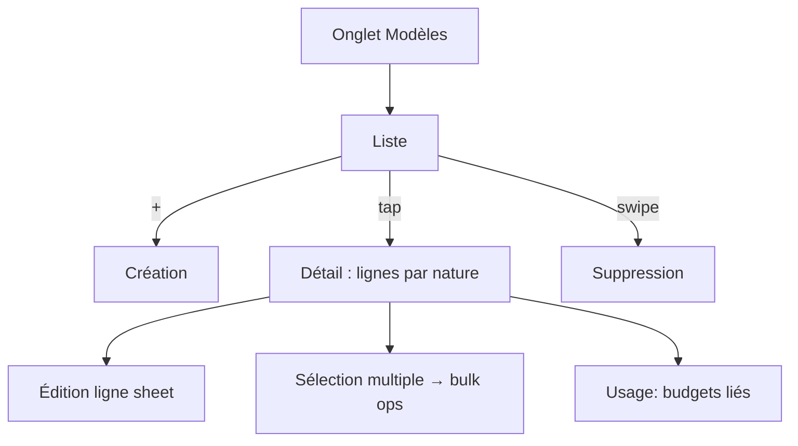

# Instruction: Modèles de budget

Onglet Modèles, miroir d'`ios/Pulpe/Features/Templates/` : liste (max 5, un par défaut), création, détail avec édition des lignes et opérations en masse, usage, suppression.

## Architecture projection

```txt
android/
├── app/(main)/
│   ├── templates.tsx                   ✏️ vraie liste (remplace placeholder)
│   └── template/
│       ├── create.tsx                  ✅
│       └── [id].tsx                    ✅ détail : lignes, usage, édition
└── src/features/templates/
    ├── template-queries.ts             ✅ CRUD /budget-templates + lines + bulk-operations + usage
    ├── components/
    │   ├── template-card.tsx           ✅ nom, nb lignes, badge défaut
    │   ├── create-template-form.tsx    ✅ validation Zod shared
    │   ├── template-lines.tsx          ✅ lignes du modèle groupées par nature
    │   ├── edit-template-line-sheet.tsx ✅
    │   └── bulk-operations-bar.tsx     ✅ sélection multiple → bulk-operations
    └── template-vm.ts                  ✅
```

## User Journey



## Tasks to do

### `1)` Liste + création

1. Liste avec `template-card`, limite 5 affichée, badge "par défaut", tip parité web (tooltip maison, une fois — miroir TipKit)
2. Création : formulaire validé Zod, haptics succès
3. Swipe action suppression (confirmation miroir iOS)

### `2)` Détail + lignes

1. `[id].tsx` : lignes groupées par nature, usage (`GET /:id/usage`)
2. `edit-template-line-sheet` : édition ligne (montant, nom, nature)
3. `bulk-operations-bar` : sélection multiple → `POST /:id/lines/bulk-operations`
4. Ajout de ligne au modèle

## Test acceptance criteria

| Task | Acceptance criteria                                                                                     |
| ---- | ------------------------------------------------------------------------------------------------------- |
| 1    | Liste identique à l'iOS (ordre, badge défaut, limite 5) ; création visible sur web/iOS                  |
| 2    | Édition + bulk operations reflétées sur les autres plateformes ; propagation conforme au comportement iOS |
| 3    | Suppression swipe + confirmation ; les budgets créés depuis le modèle restent intacts                    |
