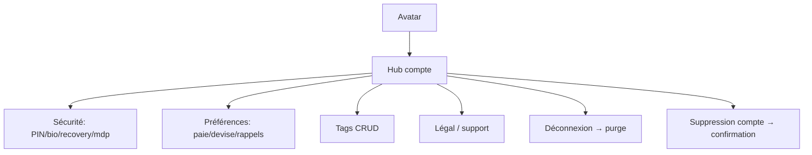

# Instruction: Compte & réglages

Hub compte (sheet depuis l'avatar), miroir d'`ios/Pulpe/Features/Account/` : profil, sécurité (PIN, biométrie, clé de récupération, mot de passe), préférences (jour de paie, devise, rappels), tags, support/légal, déconnexion, suppression de compte, diagnostic.

## Architecture projection

```txt
android/app/(main)/settings/
├── _layout.tsx                       ✅ stack settings
├── index.tsx                         ✅ hub : profil, Sécurité, Préférences, Tags, support, légal, version
├── security.tsx                      ✅ PIN, biométrie, recovery key, mot de passe
├── change-password.tsx               ✅ + confirm sheet, critères mdp
├── preferences.tsx                   ✅ jour de paie (1–31), devise, rappels notifs
├── pay-day.tsx                       ✅ picker
├── currency.tsx                      ✅ sélection + taux affiché (GET /currency/rate)
├── tags.tsx                          ✅ CRUD tags perso
└── legal/                            ✅ CGU + confidentialité (contenu servi ou webview miroir iOS)
android/src/features/account/
├── account-queries.ts                ✅ GET/PATCH /users/me, /users/settings, /tags CRUD, DELETE /users/account
└── components/                       ✅ SettingsRow, SettingsSection, avatar
```

## User Journey



## Tasks to do

### `1)` Hub + profil

1. Sheet/page hub : liste groupée miroir iOS, avatar, version app en bas, alerte déconnexion (purge session + caches, miroir `SessionReset`)
2. Profil : prénom/nom (`PATCH /users/me` ou `/users/profile` selon contrat), affichage email

### `2)` Sécurité

1. Écrans sécurité : changement PIN (réutilise flux phase 3), toggle biométrie (enrôlement/opt-out miroir iOS), affichage + vérification clé de récupération, régénération
2. Changement mot de passe : sheets + critères (miroir `ChangePasswordSheet`), `supabase.auth.update`

### `3)` Préférences + tags

1. Jour de paie (picker 1–31) et devise (`PUT /users/settings`) → impact immédiat périodes (shared) et formatage
2. Rappels notifications : toggles persistés (branchement effectif des notifications locales en phase 12)
3. Tags : CRUD complet (`/tags`), opt-out données de diagnostic (PostHog)
4. Suppression de compte : flow de confirmation → `DELETE /users/account` → purge + retour auth

## Test acceptance criteria

| Task | Acceptance criteria                                                                                                 |
| ---- | ------------------------------------------------------------------------------------------------------------------- |
| 1    | Changer le jour de paie recalcule les périodes partout (Accueil, Budgets) et persiste au reboot                      |
| 2    | Changement de PIN : ancien PIN invalide immédiatement, nouvelle recovery key affichée, données toujours lisibles     |
| 3    | Tags créés sur Android visibles sur web/iOS ; déconnexion purge toute donnée sensible (SecureStore, MMKV, caches)    |
| 4    | Suppression de compte : confirmation explicite, compte supprimé côté backend, retour écran login                     |
