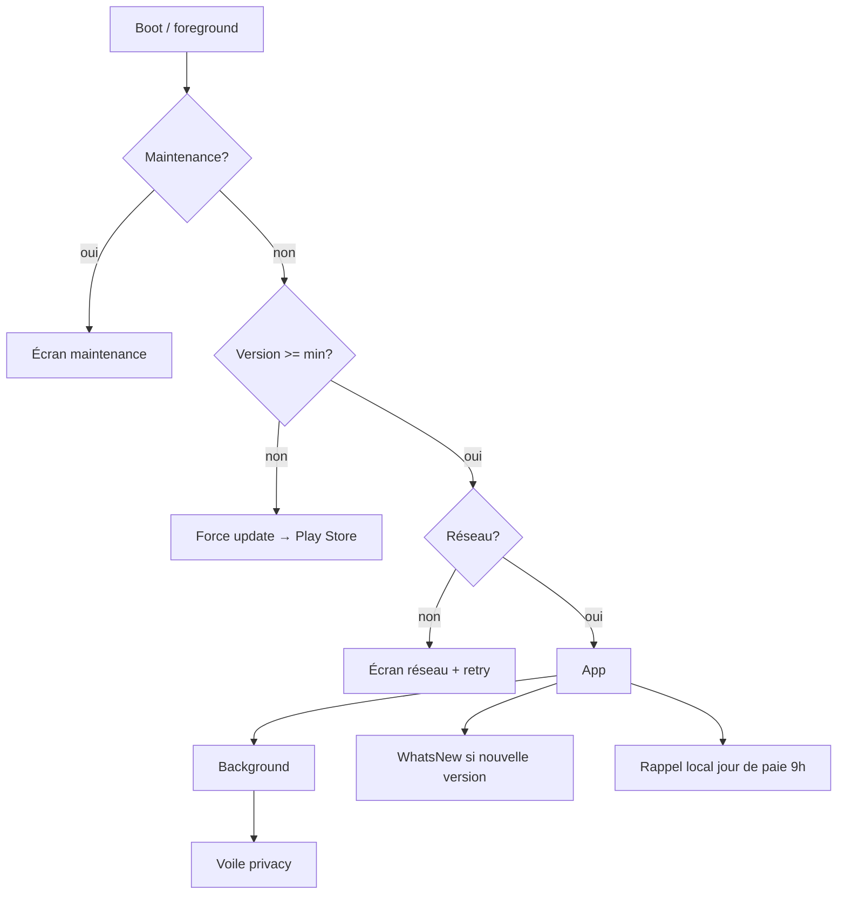

# Instruction: Système & polish transverse

Tout ce qui entoure l'app : écrans bloquants (maintenance, force update, réseau), voile de confidentialité, notifications locales, deep links, WhatsNew, tooltips, masquage des montants. Miroir des mécanismes transverses iOS.

## Architecture projection

```txt
android/
├── app/
│   ├── maintenance.tsx                 ✅ écran bloquant + Lottie
│   ├── force-update.tsx                ✅ version min → CTA Play Store
│   └── network-unavailable.tsx         ✅ retry / se déconnecter
├── src/core/
│   ├── system/
│   │   ├── app-version-gate.ts         ✅ GET /app/version au boot + foreground, fail-open, timeout 3s
│   │   ├── privacy-shield.tsx          ✅ voile au background (blur/FLAG_SECURE)
│   │   └── whats-new.tsx               ✅ sheet nouveautés (GET /whats-new/android)
│   ├── notifications/
│   │   ├── scheduler.ts                ✅ expo-notifications : rappel mensuel jour de paie 9h (clamp 28), réarmé au foreground
│   │   └── priming.ts                  ✅ pré-permission contextuelle (branchée phase 5), permission Android 13+
│   ├── linking/deep-links.ts           ✅ pulpe://add-expense, pulpe://budget?id=, App Link reset-password
│   └── tips/tooltip.tsx                ✅ tooltips maison (4 tips miroir TipKit), une fois chacun (MMKV)
└── src/features/settings/amounts-hidden.ts ✅ pref montants masqués globale (AmountText la respecte déjà)
```

## User Journey



## Tasks to do

### `1)` Gates système

1. Écrans bloquants finalisés (branchés depuis phase 2) : maintenance (Lottie), force-update (lien Play Store depuis `storeUrl` android), réseau indisponible (retry, se déconnecter) ; refresh fail-open conservateur — ne jamais déconnecter sur erreur réseau (miroir iOS)
2. Recheck au retour foreground (app-state listener)

### `2)` Privacy + WhatsNew + tooltips

1. Voile de confidentialité quand l'app passe au background (switcher d'apps)
2. `WhatsNewSheet` : `GET /whats-new/android?currentVersion&lastSeenVersion`, affichée une fois par version
3. Tooltips maison : gestes, pointage, pointage pessimiste, parité web templates — chacun une fois (flags MMKV), miroir des 4 TipKit iOS
4. Pref globale montants masqués : toggle + propagation (AmountText)

### `3)` Notifications locales + deep links

1. `scheduler.ts` : rappel mensuel "Nouveau mois" au jour de paie 9h (clampé au 28), réarmé à chaque foreground ; permission runtime Android 13+ après priming (phase 5)
2. Deep links : scheme `pulpe://` (`add-expense?budgetId=`, `budget?id=`) + App Link `https://app.pulpe.app/reset-password` (vérification assetlinks.json à publier côté web/landing) ; routage différé selon état auth

## Test acceptance criteria

| Task | Acceptance criteria                                                                                                       |
| ---- | ------------------------------------------------------------------------------------------------------------------------- |
| 1    | Maintenance ON → écran bloquant sur toutes les routes ; version < min → force update ; coupure réseau → écran dédié sans déconnexion |
| 2    | App au background → voile visible dans le switcher ; WhatsNew apparaît une fois après montée de version                    |
| 3    | Rappel local reçu au jour de paie à 9h (testé sur date simulée) ; `pulpe://budget?id=X` ouvre le bon budget, connecté ou différé après login |
| 4    | Chaque tooltip ne s'affiche qu'une fois ; activer "masquer les montants" remplace tous les montants par des •••              |
