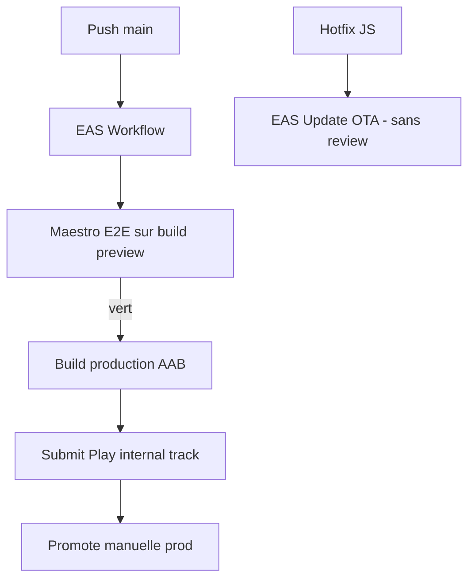

# Instruction: Release (Maestro, EAS, Play Store)

Industrialisation et mise en production : E2E des parcours critiques, pipelines EAS, signing Play Store, listing, et stratégie OTA. Référence stack : EAS Build/Update/Workflows + Maestro.

## Architecture projection

```txt
android/
├── maestro/
│   ├── onboarding.yaml                 ✅ parcours 1 : onboarding complet → budget créé
│   ├── login-vault.yaml                ✅ parcours 2 : login → unlock PIN → accueil
│   └── check-operation.yaml            ✅ parcours 3 : pointer une opération + undo
├── eas.json                            ✏️ profils finalisés (production AAB, auto-increment)
├── .eas/workflows/
│   ├── deploy-preview.yaml             ✅ push branche → build preview
│   └── deploy-production.yaml          ✅ push main → build + submit Play internal track
├── assets/                             ✅ icône adaptive, splash, feature graphic sources
└── docs-android/RELEASE.md             ✅ runbook : keystore, tracks, OTA, rollback
```

## User Journey



## Tasks to do

### `1)` E2E Maestro

1. 3 scénarios YAML : onboarding (création compte de test → budget), login+vault, pointage+undo — les parcours qui ne doivent jamais casser
2. Exécution en CI sur build preview (émulateur EAS ou runner local)

### `2)` Pipeline EAS

1. `eas.json` final : production = AAB, `autoIncrement` versionCode, channel OTA par profil
2. Workflows : preview sur PR/push branche, production sur main avec submit Play internal
3. Signing : credentials gérés par EAS (keystore distant), documenté dans RELEASE.md
4. Stratégie OTA : quels changements partent en EAS Update vs nouveau binaire (règles runtime version)

### `3)` Play Store

1. Console : fiche app (titre, descriptions FR, catégorie Finance), icône adaptive, feature graphic, screenshots (depuis Maestro ou captures device)
2. Data safety / privacy declarations, target SDK courant, app bundle signé
3. Closed track interne → tests réels → promote production
4. Brancher `storeUrl` android (phase 3) sur la fiche publiée ; vérifier assetlinks.json pour les App Links (phase 12)

## Test acceptance criteria

| Task | Acceptance criteria                                                                                          |
| ---- | ------------------------------------------------------------------------------------------------------------ |
| 1    | Les 3 scénarios Maestro passent en CI sur chaque build preview                                                |
| 2    | Un push sur main produit un AAB soumis automatiquement au track interne, sans intervention locale             |
| 3    | Un fix JS-only est livré en OTA aux utilisateurs sans passer par la review Play                               |
| 4    | L'app est installable depuis le Play Store (track interne) sur un device réel ; force-update pointe vers la fiche |
