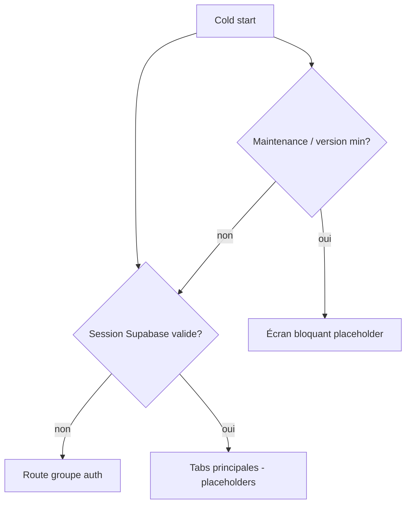

# Instruction: Core transverse (API client, session, design system)

Toute la plomberie partagée avant le premier écran métier : client HTTP validé Zod (miroir d'`APIClient.swift` et du `ApiClient` Angular), session Supabase persistée, thème Pulpe (tokens DESIGN.md), navigation par onglets, toasts, haptics, analytics, erreurs.

## Architecture projection

```txt
android/
├── app/
│   ├── _layout.tsx                    ✏️ bootstrap : session, maintenance/force-update gates, QueryClientProvider
│   ├── (auth)/                        ✅ groupe routes publiques (login en phase 3)
│   └── (main)/
│       ├── _layout.tsx                ✅ Tabs : Accueil, Budgets, Objectifs, Modèles (+ placeholders)
│       ├── index.tsx                  ✅ Accueil placeholder
│       ├── budgets.tsx                ✅ placeholder
│       ├── goals.tsx                  ✅ placeholder
│       └── templates.tsx              ✅ placeholder
├── src/
│   ├── core/
│   │   ├── api/
│   │   │   ├── api-client.ts          ✅ fetch + Zod req/res (schemas shared), retry GET transitoires, X-Request-Id, X-Client-Key (stub phase 3), erreurs normalisées FR
│   │   │   ├── endpoints.ts           ✅ constantes de paths /api/v1 (miroir Endpoint iOS)
│   │   │   └── api-client.spec.ts     ✅
│   │   ├── auth/
│   │   │   ├── supabase.ts            ✅ client supabase-js, adapter expo-secure-store, autoRefresh
│   │   │   ├── session-store.ts       ✅ Zustand : session, user, état auth (machine : loading/unauthenticated/authenticated/locked)
│   │   │   └── auth-listener.ts       ✅ onAuthStateChange → store, sign-out global
│   │   ├── analytics/
│   │   │   └── posthog.ts             ✅ init EU host, opt-out, events typés depuis shared (ANALYTICS_EVENTS)
│   │   ├── ui/
│   │   │   ├── theme.ts               ✅ tokens DESIGN.md (couleurs, spacing, radius, typo) en thème RN
│   │   │   ├── toast.tsx              ✅ ToastManager global + undo (overlay)
│   │   │   ├── haptics.ts             ✅ wrapper expo-haptics (success/warning/selection)
│   │   │   └── components/            ✅ Button, Card, Sheet (gorhom/bottom-sheet), Numpad, AmountText, ListRow, EmptyState, Skeleton
│   │   ├── storage/mmkv.ts            ✅ instance MMKV (flags, prefs UI)
│   │   └── config/env.ts              ✅ URLs API/Supabase par profil EAS (dev/preview/prod)
│   └── domain/
│       ├── queries/                   ✅ hooks TanStack Query par domaine (useBudgets, useBudgetDetails…) — wrappers, écrans en phases suivantes
│       └── formatters.ts              ✅ date/montant via shared currency
├── docs-android/DATA_LAYER.md         ✅ conventions Query/Zustand (clés de cache, invalidation)
└── tests/                             ✅ helpers jest (render avec providers)
```

## User Journey



## Wireframe

```txt
┌─────────────────────────┐
│  (contenu de l'onglet)  │  1
│                         │
│                         │
├─────────────────────────┤
│  🏠     📊     🎯    📋 │  2
│ Accueil Budgets Obj. Mod│
└─────────────────────────┘
1. Zone écran courant (placeholder en phase 2)
2. Tab bar 4 entrées, icône + label FR, état actif — miroir MainTabView iOS
```

## Tasks to do

### `1)` API client typé

> Miroir fonctionnel d'`APIClient.swift` : Zod partout, erreurs FR, headers.

1. `api-client.ts` : wrapper fetch ; validation réponse par schema `pulpe-shared`, validation body à l'envoi
2. Retry backoff uniquement GET sur 0/5xx/408/429 (miroir web)
3. Normalisation erreurs → messages FR (s'inspirer de `normalizeApiError` frontend)
4. Injection `Authorization: Bearer` depuis session-store ; header `X-Client-Key` via provider injectable (stub tant que phase 3 non faite) ; `X-Request-Id` par requête
5. `endpoints.ts` exhaustif (budgets, budget-lines, transactions, templates, savings-goals, tags, users, encryption, currency, app/version, whats-new) sous `/api/v1`

### `2)` Session Supabase

> Auth persistée, reboot-safe, sign-out propre.

1. Client supabase-js + adapter `expo-secure-store` (fallback MMKV en dev)
2. `session-store` Zustand : états `loading | unauthenticated | authenticated` (+ `locked` anticipé phase 3), expiration/refresh
3. Listener `onAuthStateChange` → navigation par groupes de routes Expo Router (`(auth)` vs `(main)`), reset des caches à la déconnexion (miroir `AppState+SessionReset`)
4. `GET /auth/validate` au bootstrap pour confirmer la session côté backend

### `3)` Design system + composants de base

> Le thème Pulpe en RN, composants réutilisables prêts pour les features.

1. `theme.ts` : tokens depuis `DESIGN.md` (couleurs, échelle typo, espacements, rayons) + dark mode si spécifié dans DESIGN.md
2. Composants : Button (variantes), Card, ListRow, Sheet (bottom-sheet), Numpad, AmountText (respecte la pref montants masqués), EmptyState, Skeleton, Toast + undo, wrappers haptics
3. Screens tracked : helper `useTrackScreen` PostHog (miroir modifier `trackScreen`)

### `4)` Navigation + gates de bootstrap

> Tabs 4 entrées + squelette des écrans bloquants.

1. Expo Router : groupes `(auth)` / `(main)`, Tabs avec labels FR (Accueil, Budgets, Objectifs, Modèles), tracking analytics du switch d'onglet
2. Bootstrap dans `_layout.tsx` : splash/loading, check `GET /app/version` (fail-open, timeout 3s) et maintenance/status, routage vers placeholders bloquants
3. `docs-android/DATA_LAYER.md` : conventions clés TanStack Query + invalidation (alignées sur les invalidations croisées des stores iOS) ; **règle : toute query de données est `enabled: false` tant que le coffre n'est pas déverrouillé** (la clé client est injectée par le provider de l'API client — une query qui part avant l'unlock partirait sans `X-Client-Key`)

## Test acceptance criteria

| Task | Acceptance criteria                                                                                          |
| ---- | ------------------------------------------------------------------------------------------------------------ |
| 1    | Un appel `GET /budgets` avec token valide retourne des données validées Zod ; un payload invalide lève une erreur typée ; un 401 déclenche le flux unauthenticated |
| 2    | Fermer/rouvrir l'app conserve la session ; « Se déconnecter » purge caches + renvoie vers `(auth)`           |
| 3    | Les composants rendent avec les tokens Pulpe ; toasts avec undo fonctionnels ; haptics sur actions clés      |
| 4    | La tab bar affiche les 4 entrées FR ; couper le réseau au boot affiche l'écran dédié ; version < min redirige vers le placeholder force-update |
