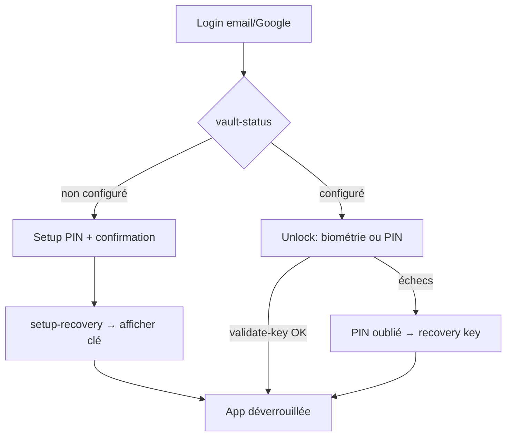

# Instruction: Auth & coffre (login, PIN, biométrie, recovery)

Tout le flux d'accès : login email + Google, mot de passe oublié, et le coffre (PIN 4 chiffres → PBKDF2 → `X-Client-Key`) avec biométrie et clé de récupération. Inclut le petit chantier backend/shared pour `app/version` et `whats-new` Android. Références : `ios/Pulpe/Features/Auth/`, `frontend/.../feature/auth/` + `core/encryption/`.

## Architecture projection

```txt
android/
├── app/
│   ├── (auth)/
│   │   ├── login.tsx                  ✅ email + Google, sheet mot de passe oublié
│   │   ├── forgot-password.tsx        ✅ resetPasswordForEmail (redirect app.pulpe.app/reset-password)
│   │   ├── reset-password.tsx         ✅ universal link, différé selon état auth
│   │   ├── vault-setup.tsx            ✅ création PIN (numpad, confirmation, haptics)
│   │   ├── vault-unlock.tsx           ✅ saisie PIN + biométrie + "PIN oublié"
│   │   └── vault-recover.tsx          ✅ clé de récupération → nouveau PIN
│   └── (main)/settings/security/      ✅ changement PIN, biométrie toggle, clé de récupération (UI finale en phase 11)
├── src/
│   ├── core/
│   │   ├── crypto/
│   │   │   ├── pbkdf2.ts              ✅ react-native-quick-crypto, PBKDF2-SHA256 → 32 bytes hex (itérations via /encryption/salt)
│   │   │   ├── client-key-manager.ts  ✅ dérivation, expo-secure-store (slot standard + slot biométrique), purge logout
│   │   │   └── pbkdf2.spec.ts         ✅ vecteurs de test croisés avec crypto.utils.ts web
│   │   ├── auth/
│   │   │   ├── google-sign-in.ts      ✅ ID token → supabase.auth.signInWithIdToken
│   │   │   └── biometric.ts           ✅ expo-local-authentication (opt-out, fallback PIN)
│   │   └── vault/
│   │       ├── vault-store.ts         ✅ état coffre : unknown/setupRequired/locked/unlocked (GET /encryption/vault-status)
│   │       └── vault-api.ts           ✅ validate-key, setup-recovery, recover, change-pin, regenerate, verify
shared/
│   └── schemas.ts                     ✏️ appVersionResponseSchema += clé android ; whatsNew platform android
backend-nest/
│   └── src/modules/app-version/ + whats-new/  ✏️ bloc android (env vars MIN_ANDROID_VERSION…, storeUrl Play)
└── .github/ + docs                    ✏️ variables d'env documentées
```

## User Journey



## Tasks to do

### `1)` Crypto client (PBKDF2)

> Dérivation bit-compatible avec le web (`crypto.utils.ts`).

1. Installer `react-native-quick-crypto` + son config plugin Expo, `expo prebuild` (dev build requis) ; implémenter `pbkdf2(pin, salt, iterations)` → hex 64 chars via `pbkdf2()` ou `subtle.deriveBits` (API vérifiée, JSI). Paramètres exacts relevés dans `frontend/.../crypto.utils.ts` : mot de passe UTF-8, salt hex→bytes, SHA-256, 256 bits, sortie hex
2. Tests avec ces vecteurs (générés via Node/OpenSSL, identiques au Web Crypto du web) :
   - `pin=1234, salt=a1b2...a1b2, iter=100000 → 04b547b25c6ad69f720443670ab3f4c60a33072bda08599d2ce0d1518264a679`
   - `pin=0000, salt=a1b2...a1b2, iter=600000 → c96738534dbbc4980d5f716b2e6ec70f069cd3abf3de361abb46949eeee92f32`
   - `pin=9876, salt=a1b2...a1b2, iter=100000 → 3ac2a9c66f5ecda1fa3723a55c152d894bb77492080ecbc6dd28c3fa1b7a863c`
   (salt complet : `a1b2c3d4e5f6a1b2c3d4e5f6a1b2c3d4e5f6a1b2c3d4e5f6a1b2c3d4e5f6a1b2`)
3. `ClientKeyManager` : stockage SecureStore, slot biométrique, invalidation sur 401 clé / `clientKeyCheckFailed`, purge au logout

### `2)` Flux coffre complet

> Setup, unlock, recovery, change PIN — miroir iOS/web.

1. `vault-store` : bootstrap via `GET /encryption/vault-status` ; branchement dans le routeur (gate après auth, avant `(main)` — miroir `encryptionSetupGuard`)
2. Écrans setup/unlock/recover : numpad custom, dots, haptics, gestion session expirée pendant recovery (miroir `PinRecoveryView`)
3. Unlock : biométrie d'abord si enrôlée, sinon PIN ; `POST /encryption/validate-key` avant de lâcher l'utilisateur (rate-limit 5/min géré en UX)
4. Sheets clé de récupération : consentement → `setup-recovery` → affichage base32 groupé + copie ; vérification `verify-recovery-key`
5. Changement PIN : `change-pin` (old+new clientKey) → nouvelle recovery key affichée

### `3)` Login + reset password

1. `login.tsx` : email/mot de passe + bouton Google (`signInWithIdToken`), validation de formulaire (schemas shared auth)
2. Sheet mot de passe oublié + flow reset via App Link `https://app.pulpe.app/reset-password` (intent-filter, routage différé selon état auth — miroir `ResetPasswordFlowView`)
3. Copy FR + consentement CGU/confidentialité là où l'iOS l'affiche

### `4)` Backend/shared : app-version & whats-new Android

> Débloque force-update et nouveautés pour la plateforme.

1. `shared/schemas.ts` : `appVersionResponseSchema` += `android: { minVersion, latestVersion, storeUrl }` ; régénérer types backend (`generate-types:local` si schéma DB touché, sinon N/A)
2. Backend : `buildAppVersionResponse` += bloc android depuis env (`MIN_ANDROID_VERSION`, `LATEST_ANDROID_VERSION`, Play store URL) ; endpoint `GET /whats-new/android` (ou param platform) miroir de `/whats-new/ios`
3. Tests backend + web non régressés (schéma étendu, clé optionnelle côté clients existants si nécessaire)

## Test acceptance criteria

| Task | Acceptance criteria                                                                                                          |
| ---- | ---------------------------------------------------------------------------------------------------------------------------- |
| 1    | Même PIN + salt + itérations → même clientKey que le web (test automatisé) ; clé absente du stockage après logout            |
| 2    | Parcours complet : compte sans coffre → setup PIN → recovery key → relock → unlock biométrie ; mauvais PIN → erreur FR ; recovery key → nouveau PIN |
| 3    | Login Google crée une session ; le lien reset-password ouvre l'app sur le bon écran, connecté ou non                          |
| 4    | `GET /app/version` retourne le bloc `android` ; `GET /whats-new/android` répond ; CI backend/web verte                        |
