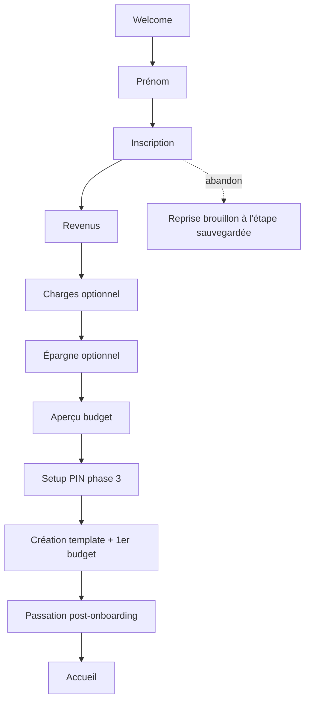

# Instruction: Onboarding (7 étapes) + passation

Flow premier lancement miroir d'`ios/Pulpe/Features/Onboarding/` : welcome → prénom → inscription → revenus → charges (optionnel) → épargne (optionnel) → aperçu budget, puis écran de passation post-onboarding. Navigation par boutons uniquement (pas de swipe), transitions animées, persistance du brouillon.

## Architecture projection

```txt
android/
├── app/
│   └── (onboarding)/
│       ├── _layout.tsx               ✅ stack + garde "déjà onboardé" + reprise de brouillon
│       ├── welcome.tsx               ✅ Lottie + CTA
│       ├── first-name.tsx            ✅
│       ├── registration.tsx          ✅ email + Google + consentement CGU
│       ├── income.tsx                ✅ montant + suggestions
│       ├── charges.tsx               ✅ grille suggestions + ajout custom + liste éditable
│       ├── savings.tsx               ✅
│       └── budget-preview.tsx        ✅ hero + barres de flux → déclenche vault setup (phase 3)
├── app/(main)/post-onboarding.tsx    ✅ passation rituel "pointer" (affichée une fois)
└── src/features/onboarding/
    ├── onboarding-store.ts           ✅ Zustand : étape courante, draft (MMKV), suggestions, total courant
    ├── suggestions.ts                ✅ grilles de suggestions (miroir iOS)
    ├── api.ts                        ✅ POST /budget-templates/from-onboarding + POST /budgets/generate
    └── components/                   ✅ StepScaffold, AmountInput, SuggestionGrid, ProgressDots
```

## User Journey



## Wireframe

```txt
┌─────────────────────────┐
│  ● ○ ○ ○ ○ ○ ○          │  1
│                         │
│  Titre de l'étape       │  2
│  [champ / grille]       │  3
│                         │
│  Total: 3'200 CHF       │  4
│                         │
│  ┌───────────────────┐  │
│  │     Continuer     │  │  5
│  └───────────────────┘  │
└─────────────────────────┘
1. Progression 7 dots (pas de swipe, boutons only)
2. Titre + sous-titre FR de l'étape
3. Contenu variable (champ montant / grille suggestions / form inscription)
4. Total courant (étapes charges/épargne) — miroir iOS
5. CTA principal + lien "Passer" sur étapes optionnelles
```

## Tasks to do

### `1)` Machine du flow + brouillon

1. `onboarding-store` : étapes ordonnées, draft persisté MMKV (reprise à l'étape sauvegardée pour email, reset pour social — miroir iOS), skip des étapes optionnelles
2. `StepScaffold` : dots de progression, transitions Reanimated entre étapes, haptics, CTA état (disabled tant que saisie invalide)

### `2)` Les 7 écrans

1. Welcome : animation Lottie (réutiliser l'asset iOS si exportable, sinon équivalent), CTA
2. Prénom : champ texte, validation
3. Inscription : email + Google (phase 3) + cases consentement CGU/confidentialité ; validation mot de passe miroir
4. Revenus : `AmountInput` + suggestions
5. Charges : `SuggestionGrid` + `AddCustomExpenseSheet` + liste éditable (suppression), total courant
6. Épargne : montant mensuel
7. Aperçu : hero "Disponible à dépenser" + barres de flux calculées via `BudgetFormulas` (shared), pas de calcul local dupliqué

### `3)` Création backend + passation

1. À la validation de l'aperçu : setup PIN (route phase 3) → `POST /budget-templates/from-onboarding` → `POST /budgets/generate` (miroir iOS)
2. Écran de passation post-onboarding (rituel "pointer"), affiché une seule fois (flag MMKV)
3. Flag `hasCompletedOnboarding` → le bootstrap ne repropose plus le flow

## Test acceptance criteria

| Task | Acceptance criteria                                                                                                  |
| ---- | -------------------------------------------------------------------------------------------------------------------- |
| 1    | Tuer l'app à l'étape charges puis relancer → reprise à cette étape avec les données saisies                          |
| 2    | Étapes optionnelles passables ; swipe arrière impossible ; CTA désactivé si saisie invalide                          |
| 3    | Fin de flow → template + budget créés côté backend, visibles sur la webapp avec les mêmes montants                   |
| 4    | La passation s'affiche une seule fois ; un utilisateur déjà onboardé n'entre jamais dans le flow                     |
