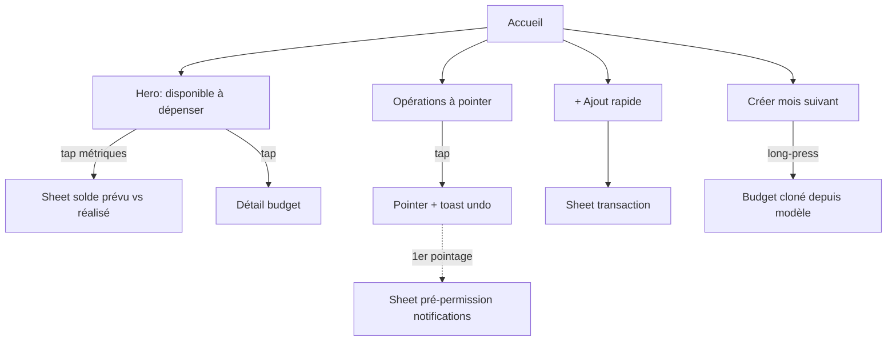

# Instruction: Accueil (dashboard du mois)

Onglet Accueil, miroir d'`ios/Pulpe/Features/CurrentMonth/` : hero "Disponible à dépenser" avec trajectoire, opérations à pointer, dérive, épargne versée, activité récente, ajout rapide de transaction, création du budget du mois suivant.

## Architecture projection

```txt
android/
├── app/(main)/
│   ├── index.tsx                       ✏️ vrai dashboard (remplace placeholder)
│   └── budget/create-next.tsx          ✅ création mois suivant depuis modèle (long-press confirmation)
└── src/features/current-month/
    ├── components/
    │   ├── home-hero-card.tsx          ✅ disponible + trajectoire de solde (chart)
    │   ├── unchecked-operations.tsx    ✅ à pointer : tap = pointer + toast undo
    │   ├── drift-card.tsx              ✅ "Ça dérive"
    │   ├── savings-done-card.tsx       ✅ mois complet → CTA objectifs
    │   ├── activity-card.tsx           ✅ transactions récentes (fenêtre 7j/mois), swipe actions
    │   ├── add-transaction-sheet.tsx   ✅ montant, tags, date
    │   ├── realized-balance-sheet.tsx  ✅ prévu vs réalisé
    │   ├── linked-transactions-sheet.tsx ✅ transactions liées à une prévision
    │   └── notification-prime-sheet.tsx ✅ pré-permission notifs (une fois, après 1er pointage)
    ├── current-month-queries.ts        ✅ TanStack Query : budget courant, détails, transactions
    └── current-month-view-model.ts     ✅ sélecteurs (miroir logique CurrentMonth iOS, calculs via shared)
```

## User Journey



## Wireframe

```txt
┌─────────────────────────┐
│ Bonjour Maxime      (◉) │  1
│ ┌─────────────────────┐ │
│ │ Disponible          │ │
│ │ 1'240 CHF  ╱╲ chart │ │  2
│ └─────────────────────┘ │
│ ┌─────────────────────┐ │
│ │ À pointer (3)     > │ │  3
│ └─────────────────────┘ │
│ ┌──────────┐┌─────────┐ │
│ │ Ça dérive││ Épargne │ │  4
│ └──────────┘└─────────┘ │
│ Activité récente        │  5
│ ─ Ligne transaction     │
│ ─ Ligne transaction     │
└─────────────────────────┘
1. Salutation + avatar (ouvre Compte, phase 11)
2. Hero : montant, trajectoire (tap → sheet solde ; tap carte → budget)
3. Opérations à pointer (tap = pointage + undo)
4. Cartes contextuelles : dérive / épargne versée (affichage conditionnel miroir iOS)
5. Activité 7j, swipe actions, "tout voir"
```

## Tasks to do

### `1)` Data + view model

1. Queries : budget de la période courante (`getBudgetPeriodForDate` shared), `/budgets/:id/details`, transactions du budget
2. View model : disponible, trajectoire (`BalanceTrajectory` shared), dérive, état épargne — **aucun calcul dupliqué**, tout via `shared/src/calculators/`
3. Pull-to-refresh + invalidation croisée après mutations (conventions phase 2)

### `2)` Les cartes

1. Hero + chart de trajectoire (victory-native XL — D3+Skia+Reanimated, vérifié maintenu), tap métriques → `RealizedBalanceSheet`, tap carte → détail budget
2. Opérations à pointer : pointage optimiste (`toggle-check`) + toast undo, haptics ; Tip "pointage" (tooltip maison, une fois)
3. DriftCard, SavingsDoneCard : règles d'affichage miroir iOS
4. ActivityCard : fenêtre 7j/mois, swipe actions (éditer/supprimer), "tout voir" → budget

### `3)` Actions

1. `AddTransactionSheet` : formulaire validé Zod (schemas shared), tags, date, conversion devise si prévu par l'iOS
2. `LinkedTransactionsSheet` : swipe actions
3. Création mois suivant : sélection modèle + long-press de confirmation (miroir `CreateBudgetView`), navigation vers le nouveau budget
4. `NotificationPrimeSheet` : après 1er pointage, une fois (flag MMKV)

## Test acceptance criteria

| Task | Acceptance criteria                                                                                              |
| ---- | ---------------------------------------------------------------------------------------------------------------- |
| 1    | Les montants affichés correspondent au centime à l'iOS/web pour le même compte (calculs shared)                   |
| 2    | Pointer une opération met à jour le hero immédiatement (optimiste) ; undo annule ; pull-to-refresh resynchronise |
| 3    | Ajouter une transaction la fait apparaître dans Activité et dans le détail budget web                             |
| 4    | Long-press crée le budget du mois suivant depuis le modèle choisi ; la sheet notifs n'apparaît qu'une fois        |
