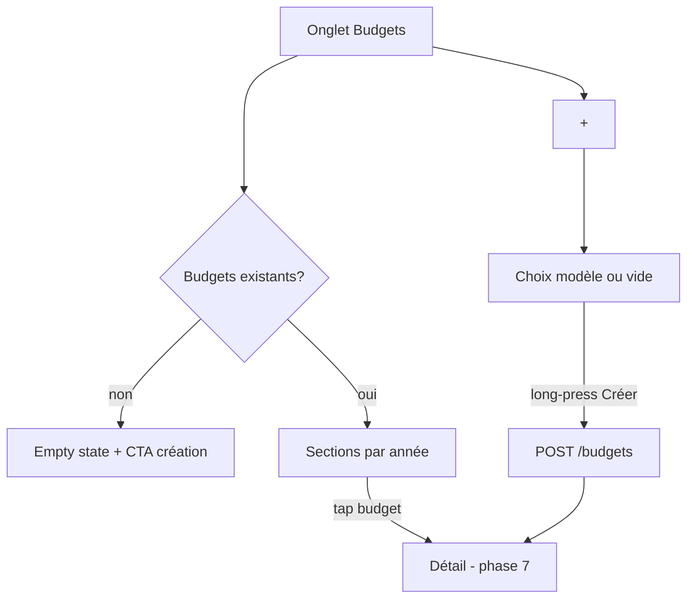

# Instruction: Budgets — liste & création

Onglet Budgets : liste des budgets groupés par année (données sparse), création depuis modèle ou vide. Miroir d'`ios/Pulpe/Features/Budgets/BudgetList/`.

## Architecture projection

```txt
android/
├── app/(main)/
│   ├── budgets.tsx                     ✏️ vraie liste (remplace placeholder)
│   └── budget/
│       └── create.tsx                  ✅ création : choix modèle ou vide, long-press
└── src/features/budgets/
    ├── budget-list.tsx                 ✅ sections par année, cartes budget, skeleton, empty state + CTA
    ├── budget-card.tsx                 ✅ mois, solde/état, période (getBudgetPeriodDates shared)
    ├── create-budget-form.tsx          ✅ sélection modèle (usage via /budget-templates), période
    └── budget-queries.ts               ✅ GET /budgets?fields=&limit=&year= (sparse), POST /budgets
```

## User Journey



## Tasks to do

### `1)` Liste

1. Query sparse (`fields/limit/year`) + pagination par année miroir iOS
2. Sections par année, `BudgetCard` (période calculée via shared `getBudgetPeriodDates`, jour de paie user), skeleton au chargement
3. Empty state avec CTA (miroir copy FR iOS)

### `2)` Création

1. `create.tsx` : liste des modèles (`GET /budget-templates`) + option budget vide, choix de la période cible
2. Long-press de confirmation (Gesture Handler + haptics, miroir iOS)
3. `POST /budgets` → invalidation liste + navigation vers le détail (phase 7)

## Test acceptance criteria

| Task | Acceptance criteria                                                                                    |
| ---- | ------------------------------------------------------------------------------------------------------ |
| 1    | La liste affiche les mêmes budgets, groupés à l'identique de l'iOS, avec les bonnes périodes de paie   |
| 2    | Créer un budget depuis un modèle le fait apparaître dans la liste et sur la webapp                     |
| 3    | Sans budget, l'empty state + CTA mène à la création ; le long-press exige un maintien (haptics)        |
