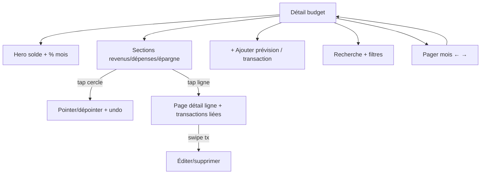

# Instruction: Budget détail — cœur

L'écran le plus dense de l'app (~40 % de l'effort UI iOS). Hero, sections revenus/dépenses/épargne, lignes prévision+réel, pointage, CRUD lignes et transactions, recherche, filtres, pager de mois. Miroir d'`ios/Pulpe/Features/Budgets/BudgetDetails/`. Spread et retrait d'épargne : phase 8.

## Architecture projection

```txt
android/
├── app/(main)/budget/
│   ├── [id].tsx                        ✅ détail : hero, sections, search, filtres, pager mois
│   └── [id]/line/[lineId].tsx          ✅ page détail prévision + transactions liées
└── src/features/budget-details/
    ├── budget-details-store.ts         ✅ Zustand : état écran (miroir Coordinator/Projector), cache LRU 6 mois
    ├── budget-details-queries.ts       ✅ GET /budgets/:id/details, mutations lignes/transactions
    ├── components/
    │   ├── budget-hero.tsx             ✅ solde, % mois écoulé (jour de paie), état émotionnel
    │   ├── budget-section.tsx          ✅ section par nature (revenu/dépense/épargne)
    │   ├── budget-line-row.tsx         ✅ prévu + réel agrégé + PointCircle
    │   ├── point-circle.tsx            ✅ tap = toggle-check, haptics, optimiste + undo
    │   ├── transaction-row.tsx         ✅ transactions libres, swipe actions
    │   ├── month-pager.tsx             ✅ barre mois préc/suiv, sticky révélée au scroll
    │   ├── search-bar.tsx              ✅ recherche + filtres type + pointé/à pointer
    │   ├── add-budget-line-sheet.tsx   ✅ récurrent/ponctuel, nature, origine revenu
    │   ├── edit-budget-line-sheet.tsx  ✅
    │   ├── add-transaction-page.tsx    ✅ transaction allouée à une ligne
    │   ├── edit-transaction-page.tsx   ✅
    │   ├── previous-budget-sheet.tsx   ✅ comparaison mois précédent
    │   └── delete-postpone-menu.tsx    ✅ suppression douce (undo toast) + report mois suivant
    └── view-models/
        ├── budget-details-vm.ts        ✅ sélecteurs : métriques via BudgetFormulas shared, regroupement lignes+transactions
        └── line-detail-vm.ts           ✅
```

## User Journey



## Wireframe

```txt
┌─────────────────────────┐
│ ← Janvier 2026      ⋮   │  1
│ ┌─────────────────────┐ │
│ │ Solde  82% du mois  │ │  2
│ └─────────────────────┘ │
│ 🔍 Rechercher  [filtres]│  3
│ Revenus                 │  4
│ ○ Salaire  4'500  4'500 │  5
│ Dépenses                │
│ ● Loyer    1'650  1'650 │
│ ○ Courses    600   412  │
│ Épargne                 │
│ ○ Vacances   300    300 │
├─────────────────────────┤
│ ← Nov.        Fév. →    │  6 (sticky au scroll)
└─────────────────────────┘
1. Titre mois + menu (comparaison, actions)
2. Hero : solde disponible + % période écoulée (jour de paie)
3. Recherche + filtres nature + pointé/à pointer
4. Sections par nature (Récurrent/Prévu/Réel mélangés, miroir BudgetLineMixedRow)
5. Ligne : cercle pointage, nom, prévu, réel
6. Pager de mois sticky révélé au scroll
```

## Tasks to do

### `1)` Store + queries

1. `budget-details-store` Zustand : état UI (filtres, recherche, mois affiché), orchestration mutations, cache LRU 6 entrées miroir `BudgetDetailCache`
2. Queries/mutations TanStack : `GET /budgets/:id/details`, toggle-check, CRUD lignes/transactions, postpone ; mises à jour optimistes + rollback
3. Invalidation croisée Accueil ↔ détail ↔ liste (conventions DATA_LAYER.md)

### `2)` Structure écran

1. `budget/[id].tsx` : hero, sections, liste mixte lignes+transactions libres, états skeleton/erreur/vide
2. Recherche + filtres (type, pointé/à pointer) miroir iOS
3. Pager de mois : navigation budget préc/suiv (résolution via périodes shared), barre sticky au scroll (Reanimated)
4. Hero : % du mois écoulé selon jour de paie, état émotionnel, tap chart icon → `RealizedBalanceSheet`

### `3)` Lignes & transactions

1. `PointCircle` : toggle-check optimiste, haptics, toast undo
2. Sheets add/edit ligne : récurrent/ponctuel, nature, origine revenu, validation Zod shared
3. Pages add/edit transaction (allouée ou libre) : montant, date, tags, source épargne
4. Menus contextuels : suppression douce (undo, file LIFO miroir MutationQueue), report au mois suivant (`postpone`)
5. `line/[lineId].tsx` : hero ligne, transactions liées (swipe actions), lien objectif d'épargne si rattachée
6. `PreviousBudgetSheet` : comparaison mois précédent

## Test acceptance criteria

| Task | Acceptance criteria                                                                                                          |
| ---- | ---------------------------------------------------------------------------------------------------------------------------- |
| 1    | Métriques (disponible, réalisé, solde) identiques au centime à l'iOS pour le même budget                                      |
| 2    | Pointage optimiste instantané, undo fonctionnel, état cohérent après refresh ; filtre "à pointer" conforme                    |
| 3    | CRUD lignes/transactions reflété sur webapp et iOS ; suppression douce annulable ; report déplace la ligne au mois suivant    |
| 4    | Pager mois sticky apparaît au scroll ; recherche filtre lignes ET transactions ; cache : revenir sur un mois récent est instantané |
