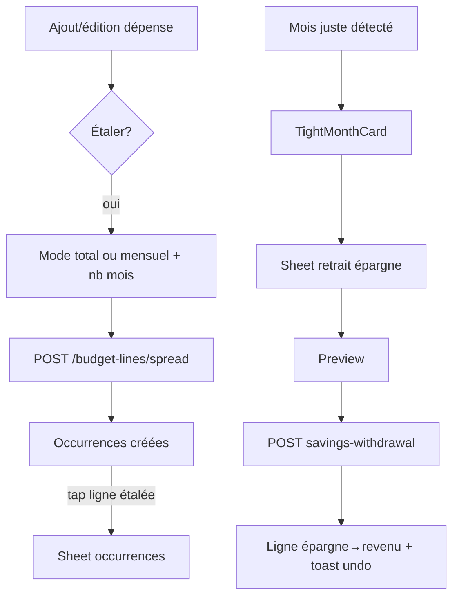

# Instruction: Budget détail — spread, retrait d'épargne, undo avancé

Les deux mécaniques complexes du détail budget : l'étalement d'une dépense sur plusieurs mois (miroir `BudgetDetails/Spread/`, règles `docs/SPREAD.md`) et le retrait d'épargne planifié (`SavingsWithdrawal/`, `docs/SAVINGS.md`). Plus la file de mutations undoable (miroir MutationQueue LIFO).

## Architecture projection

```txt
android/src/features/budget-details/
├── spread/
│   ├── spread-form-section.tsx         ✅ intégré à add/edit ligne : montant total ↔ mensuel, nb mois
│   ├── spread-month-picker-sheet.tsx   ✅ mois de départ / occurrences
│   ├── spread-occurrences-sheet.tsx    ✅ liste des occurrences (GET /budget-lines/spread/:groupId)
│   ├── spread-existing-sheet.tsx       ✅ étaler depuis une ligne existante (POST /budget-lines/:id/spread)
│   └── spread-vm.ts                    ✅ splitTotalPreserving (shared), progress (miroir SpreadProgress iOS)
├── savings-withdrawal/
│   ├── tight-month-card.tsx            ✅ "mois un peu juste", dismiss "Plus tard" (gate MMKV)
│   ├── savings-withdrawal-sheet.tsx    ✅ choix source (GET /savings-goals/withdrawal-options)
│   └── savings-withdrawal-preview.tsx  ✅ aperçu avant POST /budget-lines/savings-withdrawal
└── mutation-queue.ts                   ✅ file LIFO de mutations annulables (undo toast empilé)
```

## User Journey



## Tasks to do

### `1)` Spread

1. `spread-form-section` : toggle étalement, modes total/mensuel (bascule miroir iOS), picker nb mois ; calcul via `splitTotalPreserving` (shared — aucun split local)
2. `POST /budget-lines/spread` (création) et `POST /budget-lines/:id/spread` (depuis existant) avec sheets dédiées
3. `spread-occurrences-sheet` : occurrences du groupe, statut par occurrence (miroir `SpreadOccurrenceRow`), en-tête de progression
4. Affichage lignes étalées dans le détail : badge/tracker miroir `SpreadTrackerHeader`

### `2)` Retrait d'épargne

1. Détection "mois juste" miroir iOS (règle dans `docs/SAVINGS.md` / logique `TightMonthCard`) → carte dismissable, gate une fois par mois (MMKV)
2. Sheet : options `GET /savings-goals/withdrawal-options`, preview, `POST /budget-lines/savings-withdrawal` ; suppression `DELETE .../savings-withdrawal/:groupId?scope=`
3. Impact hero/sections immédiat (optimiste) + undo

### `3)` MutationQueue

1. `mutation-queue.ts` : file LIFO de mutations annulables (suppressions, reports, retraits) avec toasts undo empilés — miroir comportemental de la MutationQueue iOS
2. Exécution différée : la mutation part après la fenêtre d'undo, annulation = pas d'appel réseau (vérifier le comportement iOS et l'aligner)

## Test acceptance criteria

| Task | Acceptance criteria                                                                                                          |
| ---- | ---------------------------------------------------------------------------------------------------------------------------- |
| 1    | Étaler 1'000 CHF sur 3 mois produit des occurrences dont la somme = 1'000 au centime (splitTotalPreserving), visibles sur iOS/web |
| 2    | La sheet occurrences affiche le même statut que l'iOS pour le même groupe                                                    |
| 3    | Retrait d'épargne : preview exacte, ligne créée, objectif mis à jour côté web ; undo avant exécution = aucun appel réseau     |
| 4    | Plusieurs suppressions rapides empilent les toasts undo ; chaque undo restaure dans le bon ordre (LIFO)                       |
