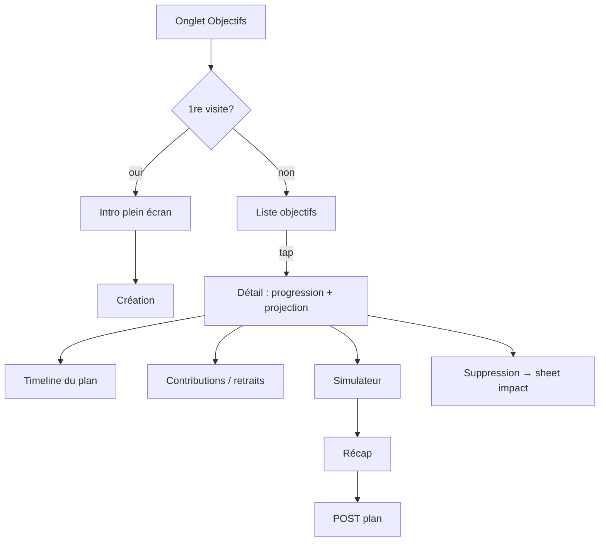

# Instruction: Objectifs d'épargne (+ simulateur)

Onglet Objectifs, miroir d'`ios/Pulpe/Features/SavingsGoals/` : liste, intro première visite, création/édition, détail avec projection et timeline du plan, contributions/retraits, simulateur de plan, suppression avec impact, arrêt de génération.

## Architecture projection

```txt
android/
├── app/(main)/
│   ├── goals.tsx                       ✏️ vraie liste + intro gate (remplace placeholder)
│   └── goal/
│       └── [id].tsx                    ✅ détail objectif
└── src/features/savings-goals/
    ├── goals-queries.ts                ✅ CRUD + progress/contributions/withdrawals/plan/future-lines/deletion-impact
    ├── components/
    │   ├── goals-intro.tsx             ✅ full screen 1re visite (flag MMKV) → enchaîne création
    │   ├── goal-form-sheet.tsx         ✅ nom, cible, échéance, mensuel, décomposition auto
    │   ├── goal-progress-card.tsx      ✅ progression (computeSavingsGoalProgress shared)
    │   ├── goal-projection-chart.tsx   ✅ victory-native XL
    │   ├── goal-plan-timeline.tsx      ✅ timeline du plan (buildSavingsGoalTimeline shared)
    │   ├── goal-contributions.tsx      ✅ historique + push vers budgets financés
    │   ├── goal-withdrawals.tsx        ✅
    │   ├── goal-deletion-sheet.tsx     ✅ impact (déliaison lignes) avant suppression
    │   ├── goal-generation-stop-sheet.tsx ✅
    │   └── simulator/
    │       ├── goal-plan-simulator-sheet.tsx  ✅ ajustement mensuel ligne par ligne
    │       └── goal-plan-apply-recap.tsx      ✅ récap → POST /savings-goals/:id/plan
    └── goals-vm.ts                     ✅ pace status, suggestions (shared)
```

## User Journey



## Tasks to do

### `1)` Liste + intro + formulaire

1. Liste + empty state ; `goals-intro` une fois (miroir `SavingsGoalsIntroGate`)
2. `goal-form-sheet` : décomposition auto montant mensuel (suggestedMonthlyContribution shared), validation Zod

### `2)` Détail

1. Progress card + projection chart (victory-native XL), pace status (shared)
2. Timeline du plan (`buildSavingsGoalTimeline` shared), lignes futures (`future-lines`)
3. Contributions/retraits : historique, navigation vers les budgets financés
4. Sheets suppression (avec `deletion-impact`) et arrêt de génération

### `3)` Simulateur

1. Sheet simulateur : édition des mensualités mois par mois (miroir `GoalPlanSimEditRow`), haptics
2. `simulateSavingsPlan` + `redistributeRemainingEffort` (shared) pour le recalcul live
3. Récap d'application → `POST /savings-goals/:id/plan`, retour détail rafraîchi

## Test acceptance criteria

| Task | Acceptance criteria                                                                                                    |
| ---- | ---------------------------------------------------------------------------------------------------------------------- |
| 1    | Création d'objectif visible sur web/iOS avec la même décomposition mensuelle                                            |
| 2    | Progression, projection et timeline identiques à l'iOS au centime/jour près (calculs shared)                            |
| 3    | Simulateur : l'application d'un plan modifie les lignes futures comme sur iOS ; suppression affiche l'impact exact      |
