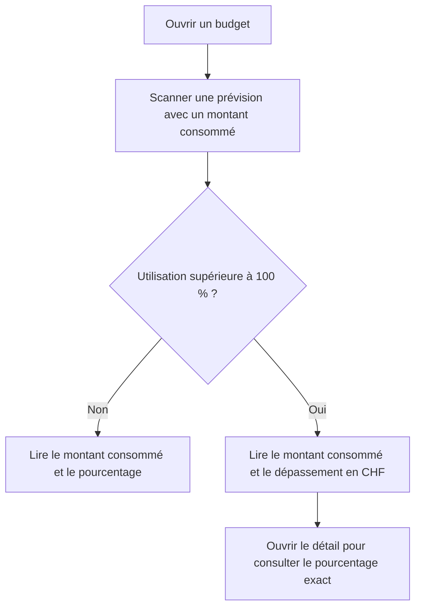
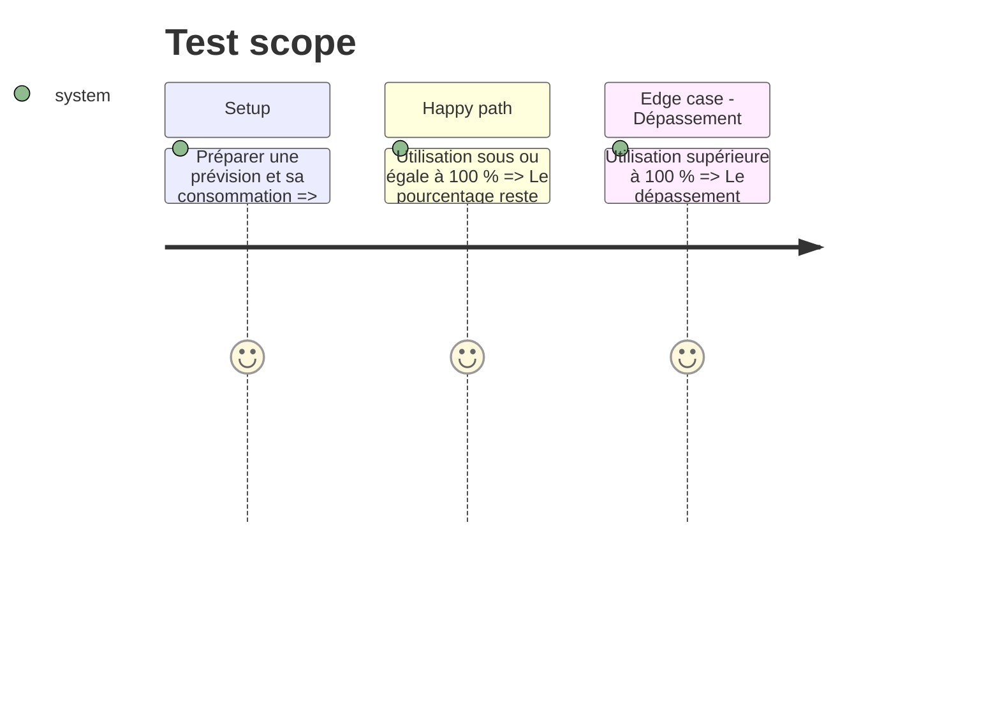

# Instruction: Aligner les résumés Web et iOS

## Architecture projection

> Tree of the final files. ✅ create · ✏️ modify · ❌ delete

```txt
.
├── frontend/projects/webapp/src/app/feature/budget/budget-details/components/budget-grid/
│   ├── ✏️ budget-grid-card.ts
│   ├── ✏️ budget-grid-mobile-card.ts
│   └── ✏️ budget-grid.spec.ts
└── ios/
    ├── Pulpe/Features/CurrentMonth/Components/
    │   └── ✏️ BudgetSection.swift
    └── PulpeTests/Features/Budgets/BudgetDetails/
        └── ✏️ BudgetLinePresentationTests.swift
```

## User Journey



## Test Scope



## Wireframe

```txt
┌──────────────────────────────────────────────┐
│ Nom de la prévision                          │
│ montant disponible                           │
│ ▰ ▰ ▰ ▰ ▰ ▰ ▰ ▰ ▰ ▰                          │
│ 343 CHF dépensés · Dépassé de 304 CHF        │
└──────────────────────────────────────────────┘
```

## Tasks to do

### `1)` Présentation Web

> Afficher le dépassement monétaire sur les cartes grille desktop et mobile.

1. Réutiliser la clé `budgetLine.exceededBy` et les montants de consommation existants.
2. Garder le pourcentage pour une utilisation inférieure ou égale à 100 %.
3. Ajouter une vérification ciblée des deux branches.

### `2)` Présentation iOS

> Appliquer la même règle à la ligne condensée du mois courant.

1. Centraliser le texte de consommation dans la vue existante.
2. Tester les seuils 100 % et supérieur à 100 %.

## Test acceptance criteria

| Task | Acceptance criteria |
| ---- | ------------------- |
| 1 | Les cartes Web affichent le pourcentage à 100 % et le dépassement en devise dès que le montant consommé excède le montant prévu, même si le pourcentage affiché est arrondi à 100 %. |
| 2 | La liste condensée iOS applique exactement la même distinction à partir du solde disponible et formate le dépassement dans la devise active. |
| 1, 2 | Les détails conservent leur présentation actuelle et aucune formule financière n'est modifiée. |
