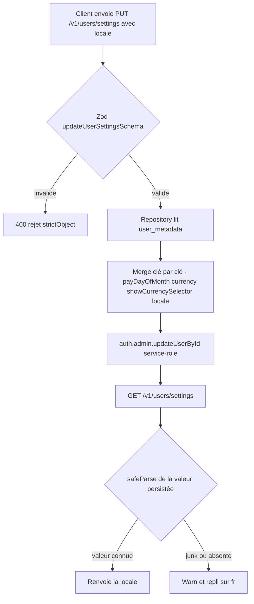
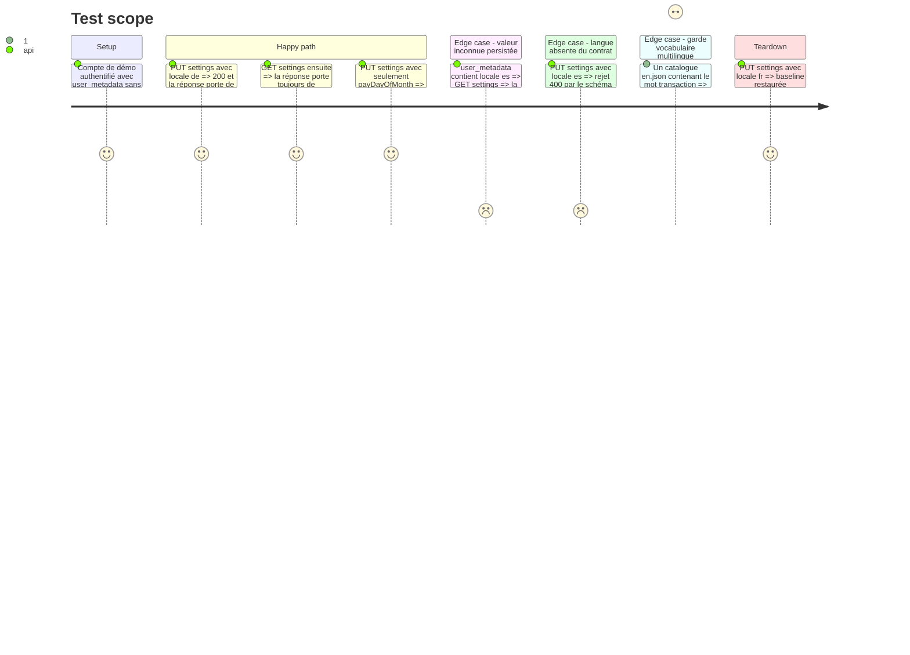

# Instruction: Contrat `locale` et décisions transverses

Le socle dont les trois plateformes dépendent : l'énumération des langues, la préférence `locale` de bout en bout sur `/users/settings`, le lexique produit traduit, le contrat analytics, et le garde-fou vocabulaire étendu aux quatre langues. Aucune interface utilisateur dans cette phase — rien n'est visible à l'écran à la fin, et c'est voulu : les phases 1, 2 et 4 doivent pouvoir fusionner dans n'importe quel ordre.

Cette phase existe parce que la webapp et iOS ont toutes deux besoin de la préférence serveur. La loger dans la phase webapp forcerait iOS à attendre la fusion de la webapp, ce qui casserait l'indépendance des phases demandée.

## Architecture projection

> Tree of the final files. ✅ create · ✏️ modify · ❌ delete

```txt
.
├── docs/
│   └── I18N.md                                              ✅ décisions transverses + lexique produit FR/EN/DE/IT + surfaces à risque de débordement
├── shared/
│   ├── src/
│   │   └── locale.ts                                        ✅ SUPPORTED_LOCALES, LOCALE_METADATA (nom natif de chaque langue, dans sa propre langue)
│   ├── src/locale.spec.ts                                   ✅ parse du schéma, exhaustivité des métadonnées
│   ├── schemas.ts                                           ✏️ supportedLocaleSchema ; locale optionnel dans updateUserSettingsSchema ; locale .default('fr') dans userSettingsSchema
│   ├── index.ts                                             ✏️ export du schéma, des constantes et du type SupportedLocale
│   └── src/feature-flags.ts                                 ✏️ ANALYTICS_PROPERTIES.LOCALE + ANALYTICS_EVENTS.LANGUAGE_CHANGED, avec le contrat de propriétés en JSDoc
├── backend-nest/src/modules/user/
│   ├── domain/user.entity.ts                                ✏️ locale sur UserSettings et UpdateUserSettingsInput
│   └── infrastructure/persistence/
│       ├── supabase-user.repository.ts                      ✏️ locale dans SupabaseUserMetadata, dans le merge, et dans #toUserSettings avec safeParse + warn + repli 'fr'
│       └── supabase-user.repository.spec.ts                 ✏️ merge préservant les clés voisines, valeur invalide repliée sur fr
├── backend-nest/src/modules/user/application/update-user-settings.use-case.spec.ts  ✏️ pass-through du champ
├── backend-nest/src/modules/user/infrastructure/http/user.controller.spec.ts        ✏️ forme de la réponse
├── ios/Pulpe/Core/Analytics/AnalyticsEvent.swift            ✏️ case languageChanged = "language_changed" (émis en phase 9, déclaré ici pour que le miroir reste vrai)
├── ios/PulpeTests/Core/Analytics/AnalyticsServiceTests.swift ✏️ ajout du nom dans le Set attendu, sinon la suite iOS échoue par égalité exacte
├── .github/scripts/lexicon.test.mjs                         ✏️ readdir sur public/i18n/ + liste de mots interdits par langue
└── .claude/rules/03-frameworks-and-libraries/transloco-i18n.md ✏️ « catalogue unique fr.json » devient « quatre catalogues, fr est la source »
```

## User Journey



## Test Scope



## Tasks to do

### `1)` Énumération et métadonnées des langues dans `shared/`

> Une seule définition des quatre langues, consommée par le backend, la webapp, la landing et iOS.

1. `shared/src/locale.ts` : `SUPPORTED_LOCALES = ['fr', 'en', 'de', 'it'] as const`, `DEFAULT_LOCALE = 'fr'`, et `LOCALE_METADATA` portant pour chaque code son `nativeName` **écrit dans sa propre langue** (`Français`, `English`, `Deutsch`, `Italiano`)
2. Ne pas reproduire l'erreur de `CURRENCY_METADATA.nativeName` (`shared/src/currency.ts:35,42`), qui stocke des noms français dans `shared/` et fuit sur l'écran iOS des devises. Documenter cette contrainte en JSDoc au-dessus de `LOCALE_METADATA`
3. `shared/schemas.ts` : `supportedLocaleSchema = z.enum(SUPPORTED_LOCALES)` posé à côté de `supportedCurrencySchema` (ligne 55) ; `locale: supportedLocaleSchema.optional()` dans `updateUserSettingsSchema` ; `locale: supportedLocaleSchema.default('fr')` dans `userSettingsSchema`
4. `shared/index.ts` : exporter le schéma, les constantes, `LOCALE_METADATA` et le type `SupportedLocale`
5. `shared/src/locale.spec.ts` : le schéma rejette `es` et `de-CH` ; `LOCALE_METADATA` couvre exactement `SUPPORTED_LOCALES`

### `2)` Persistance backend, sans migration

> Le champ suit la mécanique de `currency` à la lettre. Il n'y a pas de table de réglages : tout vit dans `auth.users.user_metadata`.

1. `user.entity.ts` : `locale` sur `UserSettings` et sur `UpdateUserSettingsInput`
2. `supabase-user.repository.ts` : `locale?: string` dans `SupabaseUserMetadata` (ligne 22-28), une ligne de plus dans le merge conditionnel (ligne 103-112), et dans `#toUserSettings` (ligne 221-246) **recopier exactement** le bloc `safeParse` / `logger.warn` / repli du currency — `userSettingsSchema` a bien un `.default()`, mais un défaut Zod ne se déclenche que sur `undefined`, jamais sur une chaîne invalide
3. Aucun fichier de migration, aucun `bun run generate-types:local` : le blob JSONB est sans schéma et `database.types.ts` ne contient que `original_currency` / `target_currency`, qui sont des colonnes de change, sans rapport
4. Aucune modification du contrôleur, des deux use cases, du port ni du DTO : ils sont agnostiques du champ (`createZodDto` dérive le DTO du schéma partagé)
5. Étendre les trois specs backend existantes plutôt que d'en créer une : merge préservant les clés voisines, valeur invalide repliée sur `fr`, pass-through du use case

### `3)` Contrat analytics

> Le minimum qui permet de savoir si les traductions servent à quelque chose, et rien de plus.

1. `ANALYTICS_PROPERTIES.LOCALE: 'locale'` dans `shared/src/feature-flags.ts` (à côté de `CURRENCY`, ligne 12-25), JSDoc mentionnant l'espace de valeurs `'fr' | 'en' | 'de' | 'it'`. C'est une **person property**, poussée par `$set` depuis l'observateur des réglages — jamais depuis `identify`, dont l'effet a `flagsVersion` en dépendance et boucterait
2. Cette seule propriété suffit à segmenter tous les entonnoirs existants par langue : c'est exactement ce que `currency` fait déjà, et les person properties pilotent déjà le ciblage des feature flags
3. `ANALYTICS_EVENTS.LANGUAGE_CHANGED: 'language_changed'`, propriétés `from`, `to`, `surface` (`'settings' | 'welcome' | 'landing'`). Justification : la person property est en dernière-écriture-gagne, elle ne montre jamais la *transition*. Or le seul mode de panne propre à l'i18n sur lequel on agirait est une détection automatique fausse — « 40 % des `de` détectés repassent en `fr` » se lit dans cet événement et nulle part ailleurs. `currency_changed` existe déjà et fait précisément cela pour la devise
4. Miroir iOS dans le même changement : `case languageChanged = "language_changed"` dans `AnalyticsEvent.swift` **et** le nom ajouté au `Set` attendu de `AnalyticsServiceTests.swift:24-60`, qui compare par égalité exacte. L'émission viendra en phase 9 ; le miroir est posé ici pour qu'il ne puisse pas dériver
5. Vérifier qu'aucun assainisseur ne filtre `locale` : ni `FINANCIAL_PROPERTY_NAMES` / `SENSITIVE_KEYWORDS` / `SENSITIVE_EXACT_KEYS` côté web, ni `financialWords` / `sensitiveKeyFragments` / `typedContentKeys` côté iOS. Ne jamais nommer une propriété i18n `name`, `label`, `title` ou `text` : ces clés exactes sont supprimées
6. N'attacher aucun montant, libellé, `navigator.languages` brut ni contenu d'erreur. La valeur envoyée est toujours l'une des quatre du contrat, normalisée avant capture

### `4)` Lexique produit traduit — `docs/I18N.md`

> Chaque terme du vocabulaire produit reçoit une traduction arrêtée. Ce n'est pas du mot à mot : c'est le même choix éditorial que le français a fait, refait dans trois langues.

1. Registre : le français tutoie toujours (`PRODUCT.md`). L'allemand utilise **du / dein**, jamais *Sie*. L'italien utilise **tu / tuo**, jamais *Lei*. L'anglais reste à la deuxième personne directe, sans formule de politesse ajoutée
2. Table de correspondance, à écrire telle quelle dans `docs/I18N.md` :

   | Concept                          | FR                    | EN                 | DE                    | IT                       |
   | -------------------------------- | --------------------- | ------------------ | --------------------- | ------------------------ |
   | `budget_line` (collection)       | Prévisions            | Planned            | Planung               | Previsioni               |
   | `budget_line` (unité)            | prévision             | planned item       | Planposten            | previsione               |
   | `fixed`                          | Récurrent             | Recurring          | Wiederkehrend         | Ricorrente               |
   | `one_off`                        | Prévu                 | One-off            | Einmalig              | Una tantum               |
   | agrégat prévisionnel             | Prévu                 | Planned            | Geplant               | Previsto                 |
   | agrégat réalisé                  | Réel                  | Actual             | Tatsächlich           | Effettivo                |
   | collection de `transaction`      | Mouvements            | Activity           | Bewegungen            | Movimenti                |
   | `income`                         | Revenu                | Income             | Einnahme              | Entrata                  |
   | `expense`                        | Dépense               | Expense            | Ausgabe               | Spesa                    |
   | `saving`                         | Épargne               | Savings            | Sparen                | Risparmio                |
   | `checked`                        | Pointé                | Checked            | Abgehakt              | Spuntato                 |
   | `unchecked`                      | À pointer             | To check           | Offen                 | Da spuntare              |
   | libellé solde                    | Disponible à dépenser | Available to spend | Verfügbar zum Ausgeben| Disponibile da spendere  |
   | libellé épargne                  | Épargne prévue        | Planned savings    | Geplantes Sparen      | Risparmio previsto       |
   | libellé récurrence               | Fréquence             | Frequency          | Häufigkeit            | Frequenza                |
   | `template`                       | Modèle                | Template           | Vorlage               | Modello                  |
   | `savings_goal`                   | Objectif d'épargne    | Savings goal       | Sparziel              | Obiettivo di risparmio   |
   | lissage (`spread`)               | Lisser                | Spread             | Verteilen             | Ripartire                |
   | report (`postpone`)              | Reporter              | Postpone           | Verschieben           | Rinviare                 |

3. Deux divergences volontaires à documenter, sinon un relecteur les prendra pour des erreurs :
   - le français emploie « Prévu » pour deux concepts distincts (le type `one_off` et l'agrégat qui fait face au réel) ; les trois autres langues les séparent, parce que réutiliser le même mot y produit une collision illisible
   - « Pointé » n'est jamais traduit par un mot bancaire. Pas de *cleared* ni *reconciled* en anglais, pas de *gebucht* ni *abgebucht* en allemand, pas de *addebitato* en italien : Pulpe n'a aucun lien bancaire, le pointage est un geste manuel de l'utilisateur
4. Section « surfaces à risque de débordement » : l'allemand déborde de 30 à 40 %. Nommer les surfaces contraintes, mesurées sur le code existant — webapp : le `mat-button-toggle-group` des devises (`settings-page.ts:115-143`), les puces de type de prévision, les libellés de navigation du shell, les en-têtes de cartes du tableau de bord ; iOS : `CapsulePicker` (une seule `HStack`, chaque case en `.frame(maxWidth: .infinity)`), la tab bar, `PulpeChip`, les `.navigationTitle`, les en-têtes de `Section` en capitales ; landing : les cinq `navLinks` de la barre desktop, le CTA du hero et le sticky CTA. Règle : là où l'espace est contraint, l'allemand prend la forme courte (`Verfügbar` et non `Verfügbar zum Ausgeben`) et le lexique liste les deux formes
5. Section « pluriels » : aucun plugin ICU n'est ajouté. Les 17 paires de clés `…One` / `…Many` existantes restent sélectionnées par le ternaire `count === 1` des composants ; les quatre langues sont toutes en catégories CLDR `one` / `other`, donc le mécanisme tient. iOS utilise les variantes *Vary by Plural* du String Catalog, qui produisent les mêmes deux formes. Noter au passage que le ternaire rend le pluriel pour `count === 0`, ce qui est correct en EN/DE/IT et légèrement faux en français — défaut préexistant, hors périmètre

### `5)` Garde-fou vocabulaire multilingue

> Le garde actuel lit un chemin en dur. Dès qu'un deuxième catalogue arrive, il reste vert en ne prouvant plus rien.

1. `.github/scripts/lexicon.test.mjs` : remplacer la constante `FR_JSON` (ligne 8) par un `readdirSync` sur `frontend/projects/webapp/public/i18n/`, en dérivant le code de langue du nom de fichier
2. Remplacer le motif unique `/transaction/i` par une table par langue : `fr` et `en` → `transaction`, `de` → `Transaktion`, `it` → `transazione`. Une liste unique ferait échouer `en.json` dès le premier jour, puisque *transaction* est le mot anglais juste — sauf que la règle Pulpe est produit, pas linguistique : le mot est banni sur les quatre surfaces parce que l'app n'a aucun lien bancaire
3. Le message d'échec (`HOW_TO_WRITE_IT_INSTEAD`, lignes 17-24) est un guide de rédaction en français. Le rendre par langue, ou l'accompagner du renvoi vers la table de `docs/I18N.md`
4. Ne pas toucher au scanner Swift de ce fichier dans cette phase : il continue de lire les littéraux `.swift`, ce qui reste juste tant que la phase 4 n'a pas déplacé les chaînes dans un catalogue
5. Vérifier que `frontend/.prettierignore` n'exempte pas les nouveaux catalogues : il n'exempte que `lottie/**`, donc `pulpe-frontend#format:check` les couvrira — c'est voulu

### `6)` Mise à jour de la règle projet

> La règle écrite contredirait le code dès la phase 2.

1. `.claude/rules/03-frameworks-and-libraries/transloco-i18n.md` : « Single translation file » (ligne 100) et « ALWAYS add new strings to fr.json » (ligne 99) deviennent « quatre catalogues, `fr.json` est la source ; toute clé nouvelle est ajoutée aux quatre, sinon le repli français s'affiche en production »
2. Renvoyer vers `docs/I18N.md` pour le lexique plutôt que de le recopier

## Test acceptance criteria

| Task | Acceptance criteria                                                                                                                                                                                     |
| ---- | --------------------------------------------------------------------------------------------------------------------------------------------------------------------------------------------------------- |
| 1    | `supportedLocaleSchema.safeParse('de')` réussit, `'es'` et `'de-CH'` échouent ; `LOCALE_METADATA` couvre exactement les quatre codes et chaque `nativeName` est écrit dans sa propre langue                 |
| 2    | Un `PUT /v1/users/settings` portant seulement `locale` renvoie 200 et le `GET` suivant rend la même valeur ; un `PUT` ne portant que `payDayOfMonth` laisse `locale` intact ; une valeur inconnue déjà présente dans `user_metadata` est rendue comme `fr` avec un warn ; `git status` ne montre aucun fichier sous `supabase/migrations/` |
| 3    | `ANALYTICS_PROPERTIES.LOCALE` et `ANALYTICS_EVENTS.LANGUAGE_CHANGED` existent avec leur JSDoc ; la suite iOS passe avec le nouveau case (le `Set` attendu a été mis à jour) ; aucun assainisseur ne supprime la clé `locale` |
| 4    | `docs/I18N.md` porte la table des 19 termes dans les quatre langues, les deux divergences volontaires, la liste des surfaces contraintes avec leurs chemins de fichier, et la décision sur les pluriels     |
| 5    | Poser volontairement le mot interdit dans un `en.json` de test fait échouer `pnpm test:lexicon` en nommant le fichier et la clé ; le supprimer rétablit le vert ; `pnpm test:lexicon` passe sur l'arbre réel avec le seul `fr.json` présent |
| 6    | La règle Transloco ne dit plus « catalogue unique » et renvoie vers `docs/I18N.md`                                                                                                                        |
