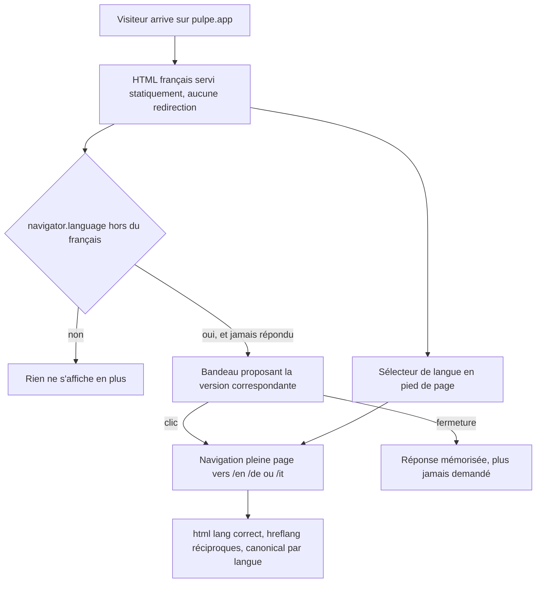
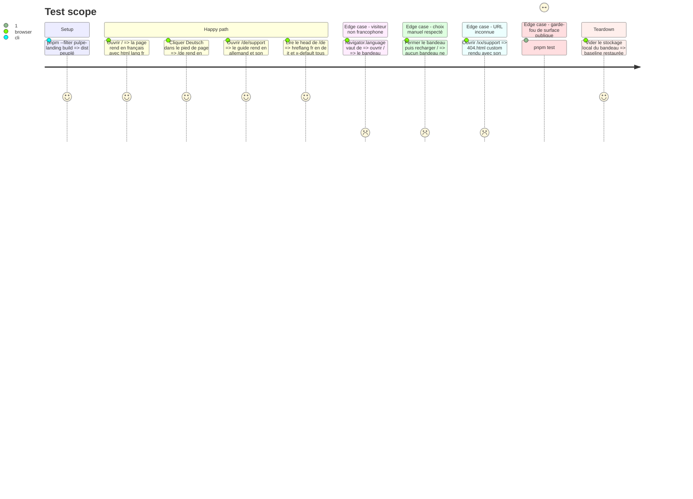

# Instruction: Landing EN/DE/IT

Le français reste servi à la racine sans préfixe ; `en`, `de` et `it` sont servis sous un segment. Sous `output: 'export'` il n'existe ni middleware ni rewrite : la seule forme qui garde le français à `/` est **deux root layouts** — `app/(fr)/` et `app/[lang]/` — et donc l'absence de `app/layout.tsx`. Cette forme a été construite et buildée contre le Next 16.2.11 du dépôt avant d'être retenue.

~280 chaînes françaises vivent aujourd'hui en texte JSX inline et en tableaux `const` de copie à l'intérieur des composants. Elles sont extraites vers `_content/dictionaries/` ; chaque page devient deux coquilles de cinq lignes qui rendent un composant partagé.

## Architecture projection

> Tree of the final files. ✅ create · ✏️ modify · ❌ delete

```txt
landing/
├── app/
│   ├── layout.tsx                                   ❌ supprimé — sa présence empêcherait deux root layouts
│   ├── page.tsx                                     ❌ déplacé vers (fr)/page.tsx
│   ├── changelog/page.tsx                           ❌ déplacé
│   ├── support/page.tsx                             ❌ déplacé
│   ├── support/modeles-et-budgets/page.tsx          ❌ déplacé
│   ├── not-found.tsx                                ❌ ignoré sous deux root layouts, remplacé par global-not-found
│   ├── (fr)/
│   │   ├── layout.tsx                               ✅ root layout FR — html lang fr, metadataBase, JSON-LD fr-CH, script d'en-tête, fournisseurs
│   │   ├── page.tsx                                 ✅ coquille -> _content/Home
│   │   ├── changelog/page.tsx                       ✅ coquille
│   │   ├── support/page.tsx                         ✅ coquille
│   │   └── support/modeles-et-budgets/page.tsx      ✅ coquille
│   ├── [lang]/
│   │   ├── layout.tsx                               ✅ root layout en/de/it — generateStaticParams, html lang dynamique, mêmes fournisseurs
│   │   ├── page.tsx                                 ✅ coquille
│   │   ├── changelog/page.tsx                       ✅ coquille
│   │   ├── support/page.tsx                         ✅ coquille
│   │   └── support/modeles-et-budgets/page.tsx      ✅ coquille
│   ├── _content/
│   │   ├── dictionaries/fr.ts                       ✅ copie française extraite verbatim, aucune reformulation
│   │   ├── dictionaries/en.ts                       ✅
│   │   ├── dictionaries/de.ts                       ✅
│   │   ├── dictionaries/it.ts                       ✅
│   │   ├── dictionary.ts                            ✅ getDictionary(lang) par import dynamique + type Dictionary dérivé de fr.ts
│   │   ├── routes.ts                                ✅ table unique des routes -> map alternates par page, source des hreflang et du sitemap
│   │   ├── Home.tsx                                 ✅ composition des sections, reçoit le dictionnaire
│   │   ├── Changelog.tsx                            ✅
│   │   ├── Support.tsx                              ✅
│   │   └── SupportGuide.tsx                         ✅
│   ├── global-not-found.tsx                         ✅ seul moyen d'obtenir un 404.html custom avec deux root layouts
│   ├── sitemap.ts                                   ✅ 16 URLs + alternates ; exige export const dynamic = 'force-static'
│   └── accessibility.test.tsx                       ✏️ les assertions qui régexent le texte source des composants sont réécrites vers les dictionnaires
├── components/sections/*.tsx                        ✏️ 23 fichiers — la copie sort en props typées, le balisage ne bouge pas
├── components/sections/Roadmap.tsx                  ❌ exporté mais jamais rendu, et un test interdit son rendu — 11 chaînes mortes
├── components/LanguageSwitcher.tsx                  ✅ liste de langues en ancres nues, langue courante marquée aria-current
├── components/LanguageBanner.tsx                    ✅ bandeau dismissible, aucune redirection, réponse mémorisée
├── lib/visitorCurrency.ts                           ✏️ un visiteur de/it n'est plus rangé en CHF par défaut faute d'être français
├── scripts/generate-og-image.ts                     ✏️ paramétré par langue, 4 PNG
├── next.config.ts                                   ✏️ experimental.globalNotFound
├── public/sitemap.xml                               ❌ remplacé par app/sitemap.ts généré
├── package.json                                     ✏️ le script test liste ses fichiers un par un — y ajouter le nouveau, sinon il ne tourne jamais
└── vercel.json                                      ✏️ Cache-Control sur les nouvelles routes si nécessaire, aucune redirection de langue
```

## User Journey



## Test Scope



## Wireframe

```txt
┌────────────────────────────────────────────────┐
│ (1) Bandeau langue — au-dessus de tout          │
│  « Diese Seite gibt es auf Deutsch »   [Lien][×]│
├────────────────────────────────────────────────┤
│ (2) Header — logo · 5 liens · CTA               │
├────────────────────────────────────────────────┤
│                                                │
│ (3) Sections de la page (hero, FAQ, …)          │
│                                                │
├────────────────────────────────────────────────┤
│ (4) Footer — liens utiles                       │
│     Code source · Conditions · … · Contact      │
│ ┌────────────────────────────────────────────┐ │
│ │ (5) Langues                                 │ │
│ │  Français · English · Deutsch · Italiano    │ │
│ │     ▔▔▔▔▔▔▔ (courante)                      │ │
│ └────────────────────────────────────────────┘ │
└────────────────────────────────────────────────┘
```

1. Bandeau : n'apparaît qu'au premier passage, si la langue du navigateur diffère de la page. Propose un lien, ne redirige jamais, et disparaît définitivement une fois répondu.
2. Header : inchangé, sa copie vient du dictionnaire.
3. Corps : inchangé structurellement, chaque section reçoit sa tranche de dictionnaire.
4. Footer : la liste de liens existante, inchangée.
5. Sélecteur : un groupe distinct du `nav` des liens utiles, chaque langue écrite dans sa propre langue, la courante marquée. Ce sont des ancres nues et non des `next/link` : traverser deux root layouts force un chargement de page complet, ce qui est correct puisque `<html lang>` doit changer.

## Tasks to do

### `1)` Restructuration des routes

> La forme a été vérifiée par un build réel, pas déduite de la documentation.

1. Supprimer `app/layout.tsx`. Sa seule présence empêcherait tout autre layout d'être un root layout
2. `app/(fr)/layout.tsx` : le contenu de l'ancien layout, `<html lang="fr">`, `metadataBase`, le JSON-LD `inLanguage: "fr-CH"`, le script d'en-tête inline de 47 lignes, la variable de police et le `<body>`
3. `app/[lang]/layout.tsx` : `generateStaticParams()` rendant `[{lang:'en'},{lang:'de'},{lang:'it'}]` — **jamais `fr`**, sinon `/fr` est émis et toutes les URL françaises indexées se dédoublent. `<html lang={lang}>` via `await params`
4. Ne pas poser `dynamicParams = false` : sous `output: 'export'` le build le force déjà, la ligne serait du bruit
5. Chaque page devient deux coquilles de cinq lignes rendant le même composant de `_content/`. Le coût de la duplication est de deux fichiers minces par page, pas de deux implémentations
6. Les deux root layouts doivent monter **indépendamment** tout ce qui est global : `PostHogProvider`, `globals.css`, la police Poppins, le script d'en-tête. Un fournisseur monté dans un seul arbre échoue en silence pour les trois autres langues
7. Sortie attendue de `next build` avec `trailingSlash: false` inchangé : `index.html`, `changelog.html`, `support.html`, `support/modeles-et-budgets.html`, puis les mêmes sous `en/`, `de/`, `it/`, plus `404.html` et `sitemap.xml`. Fumer `/en` sur l'hôte réel avant de faire confiance : `dist/en.html` cohabite avec un répertoire `dist/en/`, et certains hôtes statiques résolvent `/en` vers `/en/index.html`

### `2)` Extraction de la copie vers les dictionnaires

> La copie française sort **verbatim**. Aucune reformulation dans cette phase.

1. `_content/dictionaries/fr.ts` : la copie existante, caractère pour caractère. La typographie française est porteuse et testée — 9 espaces fines insécables U+202F avant `?` dans la page support, 9 apostrophes U+2019 dans la FAQ, des entités `&apos;` / `&nbsp;` dans le hero. Les recopier telles quelles ; ne pas les normaliser en passant par un format intermédiaire
2. `_content/dictionary.ts` : `getDictionary(lang)` par `import()` dynamique, avec `import 'server-only'`, et le type `Dictionary` dérivé de `fr.ts` — les trois autres dictionnaires sont typés contre lui, donc une clé manquante devient une erreur TypeScript et non un trou à l'écran
3. Les 14 tableaux `const` de copie (`FAQ_ITEMS`, `FOOTER_LINKS`, `navLinks`, `STEPS`, `LIMITS`, `ROADMAP`, `GUARANTEES`, `MONTHS`, `GOAL_MONTHS`, `faqs`, `choices`, `budgetSteps`, `modelSteps`) deviennent des tranches du dictionnaire ; les composants les reçoivent en props typées
4. Traduire vers `en.ts`, `de.ts`, `it.ts` en suivant la table de `docs/I18N.md`. Typographie propre à chaque langue : pas d'espace avant `?` en anglais, allemand et italien ; guillemets allemands `„…"` ; ne pas transposer les espaces fines françaises
5. `Roadmap.tsx` est exporté mais jamais rendu et un test interdit explicitement son rendu depuis `page.tsx`. Le supprimer avant de compter le périmètre — le traduire serait 33 chaînes de pure perte
6. `/changelog` reste français dans les quatre langues : `landing/data/releases.json` est lu verbatim par `backend-nest/.../releases-data.parity.spec.ts:114`. Seul le chrome de la page (titres de section, en-têtes) est traduit ; le corps des notes ne l'est pas. L'écrire dans `docs/I18N.md`
7. Le slug du guide reste `/support/modeles-et-budgets` dans les quatre langues. Il est en dur à cinq endroits ; des slugs par langue multiplieraient ce couplage pour un gain SEO marginal sur une page unique

### `3)` SEO par langue

> Les `hreflang` non réciproques sont purement et simplement ignorés par Google, pas dégradés.

1. `_content/routes.ts` : une table unique des routes d'où sont dérivés à la fois les `alternates` de chaque page et le sitemap. Écrire la carte à la main page par page garantit qu'une route existant dans une langue et pas dans une autre pointera un jour vers un 404 et fera tomber tout le cluster
2. Forme exacte attendue par Next, `x-default` inclus, et **les cinq entrées sur les quatre versions** — chaque version doit se lister elle-même :
   ```ts
   alternates: {
     canonical: '/support',
     languages: { fr: '/support', en: '/en/support', de: '/de/support', it: '/it/support', 'x-default': '/support' },
   }
   ```
3. `app/sitemap.ts` : 16 URLs avec leurs `alternates.languages` en URLs **absolues** — `metadataBase` ne s'y applique pas. Poser `export const dynamic = 'force-static'`, sans quoi le build meurt sur `route "/sitemap.xml" with "output: export"`. Supprimer `public/sitemap.xml`
4. Next émet l'attribut en `hrefLang` et non `hreflang`. C'est insensible à la casse en HTML et les robots s'en accommodent, mais une vérification par grep sur `hreflang="` dans le HTML bâti passerait sur zéro correspondance — écrire l'assertion sur `hrefLang`
5. JSON-LD par langue : le graphe du layout porte `inLanguage: "fr-CH"` en dur et des descriptions françaises ; la page support construit son `FAQPage` depuis le tableau français. Les deux se dérivent du dictionnaire actif
6. `openGraph.locale` suit la langue (`fr_CH`, `en_US`, `de_DE`, `it_IT`) ; `alternateLocale` liste les trois autres
7. `scripts/generate-og-image.ts` a le titre français en dur (`HERO_HEADLINE`) et `OG_CURRENCY: "CHF"`. Le paramétrer par langue et produire quatre PNG. **C'est la première tâche à couper si le budget de la phase serre** : une carte sociale française sur un partage allemand est laid, pas cassé

### `4)` Sélecteur et bandeau

1. `LanguageSwitcher` : quatre ancres `<a>` nues, chaque langue écrite dans sa propre langue (`Français`, `English`, `Deutsch`, `Italiano`), la courante portant `aria-current="true"` et un traitement visuel distinct. Pas de `next/link` : la traversée de deux root layouts force de toute façon un chargement complet
2. Le poser comme un groupe distinct dans le pied de page, pas comme une entrée de plus dans `FOOTER_LINKS` — le tableau est `as const` avec des clés optionnelles hétérogènes pilotant trois branches de rendu, et deux tests régexent sa forme littérale
3. `LanguageBanner` : composant client, ne s'affiche qu'à la première visite et seulement si `navigator.language` (racine courte) diffère de la langue de la page et fait partie des quatre. Un lien, une croix, la réponse mémorisée dans `localStorage`. **Jamais de redirection** : Google demande de l'éviter, et un rebond statique ne peut pas distinguer un visiteur qui a choisi sa langue à la main
4. Le bandeau ne doit pas provoquer de décalage de mise en page à l'hydratation : il est rendu après montage, jamais dans le HTML prérendu

### `5)` Devise du visiteur

1. `visitorCurrency.ts` range aujourd'hui en CHF tout ce qui n'est pas manifestement français. Un visiteur `de-DE` ou `it-IT` reçoit donc des francs suisses. Traiter le cas maintenant que ces langues existent : la logique reste basée sur le fuseau et la langue, pas sur la langue de la page
2. Ne pas remplacer `lib/amount.ts` par un `Intl.NumberFormat` par langue. L'en-tête du fichier documente que l'ICU de Node rend U+0027 là où celui de Chrome rend U+2019, ce qui produirait une divergence prérendu/hydratation sur une page exportée statiquement. Les séparateurs restent en dur

### `6)` Tests et garde-fous

> Deux gardes lisent le **texte source** des fichiers landing. Les deux cassent, et l'un d'eux est hors du paquet.

1. `app/accessibility.test.tsx` fait 1488 lignes et 63 blocs `it()`, dont beaucoup régexent le source des composants lu par `readFileSync` : phrases françaises littérales, comptes exacts (`match(/\n {4}question:/g)?.length === 9`), et jusqu'à l'ordre des clés d'un littéral d'objet, différent entre `Header` et `Footer`. Réécrire ces assertions pour porter sur les **dictionnaires** plutôt que sur le source des composants ; conserver telles quelles les assertions d'accessibilité structurelle, qui restent valides
2. Ajouter des assertions de parité : chaque dictionnaire a exactement les clés de `fr.ts` (le typage l'assure à la compilation, l'assertion le prouve à l'exécution), et aucune valeur n'est vide
3. `.github/scripts/public-surface.test.mjs` lit `landing/app/support/page.tsx` **par chemin** et y régexe des affirmations réglementaires françaises. Déplacer cette copie casse `pnpm test:public-surface`, avec un message parlant de sécurité et non d'i18n — quiconque tombe dessus se trompera de diagnostic. Repointer le garde vers `_content/dictionaries/fr.ts` dans le même changement
4. Le même garde interdit `de bout en bout`, `zero-knowledge` et `end-to-end encryption` — mais seulement sur cinq fichiers. Les traductions des affirmations de sécurité doivent porter les mêmes garanties sans sur-promettre : une version allemande rendue en `Ende-zu-Ende-Verschlüsselung` serait factuellement fausse et passerait tous les gardes. Étendre la corpus du garde aux quatre dictionnaires
5. `landing/package.json` liste ses fichiers de test un par un dans le script `test`. Tout nouveau fichier n'est pas découvert : il ne tourne jamais et CI reste vert. Y ajouter explicitement le nouveau test de parité
6. `landing` n'a pas de script `format:check` (vérifié par `turbo run quality --dry`). Les dictionnaires seraient le seul TypeScript non formaté du dépôt sans qu'aucun garde ne le dise. Ajouter le script et accepter le reformatage unique du paquet
7. `next.config.ts` : `experimental: { globalNotFound: true }` et `app/global-not-found.tsx` rendant un document HTML complet avec ses propres styles et polices. Sans cela, `app/(fr)/not-found.tsx` n'atteint **jamais** `404.html` — sans avertissement ni erreur — et l'export livre le 404 intégré de Next, sans attribut `lang`

## Test acceptance criteria

| Task | Acceptance criteria                                                                                                                                                                                    |
| ---- | -------------------------------------------------------------------------------------------------------------------------------------------------------------------------------------------------------- |
| 1    | `next build` émet `index.html`, `en.html`, `de.html`, `it.html` et les trois sous-arbres de pages ; `/` rend `<html lang="fr">` et `/de/support` rend `<html lang="de">` ; aucune URL `/fr/…` n'existe dans `dist` |
| 2    | Les quatre pages rendent dans les quatre langues sans clé brute ni chaîne française résiduelle ; le HTML français produit est identique à la version d'avant la phase (typographie U+202F et U+2019 comprise) ; `Roadmap.tsx` a disparu |
| 3    | Le head de chaque version porte cinq `hrefLang` (les quatre langues plus `x-default`), et suivre n'importe lequel mène à une page qui referme la boucle ; `dist/sitemap.xml` contient 16 URLs avec leurs alternates absolus ; le JSON-LD de `/de` déclare l'allemand |
| 4    | Le sélecteur du pied de page marque la langue courante et mène aux trois autres ; un navigateur configuré en allemand ouvrant `/` voit le bandeau, reste sur la version française, et ne le revoit plus après l'avoir fermé |
| 5    | Un visiteur allemand ou italien ne se voit plus attribuer une devise par le seul fait de ne pas être français ; les montants rendus sont identiques entre le HTML prérendu et l'hydratation |
| 6    | `pnpm --filter pulpe-landing test` passe, le nouveau test de parité inclus (vérifier qu'il apparaît bien dans la sortie du runner) ; `pnpm test:public-surface` passe ; ouvrir une URL inconnue rend le 404 personnalisé avec son `noindex` |
