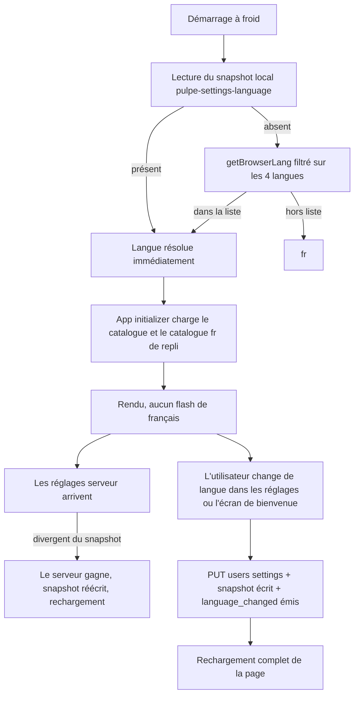
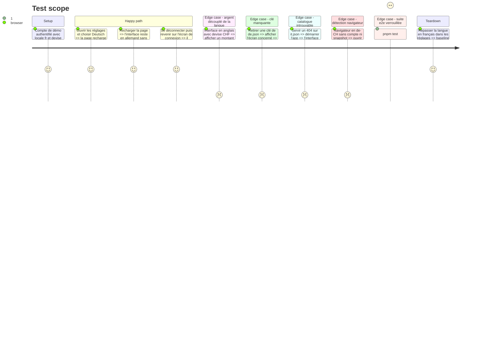

# Instruction: Webapp EN/DE/IT

Transloco est déjà là, le loader est déjà paramétré par langue et `angular.json` globe tout `public/`. Il manque trois catalogues, la configuration de repli, un sélecteur, et surtout la séparation de deux axes que le code confond aujourd'hui : `LOCALE_ID` est dérivé de la **devise** (`locale.ts:51-55`), pas d'une langue.

Un changement de langue **recharge la page**. Ce n'est pas un raccourci : `LOCALE_ID` est résolu une seule fois par une factory de DI synchrone et Angular ne sait pas le permuter à chaud. Le rechargement supprime du même coup la réécriture des 342 appels impératifs `.translate()` évalués à la construction des composants, et permet de laisser `reRenderOnLangChange` à `false`.

## Architecture projection

> Tree of the final files. ✅ create · ✏️ modify · ❌ delete

```txt
frontend/projects/webapp/
├── public/i18n/
│   ├── fr.json                                       ✏️ inchangé sur le fond — source de vérité des clés
│   ├── en.json                                       ✅ 1502 clés
│   ├── de.json                                       ✅ 1502 clés
│   └── it.json                                       ✅ 1502 clés
├── src/index.html                                    ✏️ lang="en" est faux depuis toujours — devient la langue résolue au démarrage
├── src/app/core/i18n/
│   ├── transloco-config.ts                           ✏️ 4 langues, fallbackLang fr, missingHandler.useFallbackTranslation true, initializer chargeant la langue résolue
│   ├── language-resolver.ts                          ✅ snapshot local -> getBrowserLang -> fr, avec allowlist par transloco.isLang
│   └── language-resolver.spec.ts                     ✅
├── src/app/core/user-settings/
│   ├── locale-snapshot.ts                            ✅ miroir exact de currency-snapshot.ts
│   ├── user-settings-store.ts                        ✏️ signal locale, effet de persistance du snapshot, updateLocale
│   └── user-settings-store.spec.ts                   ✏️
├── src/app/core/storage/
│   ├── storage-keys.ts                               ✏️ SETTINGS_LANGUAGE: 'pulpe-settings-language'
│   └── storage-schemas.ts                            ✏️ version 1, supportedLocaleSchema, scope 'app' — porteur, survit à la déconnexion
├── src/app/core/locale.ts                            ✏️ LOCALE_ID et date-fns suivent la LANGUE ; 8 registerLocaleData ; le format monétaire reste sur numberLocale
├── src/app/core/analytics/analytics.ts               ✏️ locale ajouté au #personPropertiesEffect existant, jamais à identify
├── src/app/core/analytics/analytics.spec.ts          ✏️ trois assertions toHaveBeenCalledWith exactes à mettre à jour, plus un toHaveBeenCalledTimes
├── src/app/core/budget/excel-export.service.ts       ✏️ mois, en-têtes et libellés de type sortent du code vers des clés
├── src/app/feature/settings/settings-page.ts         ✏️ section Langue avec confirmation de rechargement
├── src/app/feature/welcome/welcome-page.ts           ✏️ sélecteur compact, avant toute création de compte
├── src/app/feature/complete-profile/complete-profile-store.ts ✏️ les noms de prévisions amorcés ('3ème pilier', 'Épargne') sont écrits en base — les produire dans la langue active
├── src/app/ui/language-selector/language-selector.ts ✅ composant partagé entre réglages et écran de bienvenue
├── src/app/testing/transloco-testing.ts              ✏️ signature acceptant des langues supplémentaires, défaut fr inchangé pour les 104 specs existantes
└── frontend/e2e/                                     ✏️ .env.e2e et la fixture d'auth épinglent fr explicitement
```

## User Journey



## Test Scope



## Wireframe

```txt
Réglages                                Écran de bienvenue
┌────────────────────────────────┐      ┌────────────────────────────────┐
│ (1) DEVISE                      │      │                                │
│  [🇨🇭 CHF] [🇪🇺 EUR]             │      │ (4) Logo + promesse             │
├────────────────────────────────┤      │                                │
│ (2) LANGUE                      │      │  [ Continuer avec Google ]     │
│  ○ Français                     │      │  [ Créer un compte ]           │
│  ● Deutsch                      │      │  [ J'ai déjà un compte ]       │
│  ○ English                      │      │                                │
│  ○ Italiano                     │      ├────────────────────────────────┤
│  (3) note de rechargement       │      │ (5) 🌐 Deutsch  ▾               │
├────────────────────────────────┤      └────────────────────────────────┘
│ ...                             │
└────────────────────────────────┘
```

1. Devise : inchangée. Elle reste un `mat-button-toggle-group` à deux entrées.
2. Langue : une liste verticale et non un groupe de bascules horizontal — quatre entrées ne tiennent pas sur une ligne au mobile, et l'allemand y déborderait. Chaque langue est écrite dans sa propre langue, la courante est sélectionnée.
3. Note : le changement recharge la page. Le dire avant, pas après, exactement comme le dialogue de confirmation de la devise annonce que les montants ne sont pas convertis.
4. Écran de bienvenue : inchangé.
5. Sélecteur compact en pied d'écran de bienvenue, pour rattraper une détection ratée avant même la création du compte. Une entrée discrète, pas un bloc de quatre.

## Tasks to do

### `1)` Configuration Transloco

> Deux pièges de configuration, tous deux silencieux.

1. `availableLangs: ['fr','en','de','it']`. Toute langue absente de cette liste est traitée par Transloco comme un **scope**, ce qui déforme l'URL du loader en `${scope}/fr` — le catalogue ne serait jamais trouvé et rien ne le dirait
2. `fallbackLang: 'fr'` **et** `missingHandler: { useFallbackTranslation: true, logMissingKey: isDevMode() }`. `fallbackLang` seul ne couvre qu'un échec de chargement de catalogue ; il ne fait rien pour une clé manquante dans un catalogue chargé, où l'utilisateur verrait le chemin de la clé. Les deux vont ensemble ou aucun ne sert
3. Conséquence acceptée : avec `useFallbackTranslation`, `load()` fait un `forkJoin` de `[lang, fr]`. Le français est donc téléchargé en plus au démarrage pour les trois autres langues. C'est le prix du repli par clé
4. Laisser `reRenderOnLangChange: false`. Le rechargement de page rend le flag inutile, et le passer à `true` retiendrait un abonnement `langChanges$` par instance de pipe pour la durée de vie du composant, sur 116 fichiers
5. `provideAppInitializer` charge la langue **résolue** au lieu du littéral `'fr'` de la ligne 19. Sinon chaque démarrage paye un aller-retour français avant celui de la vraie langue
6. `language-resolver.ts` : snapshot local d'abord, puis `getBrowserLang()` (qui rend le code court, donc `de` pour un navigateur `de-CH`), filtré par `transloco.isLang()` — l'allowlist est déjà dans la bibliothèque, ne pas la réécrire. Repli final `fr`. `getBrowserLang()` rend `undefined` hors navigateur : garder le résultat
7. `index.html` porte `lang="en"` depuis toujours, ce qui est faux même en français-seul. Le poser à la langue résolue au démarrage

### `2)` Catalogues EN/DE/IT

1. Trois fichiers alignés clé pour clé sur `fr.json` : 1502 clés feuilles, 36 domaines de premier niveau, profondeur maximale 4, aucune valeur tableau
2. 188 clés portent des interpolations `{{param}}`. L'espacement est incohérent dans `fr.json` — `{{date}}` et `{{ date }}` coexistent. Reproduire les jetons à l'identique, espacement compris, et écrire le contrôle de parité pour qu'il normalise avant de comparer
3. Les 17 fausses paires de pluriel (`…One` / `…Many` / `…Singular` / `…Plural`) restent telles quelles, sélectionnées par le ternaire `count === 1` des composants. Les quatre langues sont en catégories CLDR `one` / `other` : le mécanisme tient sans plugin ICU
4. Un contrôle de parité des clés n'existe nulle part aujourd'hui. En écrire un : mêmes clés, mêmes jetons d'interpolation, aucune valeur vide. C'est le seul garde qui empêchera un `de.json` amputé de 400 clés de passer CI
5. Aucune reformulation de `fr.json` dans cette phase

### `3)` Séparation langue / devise

> C'est le cœur technique de la phase, et le seul endroit où une erreur casse des montants.

1. `locale.ts` : `localeIdFactory()` compose désormais **langue + région**, la région venant toujours de la devise. Table à écrire : CHF → `fr-CH` `en-CH` `de-CH` `it-CH` ; EUR → `fr-FR` `en-GB` `de-DE` `it-IT`. Les huit existent en CLDR. Le français est inchangé, à la lettre
2. Huit `registerLocaleData` correspondants. Aujourd'hui il n'y en a que trois : sous un `LOCALE_ID` non enregistré, `DatePipe` et `DecimalPipe` lèvent `Missing locale data` à l'exécution
3. `dateFnsLocaleFor` ne prend plus la devise mais la langue : `frCH` / `fr` pour le français comme aujourd'hui, puis `enGB`, `de`, `it`. date-fns ne publie pas de variante suisse pour l'allemand et l'italien — l'écrire en commentaire pour que personne ne cherche
4. **Ne pas toucher `getCurrencyFormatter`.** Il résout sur `CURRENCY_METADATA[currency].numberLocale` (`de-CH` pour CHF, `fr-FR` pour EUR) et c'est exactement le comportement voulu : le format d'un montant suit la devise, pas la langue de l'interface. Le paramètre `locale` optionnel de la fonction existe déjà et doit rester non passé depuis la webapp
5. Écrire le test qui prouve le découplage, pas seulement la règle : interface en anglais, devise CHF, un montant de `1234.5` rend `1'234.50` avec l'apostrophe. Le contre-exemple mesuré côté iOS est `it_CH`, qui perd le séparateur de groupement — une dérivation naïve produirait le même dégât ici
6. `MAT_DATE_LOCALE` et l'effet de synchronisation du `DateAdapter` suivent la langue, plus la devise

### `4)` Préférence, sélecteur et rechargement

1. `STORAGE_KEYS.SETTINGS_LANGUAGE: 'pulpe-settings-language'`, enregistré dans `storage-schemas.ts` en `{ version: 1, schema: supportedLocaleSchema, scope: 'app' }`. Le scope `app` est **porteur** : en `user`, la clé serait purgée à la déconnexion et l'écran de connexion repasserait en français. Le préfixe `pulpe-` est obligatoire, le runner de migration rejette les autres
2. `locale-snapshot.ts` : copie exacte de `currency-snapshot.ts`
3. `user-settings-store.ts` : signal `locale`, repli sur le snapshot, effet de persistance du snapshot dès que les réglages arrivent, et `updateLocale` sur le modèle de la mutation optimiste existante
4. `language-selector` : composant partagé, liste verticale, chaque langue dans sa propre langue via `LOCALE_METADATA` de `shared/`
5. Réglages : une section dédiée sous la devise, annonçant le rechargement avant l'action. Écriture immédiate — pas de mise en attente dans le `linkedSignal` de brouillon avec les autres champs, parce que l'action se termine par un rechargement
6. Écran de bienvenue : le même composant en variante compacte. Il écrit le snapshot local et recharge ; il n'y a pas encore de compte à synchroniser
7. Émettre `language_changed` avec `from`, `to` et `surface` **avant** le rechargement, en `send_instantly` — sinon la capture est perdue avec la page
8. La person property `locale` est poussée par le `#personPropertiesEffect` existant (`analytics.ts:129-144`), jamais par `identify`, dont l'effet a `flagsVersion` en dépendance. Trois assertions `toHaveBeenCalledWith` exactes et un `toHaveBeenCalledTimes(1)` d'`analytics.spec.ts` cassent : les mettre à jour dans le même commit

### `5)` Copie française hors catalogue

> Traduire le catalogue ne traduit pas le produit. Ces surfaces resteraient françaises en silence.

1. `excel-export.service.ts` : noms de mois français, en-têtes `Nom / Montant / Type / Récurrence`, `PRÉVISIONS`, `Total prévisions`, et les libellés de type `Dépense / Épargne / Récurrent / Prévu` (lignes 18-39, 91-103). Tout passe par des clés. C'est un fichier que l'utilisateur télécharge : le laisser français serait la fuite la plus visible
2. `complete-profile-store.ts:37,65` : `'3ème pilier'`, `'Épargne retraite'` et `'Épargne'` sont des **noms de prévisions écrits en base** à l'inscription. Ce sont des données, pas de l'affichage : les produire dans la langue active au moment de la création. Ne rien migrer rétroactivement
3. `turnstile.service.ts:10`, `maintenance-page.ts:76`, `demo-initializer.service.ts` : chaînes françaises en dur, à passer en clés
4. `whats-new-releases.ts` (lignes 15-50) reste en français dans les quatre langues, par la même décision que `/changelog` sur la landing. L'écrire dans `docs/I18N.md`
5. `shared/schemas.ts:173` porte `.default('Mois Standard')`, un nom français écrit côté serveur dans les données. Hors périmètre — le noter, ne pas le corriger

### `6)` Tests

1. `transloco-testing.ts` est importé par 104 fichiers de specs et fixe `langs: { fr }` avec `availableLangs: ['fr']`. **Ne rien casser** : ajouter `availableLangs` à la configuration de l'application ne touche aucune spec, car `TranslocoTestingModule.forRoot` construit sa propre configuration et ne lit jamais celle de l'app. Étendre la signature du helper avec des langues optionnelles, défaut inchangé
2. Piège du helper : `TestingLoader.getTranslation(lang)` est littéralement `of(this.langs[lang])`. Une langue déclarée dans `availableLangs` de test mais absente de `langs` produit un catalogue **vide sans erreur ni avertissement** — `logMissingKey` est forcé à `false` en test. Toute langue ajoutée à une configuration de test doit avoir son entrée dans `langs`
3. 109 lignes réparties sur 35 fichiers Playwright et ~157 lignes de specs unitaires assertent des chaînes françaises littérales, résolues contre le vrai `fr.json`. Épingler explicitement `fr` dans `.env.e2e` et dans la fixture d'authentification : sans cela, une exécution CI sous un navigateur non francophone ferait tomber les 109 lignes d'un coup, en délais d'attente de locator opaques
4. Vérifier que `pnpm test:lexicon`, étendu en phase 0, voit bien quatre catalogues et applique la bonne liste par langue
5. Rappel de garde : `strictTemplates` n'est vérifié que par `ng build`. Un paramètre de pipe `| transloco` mal formé ne sortira ni au lint ni au `type-check`, seulement au job de build

## Test acceptance criteria

| Task | Acceptance criteria                                                                                                                                                                                       |
| ---- | ----------------------------------------------------------------------------------------------------------------------------------------------------------------------------------------------------------- |
| 1    | Démarrer avec un snapshot `de` rend l'interface en allemand sans passage par le français ; retirer une clé de `de.json` fait apparaître le texte français et non le chemin de la clé ; servir un 404 sur `it.json` démarre l'app en français sans écran blanc |
| 2    | Le contrôle de parité échoue si une clé ou un jeton `{{…}}` manque dans l'un des trois catalogues, et passe sur l'arbre réel ; aucune valeur n'est vide                                                     |
| 3    | Interface en anglais et devise CHF : un montant de `1234.5` rend `1'234.50` avec l'apostrophe suisse ; les dates du même écran sont en anglais ; passer en italien ne change pas le format du montant ; aucun `Missing locale data` dans la console sur les quatre langues et les deux devises |
| 4    | Changer de langue dans les réglages recharge la page dans la nouvelle langue et la conserve après un redémarrage à froid ; se déconnecter garde l'écran de connexion dans la langue choisie ; `language_changed` apparaît dans PostHog avec `from`, `to` et `surface`, et la person property `locale` suit |
| 5    | Un export Excel demandé en allemand n'a aucun en-tête ni nom de mois français ; un compte créé en allemand a ses prévisions amorcées nommées en allemand en base                                            |
| 6    | `pnpm test` et `pnpm test:e2e` passent sans modifier une seule assertion de copie française ; `pnpm quality` passe                                                                                          |
