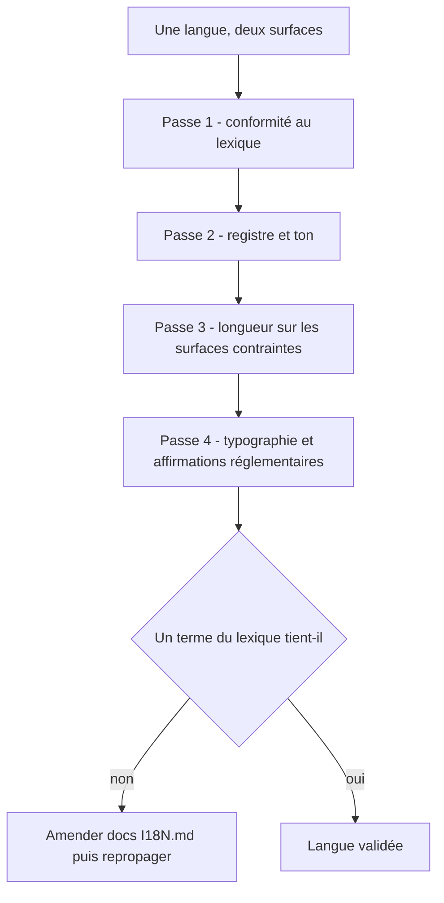
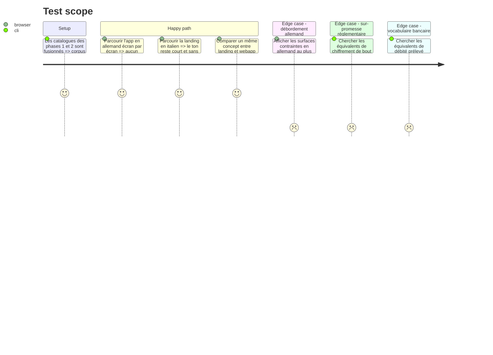

# Instruction: Relecture éditoriale EN/DE/IT

Une traduction correcte n'est pas une traduction Pulpe. Le ton de la marque — phrases courtes, vocabulaire courant, aucun jargon financier, encouragement sans jugement, tutoiement systématique — ne survit pas par accident au passage en trois langues. Cette phase est une passe de relecture par langue sur tout ce que les phases 1 et 2 ont produit, et elle a le droit d'amender le lexique.

Volume par langue : ~280 chaînes de landing plus 1502 clés de webapp, soit ~1780 chaînes × 3 langues. Le diff sera large et les LOC nettes proches de zéro : rien n'est ajouté, tout est réécrit.

Elle se place ici parce que les deux surfaces web portent ensemble tout le vocabulaire produit, ce qui rend les incohérences visibles ; et parce que les phases iOS traduiront ensuite contre un lexique déjà arbitré au lieu de le redécouvrir.

## Architecture projection

> Tree of the final files. ✅ create · ✏️ modify · ❌ delete

```txt
.
├── docs/I18N.md                                        ✏️ amendé si un choix de terme change ; la table reste la référence unique
├── landing/app/_content/dictionaries/
│   ├── en.ts                                           ✏️
│   ├── de.ts                                           ✏️
│   └── it.ts                                           ✏️
├── frontend/projects/webapp/public/i18n/
│   ├── en.json                                         ✏️
│   ├── de.json                                         ✏️
│   └── it.json                                         ✏️
└── .github/scripts/lexicon.test.mjs                    ✏️ seulement si la relecture révèle un mot à interdire de plus
```

## User Journey



## Test Scope



## Tasks to do

### `1)` Passe lexique

> Le contrat est `docs/I18N.md`. Une traduction qui s'en écarte est un défaut, même si elle est jolie.

1. Pour chacune des trois langues, vérifier les 19 termes de la table sur les deux surfaces. Un même concept ne peut pas avoir deux mots dans deux fichiers
2. Vérifier les deux divergences volontaires documentées : la séparation de « Prévu » en deux mots distincts hors français, et l'absence de vocabulaire bancaire pour « Pointé »
3. Chasser explicitement les mots qui réintroduiraient un lien bancaire inexistant : `cleared`, `reconciled`, `debited` en anglais ; `gebucht`, `abgebucht`, `belastet` en allemand ; `addebitato`, `riconciliato` en italien. Pulpe n'a aucune synchronisation bancaire — un mot de relevé bancaire est un mensonge produit
4. Si un terme de la table ne tient pas à l'usage, l'amender dans `docs/I18N.md` **puis** le repropager partout. Ne jamais laisser le code et la table diverger

### `2)` Passe registre et ton

1. Allemand : `du` / `dein` partout, jamais `Sie`. Italien : `tu` / `tuo`, jamais `Lei`. Anglais : deuxième personne directe, sans formule de politesse ajoutée
2. Ton Pulpe, tel que `PRODUCT.md` le fixe : phrases courtes, vocabulaire courant, aucun jargon financier inutile. Les quatre engagements sont le soulagement, la clarté, le contrôle et la légèreté
3. Les messages d'erreur expliquent ce qui s'est passé et proposent une suite. Ni culpabilisation, ni ton d'alerte bancaire
4. Traquer la traduction littérale qui produit un allemand administratif : c'est le mode de panne le plus probable de cette phase, et il est invisible pour qui ne lit pas la langue

### `3)` Passe longueur

1. Prendre la liste des surfaces contraintes écrite en phase 0 et les regarder en allemand au plus petit écran cible : puces de type de prévision, libellés de navigation, en-têtes de cartes du tableau de bord, sélecteur de langue lui-même, `navLinks` de la barre desktop de la landing, hero et sticky CTA
2. Là où l'espace serre, appliquer la forme courte documentée dans le lexique plutôt que d'inventer une abréviation à l'endroit
3. L'italien déborde aussi, moins que l'allemand mais plus que l'anglais. Le vérifier au même passage

### `4)` Passe typographie et affirmations

1. Typographie par langue : pas d'espace fine avant `?` et `!` hors français ; guillemets allemands `„…"` ; apostrophes correctes. Ne pas transposer les espaces fines insécables françaises
2. Affirmations réglementaires et sécurité : les traductions doivent porter la même garantie sans sur-promettre. `Ende-zu-Ende-Verschlüsselung` ou `end-to-end encryption` seraient factuellement faux — le déchiffrement a lieu côté serveur. Le garde de surface publique, étendu aux dictionnaires en phase 1, doit passer
3. Vérifier que le mot interdit par langue n'a pas été réintroduit par une reformulation

## Test acceptance criteria

| Task | Acceptance criteria                                                                                                                                                          |
| ---- | ------------------------------------------------------------------------------------------------------------------------------------------------------------------------------ |
| 1    | Chacun des 19 termes du lexique rend le même mot sur la landing et dans la webapp, dans les trois langues ; aucun mot de vocabulaire bancaire n'apparaît ; `docs/I18N.md` reflète les choix effectivement en place |
| 2    | Aucune occurrence de `Sie`/`Ihr` en allemand ni de `Lei`/`Suo` en italien dans un texte adressé à l'utilisateur ; un parcours complet de l'app dans chaque langue se lit comme du Pulpe, pas comme une traduction |
| 3    | Aucun texte tronqué ni retour à la ligne cassant sur les surfaces contraintes listées, en allemand, au plus petit écran cible                                                   |
| 4    | `pnpm test:public-surface` et `pnpm test:lexicon` passent ; aucune affirmation de chiffrement de bout en bout dans aucune langue ; la typographie suit les règles de chaque langue |
