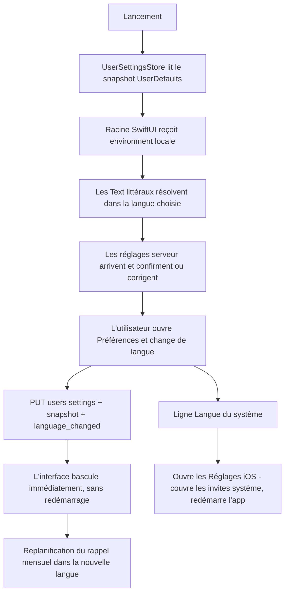
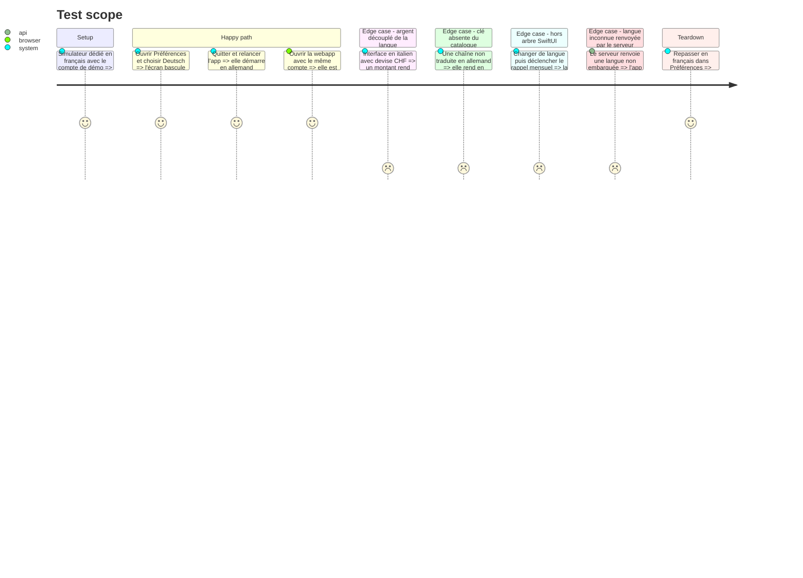

# Instruction: iOS — socle de localisation

Aucune extraction de masse ici. Cette phase pose le catalogue, sépare l'axe langue de l'axe devise dans les formateurs, ajoute le sélecteur, et **prouve la chaîne complète sur un seul écran** : `PreferencesView`. Les lots 5 à 9 ne feront ensuite que remplir le catalogue.

Elle commence par un spike, et ce n'est pas une précaution de style. Toute la conception repose sur une affirmation qu'Apple n'a jamais écrite dans une page de référence : que `.environment(\.locale, …)` re-résout les recherches de String Catalog, et pas seulement le formatage. Les deux sources qui l'établissent sont une phrase de WWDC21 et une réponse DTS sur les forums. Si le spike échoue, la conception retombe sur la langue par app dans les Réglages iOS, qui fonctionne mais **redémarre l'application** — et il vaut mieux le savoir avant d'avoir touché 358 fichiers.

## Architecture projection

> Tree of the final files. ✅ create · ✏️ modify · ❌ delete

```txt
ios/
├── Pulpe/
│   ├── Resources/
│   │   ├── Localizable.xcstrings                       ✅ catalogue principal, langue source fr
│   │   ├── InfoPlist.xcstrings                         ✅ remplace fr.lproj/InfoPlist.strings
│   │   └── fr.lproj/InfoPlist.strings                  ❌ migré dans le catalogue
│   ├── Domain/Models/
│   │   ├── SupportedLocale.swift                       ✅ miroir de supportedLocaleSchema, sur le modèle de SupportedCurrency.swift
│   │   ├── SupportedLocale+Display.swift               ✅ nativeName écrit dans sa propre langue
│   │   └── UserSettings.swift                          ✏️ locale sur UserSettings et UpdateUserSettings, défaut nil
│   ├── Domain/Store/UserSettingsStore.swift            ✏️ locale, updateLocale optimiste avec revert, reset
│   ├── Domain/Services/UserSettingsService.swift       ✏️ getSettingsWithDefaults rend aussi la langue, repli fr
│   ├── Core/Localization/
│   │   ├── AppLocale.swift                             ✅ uiLocale(code) - compose la langue sur les composants du locale courant, préserve la région
│   │   └── LocalizedText.swift                         ✅ résolution hors arbre SwiftUI via LocalizedStringResource.locale
│   ├── Shared/Formatters/Formatters.swift              ✏️ locale monétaire épinglé sur la devise, locale de date sur la langue, clé de cache élargie, ordinal francisé retiré
│   ├── Features/Account/
│   │   ├── PreferencesView.swift                       ✏️ insertion d'une ligne Langue, plus un renvoi vers les Réglages système
│   │   └── LanguageSettingView.swift                   ✅ ligne de liste + Menu — pas un CapsulePicker
│   ├── Features/Account/CurrencySettingView.swift      ✏️ la clé interpolée de la ligne 397 devient une clé statique à argument
│   ├── Shared/Components/CurrencyConversionBadge.swift ✏️ idem ligne 52
│   ├── Core/Analytics/CurrencyAnalyticsSyncModifier.swift ✏️ devient l'observateur des deux préférences, pousse aussi locale
│   ├── Core/Analytics/AnalyticsService.swift           ✏️ cesse d'envoyer error_message localisé, error_kind suffit
│   ├── Domain/Services/NotificationScheduler.swift     ✏️ contenu via LocalizedStringResource, replanification au changement de langue
│   └── App/PulpeApp.swift                              ✏️ .environment(\.locale, …) sur la racine
├── PulpeWidget/                                        ✏️ le catalogue doit être atteignable depuis ce target, sinon sa copie dérive
├── project.yml                                         ✏️ UIPrefersShowingLanguageSettings, et sources du widget si le catalogue y est requis
├── PulpeTests/
│   ├── Core/Localization/AppLocaleTests.swift          ✅ la région survit au changement de langue
│   ├── Shared/Formatters/FormattersLocaleSplitTests.swift ✅ argent suit la devise, dates suivent la langue
│   └── Core/Analytics/AnalyticsServiceTests.swift      ✏️ la propriété locale survit à opt-out puis opt-in
└── .github/scripts/lexicon.test.mjs                    ✏️ scanne aussi les traductions du catalogue, pas seulement le source Swift
```

## User Journey



## Test Scope



## Wireframe

```txt
┌────────────────────────────────────┐
│ ‹ Préférences                       │
├────────────────────────────────────┤
│ DEVISE                       (1)    │
│  [ 🇨🇭 CHF ]  [ 🇪🇺 EUR ]            │
├────────────────────────────────────┤
│ LANGUE                       (2)    │
│  Langue de l'app       Deutsch ▾    │
│  (3) Langue du système          ›   │
├────────────────────────────────────┤
│ JOUR DE PAIE                        │
├────────────────────────────────────┤
│ RAPPELS                             │
├────────────────────────────────────┤
│ DONNÉES ET CONFIDENTIALITÉ          │
└────────────────────────────────────┘
```

1. Devise : inchangée, `CapsulePicker` à deux entrées.
2. Langue : une ligne de liste avec un `Menu` à quatre entrées, chacune écrite dans sa propre langue. **Pas un `CapsulePicker`** : le composant pose toutes ses entrées dans une seule `HStack` en `.frame(maxWidth: .infinity)`, ce qui tient pour deux devises et ne tient pas pour quatre langues sur un iPhone SE.
3. Renvoi vers les Réglages iOS, pour l'utilisateur qui veut aussi les invites système — Face ID, sélecteur de photos, feuille de partage — dans la langue choisie. La copie annonce que cette voie-là redémarre l'app.

## Tasks to do

### `0)` Spike — bloquant

> Vingt minutes qui décident de la conception. Ne rien écrire d'autre avant.

1. Une vue, un `Localizable.xcstrings` avec `fr` et `de`, un bouton qui bascule `.environment(\.locale, …)`, exécuté sur un simulateur iOS 26.x
2. Vérifier dans le même spike : un `Text("…")` littéral, un `.navigationTitle`, un `.alert`, un élément de `.toolbar`, et une chaîne à variante de pluriel
3. Le `.navigationTitle` a un défaut connu (FB16124687) : il ne suit pas le locale d'environnement depuis iOS 18. Si le spike le confirme, prévoir un titre en `Text` explicite et l'écrire dans la conception
4. Résultat négatif ⇒ arrêter et remonter : la seule voie restante est la langue par app dans les Réglages iOS, avec redémarrage, et le sélecteur in-app devient un simple renvoi. Les lots 5 à 9 restent valables tels quels — seule la bascule change
5. Vérifier au passage que les variantes de pluriel et l'accord grammatical automatique se résolvent bien sur le locale d'environnement : ce point n'est documenté nulle part

### `1)` Catalogue

1. `Localizable.xcstrings` dans `Pulpe/Resources/`, ajouté au target. `project.yml` déclare déjà `- path: Pulpe` comme source de dossier : rien à modifier pour que le catalogue soit embarqué
2. `options.developmentLanguage: fr` est déjà posé, donc XcodeGen dérive `developmentRegion = fr` et `knownRegions = (Base, fr)` — vérifié en générant le pbxproj. Ajouter `en`, `de`, `it` depuis la barre latérale du catalogue
3. Clé = littéral français, pour le gros du volume. C'est ce que l'extraction SwiftUI donne gratuitement : `Text("Bonjour")` est extrait automatiquement et la clé est `Bonjour`
4. Clé symbolique explicite (`String(localized: "KEY", defaultValue: "…")`) réservée à trois cas : la copie qu'on prévoit de reformuler, les homographes français qui doivent diverger selon la langue — « Prévu » comme puce de type et « Prévu » comme agrégat — et les chaînes appelées hors SwiftUI
5. **Avant toute extraction**, réparer les deux `String(localized:)` qui interpolent une valeur dans la clé (`CurrencySettingView.swift:397`, `CurrencyConversionBadge.swift:52`). L'extraction produirait des clés ingérables et le catalogue naîtrait cassé
6. `InfoPlist.xcstrings` remplace `fr.lproj/InfoPlist.strings`. Ces chaînes sont résolues par le **système** au moment de l'invite : elles suivront la langue de l'appareil ou la langue par app, jamais le sélecteur in-app. L'accepter et le documenter
7. Le widget est un target séparé qui ne liste pas `Pulpe/Resources` dans ses sources. Trancher explicitement : rendre le catalogue atteignable depuis le widget, ou en accepter un second — auquel cas la copie dérivera, exactement comme le miroir analytics

### `2)` Séparation langue / devise dans les formateurs

> C'est ici que se cassent les montants si on va vite.

1. `Formatters.locale(for: currency)` reste la source du **format monétaire** et rien d'autre. Épingler et rendre en `Text(verbatim:)` pour que SwiftUI ne réapplique pas le locale d'environnement par-dessus le format
2. Preuve mesurée que le découplage est porteur : `CHF 1234.5` rend `CHF 1'234.50` sous fr_CH, de_CH et en_CH, mais `CHF 1234.50` sous **it_CH** — le séparateur de groupement disparaît. Dériver le locale monétaire de la langue casserait le format suisse dès qu'un utilisateur passe en italien
3. Les six `DateFormatter` qui épinglent `Locale(identifier: "fr_FR")` (lignes 156, 163, 170, 186, 193, 200) suivent désormais la **langue**. Le commentaire des lignes 151-153 qui justifie l'épinglage devient faux : le réécrire
4. Les formateurs sont mis en cache dans des `NSCache` clés sur `currency.rawValue` seul (`Formatters.swift:28,84`, `BudgetPeriodCalculator.swift:133`). Ajouter la langue à la clé, sinon un formateur périmé est rendu pour la mauvaise langue, en silence et pour toute la session
5. `dayMonthLabel` code la règle ordinale française (`"1er …"`). Ce n'est pas un problème de locale mais de grammaire : l'allemand écrit `1. August`, l'italien `1º agosto`, l'anglais `1st`. Rendre la règle dépendante de la langue
6. Les 24 sous-titres marketing français de `Formatters.swift:119-147` sont de la copie, pas des données : 24 × 4 langues. Les passer au catalogue avec des clés symboliques
7. Ne pas toucher `SavingsGoalDateFormatter` (`SavingsGoal.swift:107-115`) : son `en_US_POSIX` est de la sérialisation de fil, pas de l'affichage
8. Les 15 sites en `.formatted(date:.abbreviated,…)` suivent déjà `Locale.autoupdatingCurrent`. Aujourd'hui l'écart est invisible parce que tout est français ; dès la bascule, ils rendraient dans une langue et le reste dans une autre. Les faire passer par le même locale que l'environnement, dans cette phase et pas après

### `3)` Préférence et sélecteur

1. `SupportedLocale.swift` sur le modèle exact de `SupportedCurrency.swift`, JSDoc comprise, avec la mention du miroir vers `supportedLocaleSchema`
2. `UserSettings` / `UpdateUserSettings` : champ optionnel avec défaut `nil`, pour que l'`Encodable` synthétisé omette la clé — c'est ce qui rend un ancien binaire compatible
3. `UserSettingsStore.updateLocale` sur le modèle de `updateCurrency` : écriture optimiste, retour arrière sur `APIError`, conservation de la valeur qu'on vient de persister si le serveur renvoie un payload partiel
4. `getSettingsWithDefaults` et `reset()` doivent replier sur `fr` de la même manière qu'ils replient sur `.chf` — sinon un incident réseau pendant une synchronisation widget rend un tuple à moitié par défaut
5. `AppLocale.uiLocale(code)` compose la langue sur les composants du locale courant plutôt que de fabriquer un identifiant : cela préserve la région et les surcharges `@rg=` de l'utilisateur. Vérifié : `en_US@rg=chzzzz` + langue `de` donne `de_US@rg=chzzzz`
6. `LanguageSettingView` : ligne de liste et `Menu`. Les quatre langues écrites dans leur propre langue
7. `UIPrefersShowingLanguageSettings` dans les propriétés Info, plus la ligne de renvoi vers `UIApplication.openSettingsURLString`. Ne pas faire de cette voie le chemin principal : elle redémarre l'app

### `4)` Surfaces hors de l'arbre SwiftUI

1. `LocalizedText.swift` : helper unique construisant un `LocalizedStringResource` dont on pose `locale` avant de le passer à `String(localized:)`. C'est la voie publique documentée
2. Piège à écrire en commentaire dans ce fichier : `String(localized: "…", locale: x)` **ne change pas** la langue de recherche, il ne formate que les interpolations. Le code compile, s'exécute, et rend du français
3. `NotificationScheduler` : le contenu est figé à la planification dans un `UNCalendarNotificationTrigger` répétitif. Replanifier au changement de langue, sinon l'utilisateur lit un rappel français des mois après avoir basculé. Deux chaînes — le brief exclut les notifications push distantes, et c'est maintenu ; ce rappel local est inclus parce que c'est un défaut visible pour deux chaînes de coût
4. `AnalyticsService.captureAuthError` envoie `AuthErrorLocalizer.localize(error)` en propriété `error_message`. Localiser ces 40 chaînes fragmenterait la dimension en quatre langues et casserait toutes les requêtes de triage existantes. Cesser d'envoyer le message localisé : `error_kind` est déjà présent et déjà stable
5. Étendre `CurrencyAnalyticsSyncModifier` plutôt que d'ajouter un second observateur. Passer par `AnalyticsService.setPersonProperties`, jamais par le SDK PostHog directement — la méthode met en cache avant `identify` et rejoue ensuite, ce qui évite d'écrire sur le profil anonyme

### `5)` Preuve de bout en bout et gardes

1. `PreferencesView` et `CurrencySettingView` sont entièrement traduits dans cette phase — c'est l'écran qui porte le sélecteur, il ne peut pas rester français
2. `AppLocaleTests` : la région survit au changement de langue. `FormattersLocaleSplitTests` : l'argent suit la devise sur les quatre langues, les dates suivent la langue sur les deux devises
3. `BudgetDetailsCoordinatorTests:434-466` n'épingle aucun locale et asserte sur du français. Ces tests dépendent déjà de la **région** du simulateur ; ils dépendraient en plus de sa **langue**. Injecter le locale explicitement dans le test plutôt que d'ajouter un troisième axe non contrôlé
4. `CurrencyGateArchitectureTests` asserte des chemins de fichiers en dur. Tout déplacement pendant les lots 5 à 9 le casse : le vérifier à chaque lot
5. `lexicon.test.mjs` scanne le source Swift. Comme la clé reste le littéral français, ce scan **continue de fonctionner** pour le français — mais il ne voit pas les traductions. Lui faire lire aussi les valeurs `en`/`de`/`it` de `Localizable.xcstrings`, avec la même liste par langue que les catalogues web
6. Vérifier le compte de tests **exécutés** et pas le statut de sortie : un `-only-testing:` sur une suite Swift Testing peut sélectionner zéro test et afficher `TEST SUCCEEDED`

## Test acceptance criteria

| Task | Acceptance criteria                                                                                                                                                                          |
| ---- | ------------------------------------------------------------------------------------------------------------------------------------------------------------------------------------------------ |
| 0    | Le spike rend un `Text`, un `.navigationTitle`, une alerte, un élément de toolbar et un pluriel en allemand après bascule de `.environment(\.locale)`, sans redémarrage — ou le rapport dit lequel échoue et la conception est révisée avant tout autre travail |
| 1    | `Localizable.xcstrings` et `InfoPlist.xcstrings` sont embarqués ; le build peuple le catalogue automatiquement ; aucun `String(localized:)` n'a plus de valeur interpolée dans sa clé ; la décision sur le widget est écrite |
| 2    | Interface en italien, devise CHF : un montant de `1234.5` rend `1'234.50` ; les dates du même écran sont en italien ; aucun formateur ne rend une langue périmée après deux bascules successives ; le 1er du mois s'écrit correctement dans les quatre langues |
| 3    | Changer de langue dans Préférences bascule l'écran immédiatement, survit à un redémarrage à froid, et la webapp connectée au même compte affiche la même langue ; un serveur renvoyant une langue non embarquée fait rendre en français sans plantage |
| 4    | Après un changement de langue, le rappel mensuel arrive dans la nouvelle langue ; `error_message` n'est plus envoyé à PostHog ; la person property `locale` survit à un cycle opt-out / opt-in |
| 5    | `xcodebuild test` passe avec un compte de tests exécutés non nul ; `pnpm test:lexicon` échoue si le mot interdit est posé dans la traduction allemande du catalogue                            |
