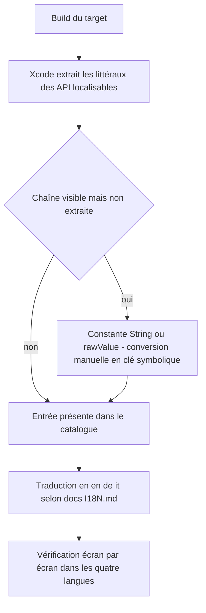
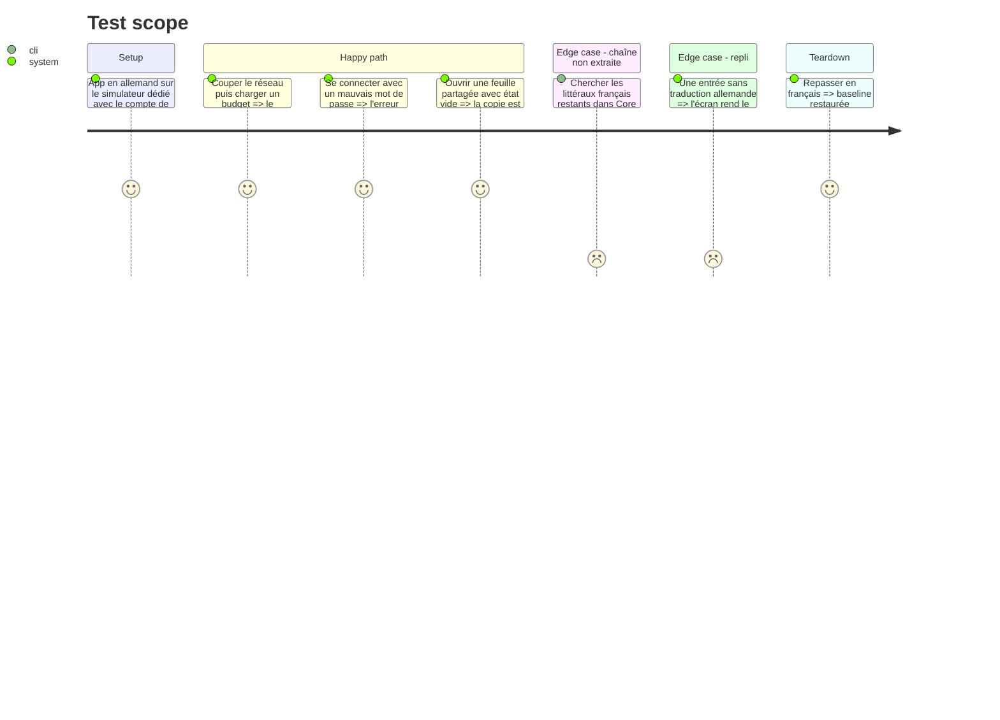

# Instruction: iOS — lot A : Core, Domain, Shared

Le premier lot d'extraction, et le plus transverse : les erreurs réseau, les erreurs d'authentification, les composants partagés et les modèles. ~532 chaînes sur 147 fichiers. Il passe en premier parce que ces chaînes apparaissent sur tous les écrans des lots suivants — les traduire ailleurs qu'ici les traduirait quatre fois.

Le socle de la phase 4 est acquis : catalogue en place, formateurs séparés, sélecteur fonctionnel. Ce lot ne fait que remplir. Le diff Swift reste petit — la clé est le littéral français, donc `Text("…")` ne bouge pas ; le volume atterrit dans `Localizable.xcstrings`.

## Architecture projection

> Tree of the final files. ✅ create · ✏️ modify · ❌ delete

```txt
ios/Pulpe/
├── Core/                                        ✏️ 30 fichiers · ~276 chaînes
│   ├── Network/APIError.swift                   ✏️ 46 littéraux — la plus forte densité du dépôt
│   ├── Auth/AuthErrorLocalizer.swift            ✏️ 40 chaînes dans un dictionnaire clé Supabase -> (kind, message) — conversion la plus mécanique du lot
│   ├── Encryption/                              ✏️ copie du coffre et des clés de récupération
│   └── Analytics/                               ✏️ aucune chaîne affichée, vérifier seulement qu'aucun message localisé ne part en propriété
├── Domain/                                      ✏️ 51 fichiers · ~53 chaînes — surtout des libellés d'enum
│   └── Models/*+Display.swift                   ✏️ nativeName, compactLabel, fullLabel : des rawValues calculées, invisibles à l'extraction SwiftUI
├── Shared/                                      ✏️ 66 fichiers · ~203 chaînes
│   ├── Components/                              ✏️ TagPickerField, CapsulePicker, PulpeChip, EmptyState, WhatsNewSheet
│   ├── Formatters/Formatters.swift              ✏️ reliquat après la phase 4 : les 24 sous-titres mensuels
│   └── Extensions/                              ✏️ libellés d'accessibilité
└── Resources/Localizable.xcstrings              ✏️ ~532 entrées × 3 traductions
```

## User Journey



## Test Scope



## Tasks to do

### `1)` Extraction automatique

1. Construire le target, laisser Xcode peupler le catalogue depuis les littéraux passés aux API localisables
2. Trier les entrées produites : celles qui sont de la copie, et celles qui sont des identifiants techniques capturés par erreur — 27 noms de symboles SF et 36 identifiants d'accessibilité existent dans l'app, la plupart déjà filtrés par leur forme
3. `APIError.swift` d'abord : 46 littéraux, tous des messages d'erreur utilisateur qui apparaissent partout ailleurs

### `2)` Chaînes invisibles à l'extraction

> L'extraction ne voit que les littéraux passés à une API localisable. Tout le reste reste français dans les quatre langues, en silence.

1. `AuthErrorLocalizer` : un dictionnaire `[String: (AuthErrorKind, String)]` — la clé Supabase est déjà stable, seul le message du tuple passe au catalogue. Conversion la plus mécanique du lot
2. Les `+Display.swift` du domaine : `nativeName`, `compactLabel`, `fullLabel` sont des propriétés calculées rendant des `String` — invisibles à l'extraction. Les convertir en `LocalizedStringResource`
3. Toute chaîne construite par concaténation ou interpolation doit devenir une clé unique à arguments positionnels
4. `TagPickerField.swift:118` (`"30 caractères maximum"`) illustre le cas où la contrainte chiffrée est dans la phrase : la clé porte l'argument, jamais le nombre en dur

### `3)` Traduction et libellés d'accessibilité

1. Traduire en `en`, `de`, `it` en suivant la table de `docs/I18N.md`
2. 230 occurrences d'`accessibilityLabel` existent sur 112 fichiers, dont une part dans ce lot. Ce sont des chaînes utilisateur au même titre que les autres — les traduire, ne pas les sauter parce qu'elles sont invisibles à l'œil
3. Les messages d'erreur suivent la règle de ton de `PRODUCT.md` : expliquer ce qui s'est passé, proposer une suite, sans culpabiliser

### `4)` Gardes

1. `pnpm test:lexicon` couvre à la fois le source Swift et les traductions du catalogue depuis la phase 4
2. `swiftlint --strict` tourne sur les fichiers indexés au commit et fait de 500 lignes le vrai plafond — une conversion qui allonge un fichier peut le franchir
3. Vérifier le compte de tests exécutés, pas le statut de sortie

## Test acceptance criteria

| Task | Acceptance criteria                                                                                                                                          |
| ---- | ---------------------------------------------------------------------------------------------------------------------------------------------------------------- |
| 1    | Le catalogue contient les entrées de `Core`, `Domain` et `Shared` ; aucune entrée n'a une valeur interpolée pour clé                                            |
| 2    | Une recherche de littéraux français accentués sur ces trois racines ne rend plus que des identifiants techniques, des journaux et des commentaires             |
| 3    | En allemand : une erreur réseau, une erreur d'authentification et un état vide rendent en allemand, y compris leurs libellés d'accessibilité lus par VoiceOver |
| 4    | `xcodebuild test` passe avec un compte non nul ; `pnpm test:lexicon` passe ; `swiftlint --strict` passe sur les fichiers touchés                                |
