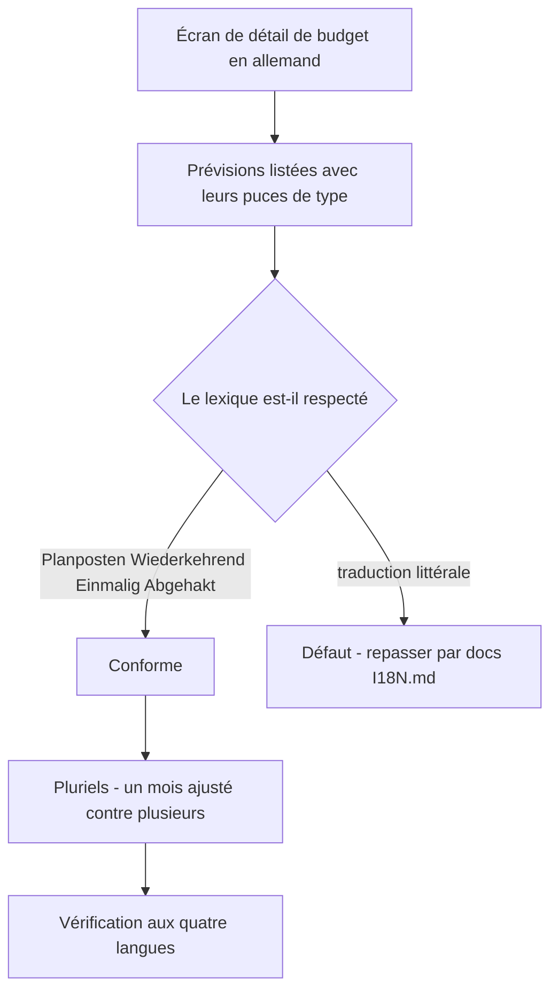
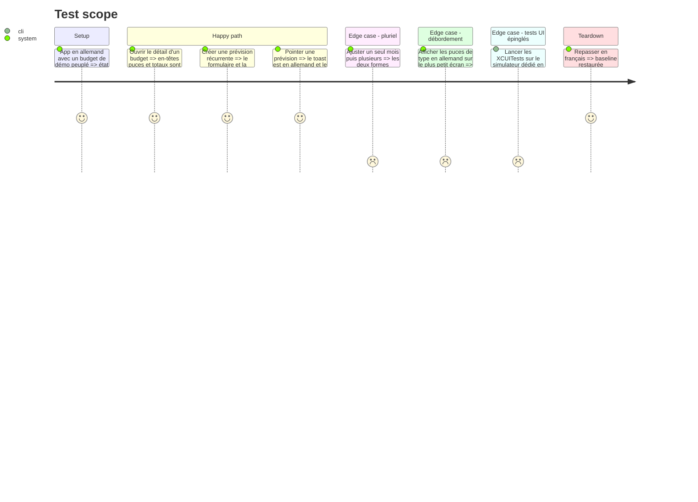

# Instruction: iOS — lot B : Budgets, Templates

~450 chaînes sur 82 fichiers. `Features/Budgets` est le plus gros dossier de l'app (376 chaînes, 78 fichiers) et porte le vocabulaire produit le plus dense : prévisions, récurrent, prévu, réel, pointé, lissage, report. C'est le lot où le lexique de `docs/I18N.md` se gagne ou se perd.

C'est aussi le lot qui concentre les pluralisations bricolées et un test d'architecture qui asserte des chemins de fichiers en dur.

## Architecture projection

> Tree of the final files. ✅ create · ✏️ modify · ❌ delete

```txt
ios/Pulpe/Features/
├── Budgets/                                     ✏️ 78 fichiers · ~376 chaînes
│   ├── BudgetDetails/                           ✏️ le cœur : lignes de prévision, pointage, feuilles de création, lissage, retrait d'épargne
│   ├── BudgetDetails/AddAllocatedTransactionPage.swift   ✏️ chemin épinglé par CurrencyGateArchitectureTests
│   ├── BudgetDetails/AddBudgetLineSheet.swift            ✏️ idem
│   ├── BudgetDetails/SavingsWithdrawal/SavingsWithdrawalSheet.swift ✏️ idem
│   └── BudgetsList/                             ✏️ liste, recherche, états vides
├── Templates/                                   ✏️ 4 fichiers · ~74 chaînes
└── ../Resources/Localizable.xcstrings           ✏️ ~450 entrées × 3 traductions
ios/PulpeTests/Architecture/CurrencyGateArchitectureTests.swift  ✏️ seulement si un fichier est déplacé
ios/PulpeUITests/                                ✏️ BudgetLineLongPressTests et ContextualCreationUITests assertent 31 littéraux français
```

## User Journey



## Test Scope



## Tasks to do

### `1)` Extraction et vocabulaire

1. Extraire par build, puis traduire en suivant strictement la table de `docs/I18N.md`. C'est le lot qui porte le plus de termes du lexique : `Prévisions`, `Récurrent`, `Prévu`, `Réel`, `Pointé`, `À pointer`, `Disponible à dépenser`, `Lisser`, `Reporter`
2. Traiter la divergence documentée : le français emploie « Prévu » pour le type `one_off` **et** pour l'agrégat face au réel. Les deux ont besoin de clés symboliques distinctes ici, sinon l'allemand et l'italien collent le même mot sur deux concepts
3. `Pointé` / `À pointer` ne prennent jamais un mot de relevé bancaire. Pulpe n'a aucun lien bancaire : le pointage est un geste manuel

### `2)` Pluriels

1. Les sites qui bricolent le pluriel par ternaire ou par suffixe `(s)` deviennent des variantes *Vary by Plural* du catalogue. Les quatre langues sont en catégories `one` / `other`, donc deux formes chacune
2. Le `(s)` français collé — `"prévision(s) retirée(s)"` — n'a pas d'équivalent en allemand ni en italien : ces langues exigent les deux formes écrites

### `3)` Gardes spécifiques au lot

1. `CurrencyGateArchitectureTests` asserte quatre chemins de fichiers en dur, tous dans ce lot. Ne pas déplacer ces fichiers ; s'il faut le faire, mettre le test à jour dans le même commit
2. `BudgetLineLongPressTests` et `ContextualCreationUITests` assertent 31 littéraux français. Les basculer sur des recherches par `accessibilityIdentifier` — 36 identifiants existent déjà. Sans cela ils cassent un par un, à l'exécution, dès que l'app peut tourner dans une autre langue
3. Vérifier la longueur allemande sur les puces de type et les en-têtes de carte, qui sont les surfaces les plus contraintes de l'écran

## Test acceptance criteria

| Task | Acceptance criteria                                                                                                                                         |
| ---- | --------------------------------------------------------------------------------------------------------------------------------------------------------------- |
| 1    | Un parcours complet du détail de budget en allemand et en italien n'affiche aucun français ; chaque terme du lexique rend le mot arrêté ; les deux sens de « Prévu » rendent deux mots distincts hors français |
| 2    | « 1 mois ajusté » et « 3 mois ajustés » rendent la bonne forme dans les quatre langues ; plus aucun `(s)` collé n'apparaît hors français                      |
| 3    | `xcodebuild test` passe avec un compte non nul, XCUITests compris ; aucune puce de type n'est tronquée en allemand au plus petit écran                        |
