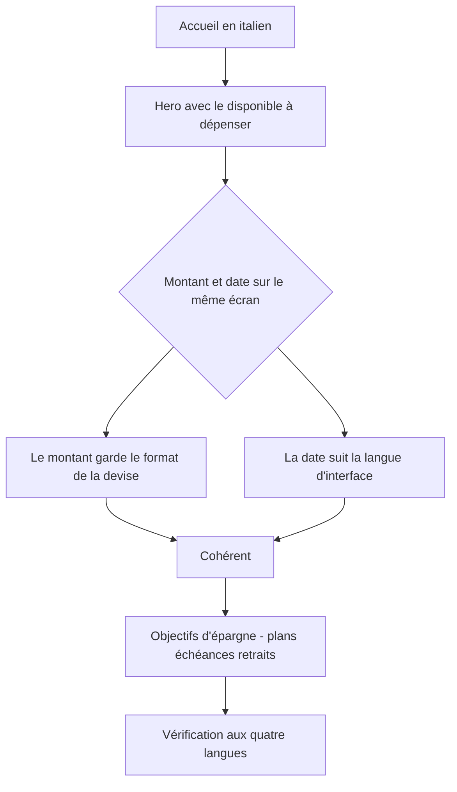
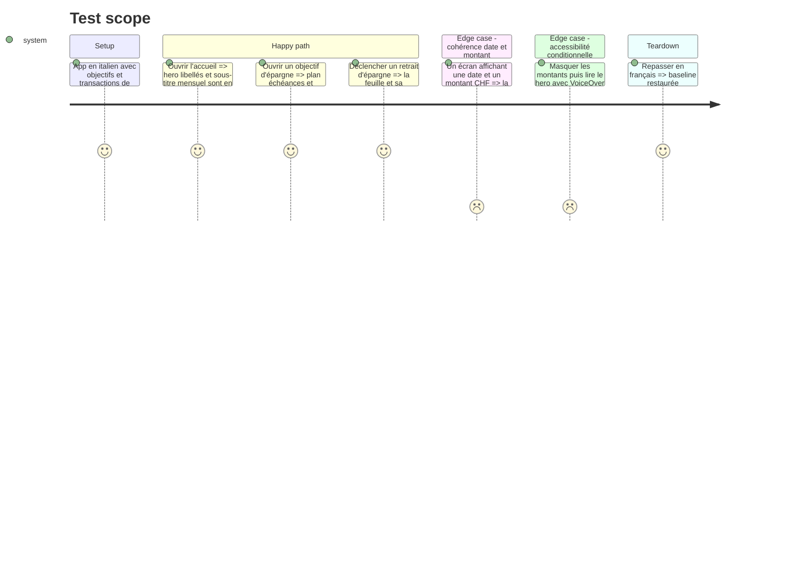

# Instruction: iOS — lot C : CurrentMonth, SavingsGoals

~461 chaînes sur 37 fichiers. Peu de fichiers, beaucoup de copie : `SavingsGoals` concentre 285 chaînes sur 20 fichiers, avec des feuilles de récapitulatif et de suppression très bavardes. `CurrentMonth` porte l'écran d'accueil, la première chose qu'un utilisateur non francophone verra.

C'est le lot où l'incohérence de dates traitée en phase 4 se vérifie réellement : 14 des 15 sites rendant une date via le locale de l'appareil vivent dans `SavingsGoals`.

## Architecture projection

> Tree of the final files. ✅ create · ✏️ modify · ❌ delete

```txt
ios/Pulpe/Features/
├── CurrentMonth/                                ✏️ 17 fichiers · ~176 chaînes
│   ├── HomeHeroCard.swift                       ✏️ 21 littéraux — le hero de l'accueil, dont les libellés d'accessibilité conditionnés au masquage des montants
│   └── Components/AddTransactionSheet.swift     ✏️ chemin épinglé par CurrencyGateArchitectureTests
├── SavingsGoals/                                ✏️ 20 fichiers · ~285 chaînes
│   ├── GoalPlanApplyRecapSheet.swift            ✏️ 29 littéraux, plus un pluriel bricolé
│   ├── GoalDeletionSheet.swift                  ✏️ 20 littéraux
│   ├── GoalGenerationStopSheet.swift            ✏️ pluriel bricolé en (s)
│   ├── SavingsGoalDetailView.swift              ✏️ pluriel bricolé en (s)
│   └── (14 sites de date via .formatted)        ✏️ vérifier qu'ils suivent bien le locale d'interface depuis la phase 4
└── ../Resources/Localizable.xcstrings           ✏️ ~461 entrées × 3 traductions
ios/PulpeUITests/SavingsGoalIntervalUITests.swift ✏️ 14 littéraux français assertés
```

## User Journey



## Test Scope



## Tasks to do

### `1)` Extraction et traduction

1. Extraire par build, traduire selon `docs/I18N.md`. Termes portés par ce lot : `Objectif d'épargne`, `Épargne prévue`, `Disponible à dépenser`, `Mouvements`
2. `HomeHeroCard` porte des libellés d'accessibilité conditionnés au masquage des montants. Ces variantes sont de la copie utilisateur à part entière : les traduire, pas seulement le texte visible
3. Les feuilles de récapitulatif et de suppression sont longues et explicatives : c'est là que la traduction littérale produit de l'allemand administratif. Les relire au ton, pas seulement au sens

### `2)` Pluriels et dates

1. Les trois sites à `(s)` collé et le ternaire de `GoalPlanApplyRecapSheet` passent aux variantes de pluriel du catalogue
2. Vérifier sur les 14 sites `.formatted(date:…)` que la date suit bien le locale d'interface depuis la phase 4. C'est l'écran où l'incohérence serait la plus visible : un plan d'épargne mêle mois nommés et montants sur la même carte
3. `GoalWithdrawalsSection` utilise `.formatted(.dateTime.month(.wide).year())` — un mois en toutes lettres, donc entièrement dépendant de la langue

### `3)` Gardes

1. `AddTransactionSheet.swift` est l'un des quatre chemins épinglés par `CurrencyGateArchitectureTests` : ne pas le déplacer
2. `SavingsGoalIntervalUITests` asserte 14 littéraux français : basculer sur des identifiants d'accessibilité
3. Vérifier la longueur allemande sur les en-têtes de cartes d'objectif et les puces d'état

## Test acceptance criteria

| Task | Acceptance criteria                                                                                                                                     |
| ---- | ----------------------------------------------------------------------------------------------------------------------------------------------------------- |
| 1    | Un parcours accueil + objectifs en italien et en allemand n'affiche aucun français ; les libellés d'accessibilité du hero sont traduits dans les deux états, montants visibles et masqués |
| 2    | Les comptes singuliers et pluriels rendent la bonne forme dans les quatre langues ; sur un écran mêlant date et montant, la date suit la langue et le montant garde le format de sa devise |
| 3    | `xcodebuild test` passe avec un compte non nul, XCUITests compris ; aucune carte d'objectif tronquée en allemand                                          |
