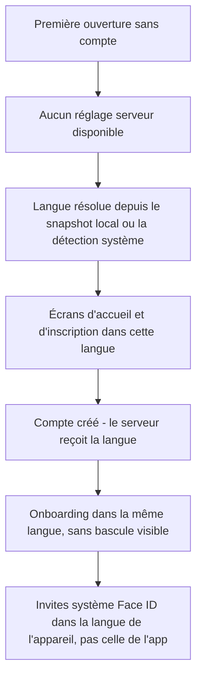
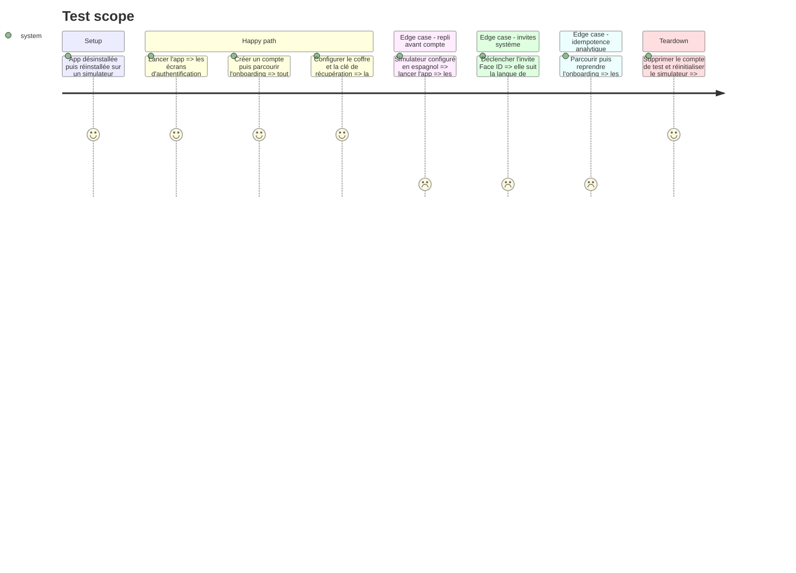

# Instruction: iOS — lot D : Auth, Onboarding

~376 chaînes sur 40 fichiers. Ce sont les premiers écrans qu'un utilisateur voit, et les seuls qui s'affichent **avant** que les réglages serveur soient connus : ils rendent depuis le snapshot local ou depuis la détection, jamais depuis le compte. Un défaut de repli ici se voit à la première seconde d'usage.

L'onboarding porte aussi des événements analytiques idempotents dont les garde-fous ne doivent pas bouger.

## Architecture projection

> Tree of the final files. ✅ create · ✏️ modify · ❌ delete

```txt
ios/Pulpe/Features/
├── Auth/                                        ✏️ 15 fichiers · ~185 chaînes
│   ├── ResetPasswordFlowView.swift              ✏️ 21 littéraux
│   └── (coffre, PIN, biométrie, récupération)   ✏️ copie sécurité — ne jamais sur-promettre en traduction
├── Onboarding/                                  ✏️ 25 fichiers · ~191 chaînes
│   └── OnboardingFlow.swift                     ✏️ chaînes seulement — les gardes d'idempotence analytique restent intacts
└── ../Resources/Localizable.xcstrings           ✏️ ~376 entrées × 3 traductions
```

## User Journey



## Test Scope



## Tasks to do

### `1)` Extraction et traduction

1. Extraire par build, traduire selon `docs/I18N.md`
2. La copie sécurité — coffre, PIN, clé de récupération, biométrie — décrit une garantie réelle et bornée. Ne pas sur-promettre en traduction : pas de « Ende-zu-Ende-Verschlüsselung », pas de « end-to-end encryption ». Le déchiffrement a lieu côté serveur
3. Le ton reste celui de `PRODUCT.md` : un écran d'erreur d'authentification explique et propose une suite, il n'alarme pas

### `2)` Comportement avant compte

1. Ces écrans rendent avant toute réponse serveur. Vérifier que la langue vient bien du snapshot local ou de la détection, et que le repli sur le français est propre pour une langue système non embarquée
2. `InfoPlist.xcstrings` couvre l'invite Face ID, mais elle est résolue par le système : elle suit la langue de l'appareil ou la langue par app, jamais le sélecteur in-app. Le vérifier et l'accepter — c'est une limite documentée, pas un défaut

### `3)` Gardes

1. Ne pas toucher aux drapeaux d'idempotence de `OnboardingFlow` ni au test de régression qui pin le ré-armement. Ce lot ne change que des chaînes
2. Vérifier la longueur allemande sur les boutons d'étape de l'onboarding et les libellés de progression

## Test acceptance criteria

| Task | Acceptance criteria                                                                                                                              |
| ---- | ---------------------------------------------------------------------------------------------------------------------------------------------------- |
| 1    | Un parcours inscription + onboarding complet en allemand n'affiche aucun français ; aucune affirmation de chiffrement de bout en bout dans les trois langues |
| 2    | Une réinstallation sur un simulateur allemand ouvre l'app en allemand ; sur un simulateur espagnol elle ouvre en français ; aucune bascule visible au moment de la création du compte |
| 3    | `xcodebuild test` passe avec un compte non nul, le test d'idempotence de l'onboarding compris ; aucun bouton d'étape tronqué en allemand           |
