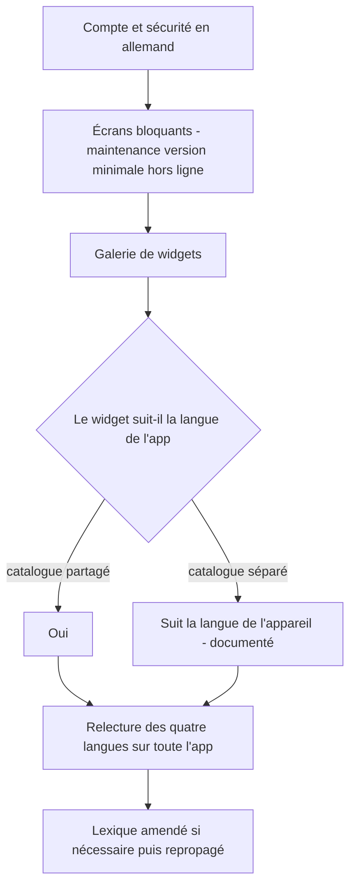
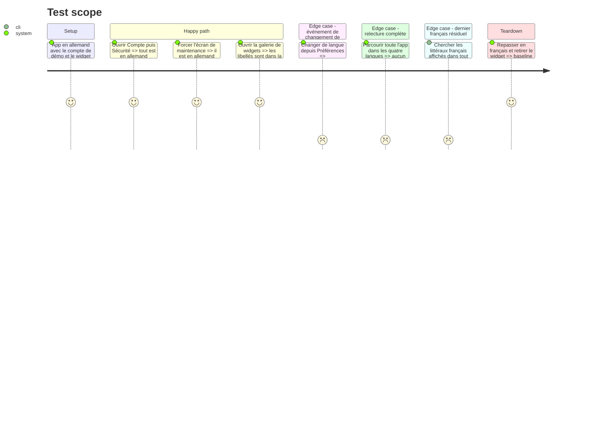

# Instruction: iOS — lot E : Account, App, Widget + relecture iOS

Le dernier lot : ~488 chaînes sur ~53 fichiers, plus la passe de relecture qui referme le chantier. `Features/Account` est en partie déjà fait — `PreferencesView` et `CurrencySettingView` ont été traduits en phase 4 pour porter le sélecteur. Reste la sécurité, le compte, les écrans bloquants, et le widget.

Le widget est un target séparé : sa copie de galerie est en français dans deux fichiers, et il ne liste pas `Pulpe/Resources` dans ses sources. La décision prise en phase 4 s'applique ici.

## Architecture projection

> Tree of the final files. ✅ create · ✏️ modify · ❌ delete

```txt
ios/
├── Pulpe/
│   ├── Features/Account/                        ✏️ ~177 chaînes moins ce que la phase 4 a déjà couvert
│   │   ├── SecuritySettingsView.swift           ✏️ 25 littéraux
│   │   └── AccountView.swift                    ✏️ 19 littéraux
│   ├── App/                                     ✏️ 39 fichiers · ~249 chaînes — racine, navigation, écrans bloquants, réinitialisation de session
│   ├── Features/Tips/                           ✏️ 1 fichier · 10 chaînes
│   ├── Features/Maintenance/                    ✏️ 1 fichier · 6 chaînes
│   ├── Features/ForceUpdate/                    ✏️ 1 fichier · 3 chaînes
│   ├── Core/Analytics/AnalyticsEvent.swift      ✏️ émission effective de language_changed depuis le sélecteur
│   └── Resources/Localizable.xcstrings          ✏️ ~488 entrées × 3 traductions, puis relecture de la totalité
├── PulpeWidget/                                 ✏️ 12 fichiers · ~43 chaînes
│   ├── Widgets/CurrentMonth/CurrentMonthWidget.swift ✏️ configurationDisplayName et description en français
│   └── Widgets/YearOverview/YearOverviewWidget.swift ✏️ idem
└── docs/I18N.md                                 ✏️ amendé si la relecture iOS révise un terme
```

## User Journey



## Test Scope



## Tasks to do

### `1)` Extraction et traduction

1. Extraire par build sur `Account`, `App`, `Tips`, `Maintenance`, `ForceUpdate` et traduire selon `docs/I18N.md`
2. Les écrans bloquants — maintenance, version minimale, hors ligne — sont rendus dans des conditions dégradées, parfois sans réglages chargés. Vérifier qu'ils rendent dans la langue du snapshot local, pas en français par accident
3. `SecuritySettingsView` porte de la copie de garantie : mêmes contraintes de non-sur-promesse que le lot D

### `2)` Widget

1. `configurationDisplayName` et `description` sont en français en dur dans les deux widgets. Ce sont les libellés de la galerie iOS
2. Appliquer la décision de phase 4 sur l'atteignabilité du catalogue depuis le target widget. Si le choix a été un catalogue séparé, l'écrire dans `docs/I18N.md` avec sa conséquence : la copie du widget dérivera, et elle suit la langue de l'appareil et non le sélecteur in-app
3. Le widget ne peut pas lire le sélecteur in-app : il tourne hors du processus de l'app et hors de l'arbre SwiftUI de la racine. Le documenter plutôt que de le découvrir en production

### `3)` Émission de `language_changed`

1. Le nom et le miroir Swift ont été posés en phase 0. Émettre depuis le sélecteur de `LanguageSettingView`, avec `from`, `to` et `surface: "settings"`
2. La person property `locale` part par l'observateur étendu en phase 4, pas depuis le site de mutation — même séparation que la devise

### `4)` Relecture iOS et clôture

1. Passe de relecture sur la totalité du catalogue iOS, dans les trois langues, avec le même contrat qu'en phase 3 : lexique, registre `du` / `tu` / deuxième personne directe, ton Pulpe, longueur allemande sur les surfaces contraintes, typographie
2. Comparer terme à terme avec les catalogues web : un même concept doit rendre le même mot sur les trois plateformes. C'est le seul moment du plan où les trois surfaces sont comparables
3. Amender `docs/I18N.md` si un terme est révisé, puis repropager sur la landing et la webapp — sinon les plateformes divergent silencieusement, exactement comme le miroir de formules TypeScript ↔ Swift que le projet surveille déjà
4. Recherche finale de littéraux français affichés dans tout `ios/Pulpe` : il ne doit rester que des identifiants techniques, des journaux et des commentaires

## Test acceptance criteria

| Task | Acceptance criteria                                                                                                                                        |
| ---- | -------------------------------------------------------------------------------------------------------------------------------------------------------------- |
| 1    | Compte, sécurité et les trois écrans bloquants rendent en allemand ; un écran de maintenance atteint sans réglages chargés rend dans la langue du snapshot   |
| 2    | Les libellés de galerie des deux widgets ne sont plus en français en dur ; le comportement retenu est écrit dans `docs/I18N.md`                              |
| 3    | `language_changed` apparaît dans PostHog avec `from`, `to` et `surface` ; la suite iOS passe avec le nom déjà présent dans le `Set` attendu                  |
| 4    | Un parcours complet de l'app dans les quatre langues ne montre aucun français résiduel ni terme hors lexique ; le même concept rend le même mot sur landing, webapp et iOS ; `pnpm test:lexicon` passe sur les quatre catalogues web et le catalogue iOS |
