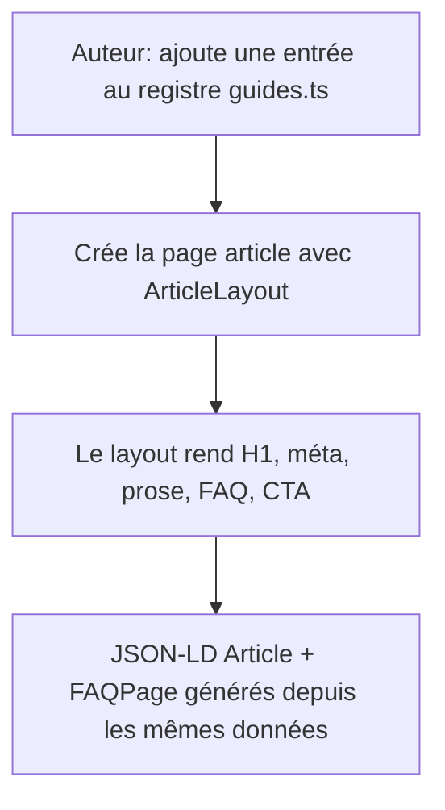
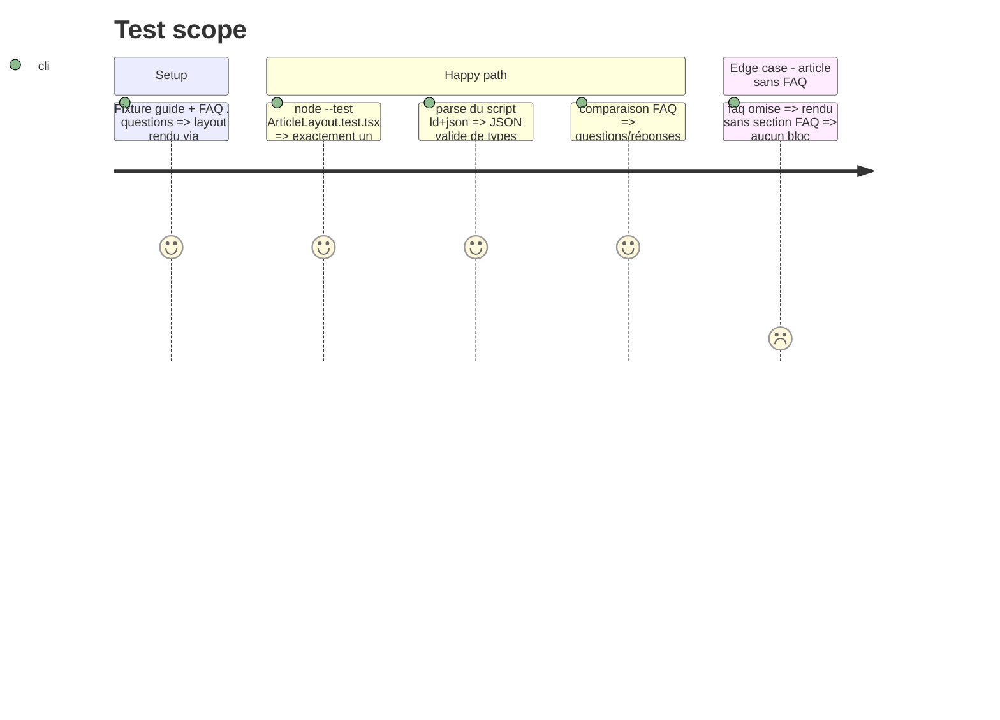

# Instruction: Socle — registre typé, layout article, prose CSS

## Architecture projection

> Tree of the final files. ✅ create · ✏️ modify · ❌ delete

```txt
landing/
├── app/
│   └── globals.css                       ✏️ bloc prose (mesure 65–75ch, hiérarchie H2/H3, liens soulignés, tableaux scrollables)
├── components/
│   └── guides/
│       ├── guides.ts                     ✅ registre typé — source unique index/sitemap/métadonnées
│       ├── ArticleLayout.tsx             ✅ layout partagé : header, méta, prose, FAQ, CTA final, JSON-LD Article+FAQPage
│       └── ArticleLayout.test.tsx        ✅ H1 unique, JSON-LD valide, FAQ visible ≡ FAQ schema
└── package.json                          ✏️ ajouter le test au script `test` (liste explicite de fichiers)
```

## User Journey



## Test Scope



## Wireframe

```txt
┌────────────────────────────────────────┐
│ (1) Header landing existant            │
├────────────────────────────────────────┤
│ (2) H1 + date publiée/màj + tps lecture│
├────────────────────────────────────────┤
│ (3) Prose ~65-75ch : réponse courte,   │
│     H2/H3, listes, étapes, tableaux    │
├────────────────────────────────────────┤
│ (4) FAQ visible (details/summary)      │
├────────────────────────────────────────┤
│ (5) CTA unique: capsule verte          │
├────────────────────────────────────────┤
│ (6) Footer existant                    │
└────────────────────────────────────────┘
```

1. Header : composant existant, aucune variante.
2. Titre : H1 unique (requête cible), `<time>` datées, temps de lecture depuis le registre.
3. Prose : bloc CSS dédié dans globals.css, Poppins seul, fond `#F7F6F3`, jamais de glass.
4. FAQ : `AccordionItem` existant, réponses présentes dans le HTML serveur.
5. CTA : un seul par article, en fin — pattern `FinalCTA`/`Button` primaire existant.
6. Footer : composant existant.

## Tasks to do

### `1)` Registre des guides

> Une source unique de vérité : index, sitemap, métadonnées et JSON-LD lisent le même objet.

1. Lire `landing/DESIGN.md`, `app/changelog/page.tsx`, `app/support/page.tsx` (pattern FAQPage JSON-LD déjà en place) avant d'écrire.
2. Créer `components/guides/guides.ts` : `interface Guide { slug; title; description; publishedAt; updatedAt; readingMinutes }` + `export const GUIDES: Guide[]` (vide ou avec l'entrée seed en phase 2).

### `2)` Prose CSS dans globals.css

> La typographie d'article, absente aujourd'hui, dans la continuité poster-flat de la landing.

1. Bloc `.guide-prose` : mesure 65–75ch desktop, hiérarchie H2/H3 par échelle/graisse Poppins, listes, `blockquote`, tableaux dans un conteneur `overflow-x: auto`.
2. Liens soulignés (distinguables autrement que par la couleur), focus visible, cibles ≥ 44px sur les éléments interactifs, `tabular-nums` pour tout montant.
3. Aucun scroll-reveal ni animation sur le contenu ; ce qui bouge respecte `prefers-reduced-motion`.

### `3)` ArticleLayout partagé

> Chaque article rend la même structure ; le JSON-LD sort des mêmes données que le visible.

1. Créer `ArticleLayout.tsx` : props `{ guide: Guide; faq?: { question; answer }[]; children }` — Header, H1, méta (`<time>` publiée/màj, temps de lecture), conteneur prose, FAQ (visible seulement si fournie), CTA final unique, Footer.
2. JSON-LD inline en `@graph` : `Article` (headline, description, datePublished, dateModified, author `Person` Maxime, publisher → `@id` Organization du layout racine, posé en phase 3) + `FAQPage` construit depuis la MÊME prop `faq`. Échapper `<` comme dans `app/layout.tsx`.
3. Réponses FAQ ≤ ~120 mots (au-delà, tronquées par les moteurs IA).

### `4)` Test de non-régression du contrat

> Le socle casse bruyamment si un article viole le contrat SEO/GEO.

1. Créer `ArticleLayout.test.tsx` (node:test + `renderToStaticMarkup`, pattern `accessibility.test.tsx`) : un seul `<h1>`, JSON-LD parseable, FAQ schema ≡ FAQ visible, pas de bloc `FAQPage` quand `faq` est omise.
2. Ajouter le fichier à la liste du script `test` de `landing/package.json`.

## Test acceptance criteria

| Task | Acceptance criteria                                                                                                       |
| ---- | ------------------------------------------------------------------------------------------------------------------------- |
| 1    | Le registre exporte un tableau typé strict ; `updatedAt` est obligatoire (alimente `dateModified` et `lastmod` en phase 3) |
| 2    | La prose rend Poppins seul, mesure 65–75ch, liens soulignés, fond chaud, sans glass ni animation de contenu                |
| 3    | Le layout rend un H1 unique, un seul CTA primaire, et un JSON-LD dont la FAQ est identique mot pour mot à la FAQ visible   |
| 4    | `pnpm test` (landing) passe et échoue si on introduit un second H1 ou une FAQ schema divergente                            |
