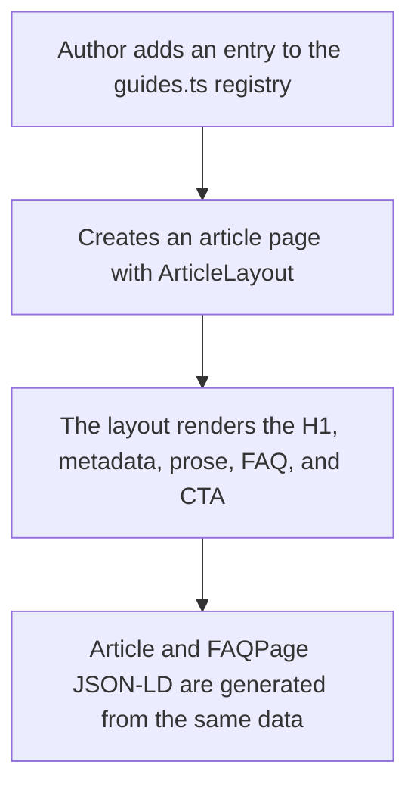

# Instruction: Foundation — typed registry, article layout, and prose CSS

## Architecture projection

> Tree of the final files. ✅ create · ✏️ modify · ❌ delete

```txt
landing/
├── app/
│   └── globals.css                       ✏️ prose block (65–75ch measure, H2/H3 hierarchy, underlined links, scrollable tables)
├── components/
│   └── guides/
│       ├── guides.ts                     ✅ typed registry — single source for index, sitemap, and metadata
│       ├── ArticleLayout.tsx             ✅ shared layout: header, metadata, prose, FAQ, final CTA, Article + FAQPage JSON-LD
│       └── ArticleLayout.test.tsx        ✅ one H1, valid JSON-LD, visible FAQ identical to FAQ schema
└── package.json                          ✏️ add the test to the explicit file list in the `test` script
```

## User Journey



## Test Scope


## Wireframe

```txt
┌────────────────────────────────────────┐
│ (1) Existing landing header            │
├────────────────────────────────────────┤
│ (2) H1 + published/updated dates + time│
├────────────────────────────────────────┤
│ (3) ~65–75ch prose: direct answer,     │
│     H2/H3, lists, steps, and tables    │
├────────────────────────────────────────┤
│ (4) Visible FAQ (details/summary)      │
├────────────────────────────────────────┤
│ (5) One CTA: green capsule             │
├────────────────────────────────────────┤
│ (6) Existing footer                    │
└────────────────────────────────────────┘
```

1. Header: reuse the existing component without a variant.
2. Title: one H1 for the target query, dated `<time>` elements, and reading time from the registry.
3. Prose: a dedicated block in globals.css, Poppins only, `#F7F6F3` background, never glass.
4. FAQ: reuse the existing `AccordionItem`; answers remain in server-rendered HTML.
5. CTA: one per article at the end, using the existing `FinalCTA`/`Button` primary pattern.
6. Footer: reuse the existing component.

## Tasks to do

### `1)` Budget advice registry

> One source of truth: the index, sitemap, metadata, and JSON-LD read the same object.

1. Read `landing/DESIGN.md`, `app/changelog/page.tsx`, and `app/support/page.tsx` (existing FAQPage JSON-LD pattern) before writing.
2. Create `components/guides/guides.ts`: `interface Guide { slug; title; description; publishedAt; updatedAt; readingMinutes }` + `export const GUIDES: Guide[]` (empty or with the phase 2 seed entry).

### `2)` Prose CSS in globals.css

> Article typography extends the landing's flat-poster visual direction.

1. Add a `.guide-prose` block: 65–75ch desktop measure, Poppins H2/H3 scale and weight hierarchy, lists, `blockquote`, and wide tables inside an `overflow-x: auto` container.
2. Underline links so they are distinguishable without color, keep focus visible, provide targets of at least 44px for interactive elements, and apply `tabular-nums` to amounts.
3. Add no scroll reveal or content animation; any motion must respect `prefers-reduced-motion`.

### `3)` Shared ArticleLayout

> Every article renders the same structure, and JSON-LD uses the visible data.

1. Create `ArticleLayout.tsx` with props `{ guide: Guide; faq?: { question; answer }[]; children }`: Header, H1, metadata (published/updated `<time>` elements and reading time), prose container, optional visible FAQ, one final CTA, and Footer.
2. Render inline JSON-LD as an `@graph`: `Article` (headline, description, datePublished, dateModified, Maxime as `Person` author, and publisher referencing the root layout's Organization `@id` added in phase 3) plus `FAQPage` built from the SAME `faq` prop. Escape `<` as in `app/layout.tsx`.
3. Keep FAQ answers to about 120 words or fewer because AI answer engines truncate longer responses.

### `4)` Contract regression test

> The foundation fails loudly when an article violates the SEO/GEO contract.

1. Create `ArticleLayout.test.tsx` with node:test + `renderToStaticMarkup`, following `accessibility.test.tsx`: one H1, parseable JSON-LD, FAQ schema equal to the visible FAQ, and no `FAQPage` when `faq` is omitted.
2. Add the file to the explicit list in the `test` script in `landing/package.json`.

## Test acceptance criteria

| Task | Acceptance criteria                                                                                                        |
| ---- | -------------------------------------------------------------------------------------------------------------------------- |
| 1    | The registry exports a strictly typed array; `updatedAt` is required and feeds phase 3 `dateModified` and `lastmod` values |
| 2    | Prose uses only Poppins, a 65–75ch measure, underlined links, the warm background, and no glass or content animation       |
| 3    | The layout renders one H1, one primary CTA, and JSON-LD whose FAQ is word-for-word identical to the visible FAQ            |
| 4    | The landing `pnpm test` passes and fails if a second H1 or divergent FAQ schema is introduced                              |
