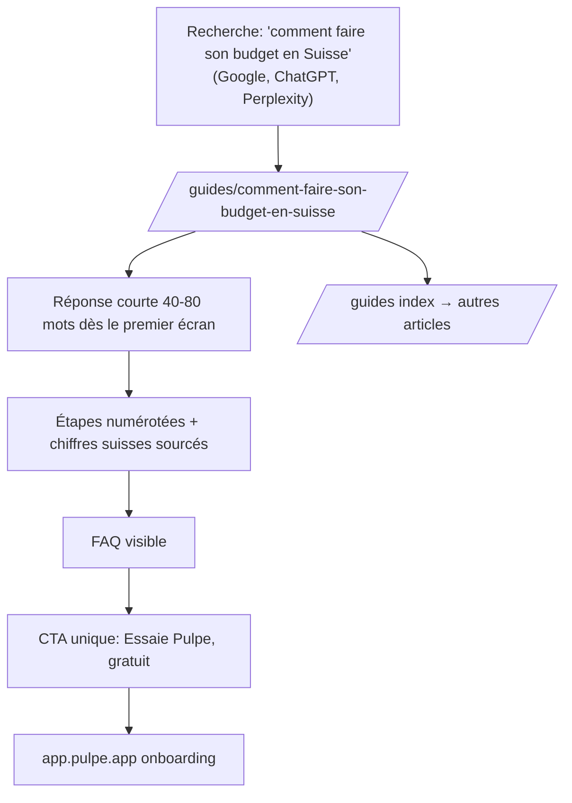

# Instruction: Index `/guides` + article seed GEO-structuré

## Architecture projection

> Tree of the final files. ✅ create · ✏️ modify · ❌ delete

```txt
landing/
├── app/
│   └── guides/
│       ├── page.tsx                                  ✅ index en cards scannables (titre, description, temps de lecture)
│       └── comment-faire-son-budget-en-suisse/
│           └── page.tsx                              ✅ article seed ~1200 mots via ArticleLayout
└── components/
    └── guides/
        └── guides.ts                                 ✏️ entrée seed au registre
```

## User Journey



## Test Scope


## Wireframe

```txt
┌────────────────────────────────────────┐
│ (1) Header landing existant            │
├────────────────────────────────────────┤
│ (2) H1 "Guides" + intro courte         │
├────────────────────────────────────────┤
│ (3) Cards verticales                   │
│  ┌───────────────────────────────────┐ │
│  │ (4) Titre · description · ~X min  │ │
│  └───────────────────────────────────┘ │
├────────────────────────────────────────┤
│ (5) Footer existant                    │
└────────────────────────────────────────┘
```

1. Header : composant existant.
2. Titre : l'index reste sobre — c'est l'article qui convertit, pas l'index.
3. Cards : boucle sur `GUIDES`, surfaces porcelaine `#FFFEFA` plates (filet léger, pas de grille générique à badges).
4. Card : toute la card cliquable, cible ≥ 44px, focus visible.
5. Footer : composant existant.

## Tasks to do

### `1)` Index `/guides`

> La liste vit du registre ; ajouter un guide ne demande aucune autre édition.

1. Créer `app/guides/page.tsx` : cards depuis `GUIDES`, `metadata` avec title, description et `canonical: '/guides'`.
2. DA : cards éditoriales plates (ton + filet), pas de damier ni d'icônes décoratives.

### `2)` Article seed « Comment faire son budget en Suisse »

> Le premier contenu réel prouve le socle et vise la citation IA autant que le rang Google.

1. Ajouter l'entrée au registre (`publishedAt` = `updatedAt` = date du jour, `readingMinutes` réaliste).
2. Rédiger ~1200 mots dans `ArticleLayout`, structure GEO :
   - réponse courte 40–80 mots immédiatement sous le H1 (citable telle quelle par un moteur IA) ;
   - H2 formulés en questions quand c'est naturel (« Combien mettre de côté chaque mois ? ») ;
   - étapes numérotées pour le cœur méthodologique (poser revenus → prévisions → épargne → disponible) ;
   - 2–3 chiffres suisses sourcés (salaire médian OFS CHF 7'024/mois ESS 2024 ; prime maladie moyenne 2026 CHF 393.30, OFSP) — liens sortants vers les sources officielles ;
   - FAQ 3 questions via la prop `faq` (visible + `FAQPage` auto).
3. Copy : tutoiement, vocabulaire produit (« prévisions », « Disponible à dépenser », « épargne »), zéro jargon financier, le mot « transaction » n'apparaît jamais à l'écran.
4. Un seul CTA primaire en fin d'article, aucun CTA concurrent dans la prose.

### `3)` Vérification build + accessibilité

> Les critères d'acceptation du ticket se constatent sur le build prod.

1. `pnpm build` (landing) vert ; inspecter `dist/` : H1 unique, canonical, JSON-LD.
2. Contrôle navigateur (`pnpm dev`) : contraste AA sur fond chaud, liens distinguables, focus visible, cibles ≥ 44px, `prefers-reduced-motion` sans effet résiduel.

## Test acceptance criteria

| Task | Acceptance criteria                                                                                                        |
| ---- | --------------------------------------------------------------------------------------------------------------------------- |
| 1    | `/guides` liste l'article seed depuis le registre ; ajouter une entrée au registre suffit à faire apparaître une carte       |
| 2    | L'article rend en build prod : H1 unique, réponse courte en tête, chiffres sourcés, FAQ visible ≡ FAQPage, un seul CTA       |
| 3    | title/description/canonical corrects dans le HTML exporté ; tout le contenu lisible sans exécuter de JavaScript              |
