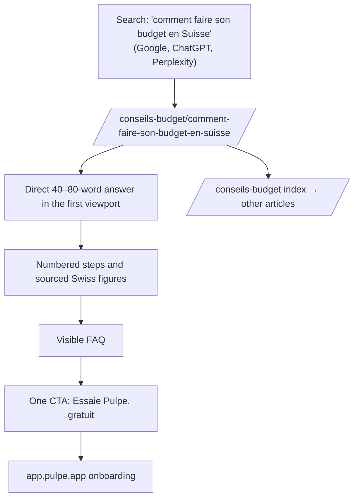
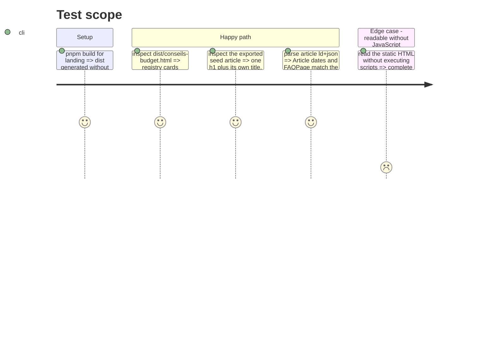

# Instruction: `/conseils-budget` index and GEO-structured seed article

## Architecture projection

> Tree of the final files. ✅ create · ✏️ modify · ❌ delete

```txt
landing/
├── app/
│   └── conseils-budget/
│       ├── page.tsx                                  ✅ index with scannable cards (title, description, reading time)
│       └── comment-faire-son-budget-en-suisse/
│           └── page.tsx                              ✅ ~1,200-word seed article through ArticleLayout
└── components/
    └── guides/
        └── guides.ts                                 ✏️ seed entry in the registry
```

## User Journey



## Test Scope



## Wireframe

```txt
┌────────────────────────────────────────┐
│ (1) Existing landing header            │
├────────────────────────────────────────┤
│ (2) H1 "Conseils budget" + short intro │
├────────────────────────────────────────┤
│ (3) Vertical cards                     │
│  ┌───────────────────────────────────┐ │
│  │ (4) Title · description · ~X min  │ │
│  └───────────────────────────────────┘ │
├────────────────────────────────────────┤
│ (5) Existing footer                    │
└────────────────────────────────────────┘
```

1. Header: reuse the existing component.
2. Title: keep the index restrained; the article converts, not the index.
3. Cards: loop over `GUIDES` with flat porcelain `#FFFEFA` surfaces, a light rule, and no generic badge grid.
4. Card: make the whole card clickable with a target of at least 44px and visible focus.
5. Footer: reuse the existing component.

## Tasks to do

### `1)` `/conseils-budget` index

> The registry drives the list, so publishing another article requires no index edit.

1. Create `app/conseils-budget/page.tsx`: cards from `GUIDES`, plus metadata with title, description, and `canonical: '/conseils-budget'`.
2. Visual direction: flat editorial cards (tone + rule), with no checkerboard or decorative icons.

### `2)` Seed article: « Comment faire son budget en Suisse »

> The first real article proves the foundation and targets AI citation as well as Google rank.

1. Add the registry entry with `publishedAt` = `updatedAt` = the publication date and a realistic `readingMinutes`.
2. Write about 1,200 words in `ArticleLayout` using this GEO structure:
   - a citable 40–80-word direct answer immediately below the H1;
   - question-shaped H2 headings where natural, such as « Combien mettre de côté chaque mois ? »;
   - numbered steps for the core method: list income → add « prévisions » → plan « épargne » → calculate « Disponible à dépenser »;
   - two or three sourced Swiss figures (FSO 2024 median salary of CHF 7,024/month; FOPH 2026 average health-insurance premium of CHF 393.30), with outbound links to official sources;
   - a three-question FAQ through the `faq` prop, visible and mirrored automatically in `FAQPage`.
3. Copy: use informal French, Pulpe vocabulary (« prévisions », « Disponible à dépenser », « épargne »), no financial jargon, and never render the word « transaction ».
4. Keep one primary CTA at the end of the article and no competing CTA in the prose.

### `3)` Build and accessibility verification

> The ticket acceptance criteria are observable in the production export.

1. Run the landing `pnpm build` and inspect `dist/` for one H1, the canonical, and JSON-LD.
2. Check in a browser with `pnpm dev`: AA contrast on the warm background, distinguishable links, visible focus, targets of at least 44px, and no residual effect under `prefers-reduced-motion`.

## Test acceptance criteria

| Task | Acceptance criteria                                                                                                             |
| ---- | ------------------------------------------------------------------------------------------------------------------------------- |
| 1    | `/conseils-budget` lists the seed article from the registry; adding a registry entry is sufficient to render another index card |
| 2    | The production article has one H1, an opening direct answer, sourced figures, a visible FAQ equal to FAQPage, and one CTA       |
| 3    | The exported HTML has the correct title, description, and canonical, and all content is readable without executing JavaScript   |
