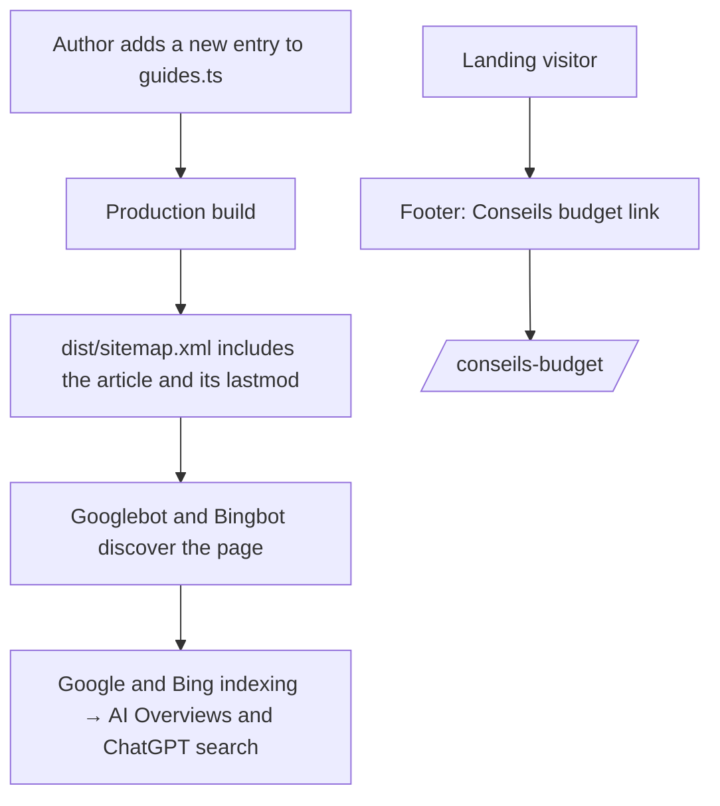
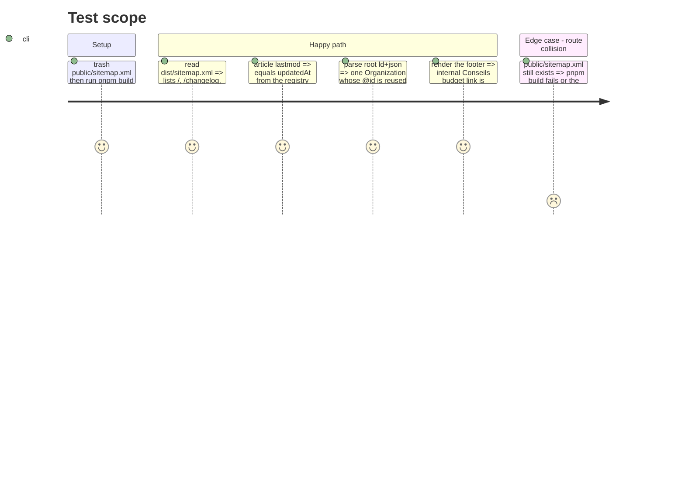

# Instruction: Discoverability — dynamic sitemap, Organization entity, and internal linking

## Architecture projection

> Tree of the final files. ✅ create · ✏️ modify · ❌ delete

```txt
landing/
├── app/
│   ├── sitemap.ts                        ✅ static pages + GUIDES loop (lastmod = updatedAt)
│   └── layout.tsx                        ✏️ Organization in the existing @graph, referenced by articles
├── components/
│   └── sections/Footer.tsx               ✏️ internal "Conseils budget" link
└── public/
    └── sitemap.xml                       ❌ replaced by app/sitemap.ts to avoid a route collision — via trash
```

## User Journey



## Test Scope



## Tasks to do

### `1)` Dynamic sitemap

> Google and Bing discover every registry article without a manual sitemap edit.

1. Create `app/sitemap.ts`: static entries (`/`, `/changelog`, `/support`, `/support/modeles-et-budgets`, `/conseils-budget`) plus a `GUIDES` loop using `lastModified: updatedAt`.
2. Remove `public/sitemap.xml` through `trash` in the same PR (CA2).
3. Make NO robots.txt change: it already points to `https://pulpe.app/sitemap.xml` and allows every crawler, which is the intended GEO posture.

### `2)` Organization entity

> AI engines receive one entity definition referenced everywhere.

1. Add one `Organization` to the `@graph` in `app/layout.tsx`: `@id: https://pulpe.app/#org`, name, URL, and logo.
2. Link `WebSite.publisher` and `SoftwareApplication.author` to the Organization `@id`; the `publisher` in `ArticleLayout` from phase 1 points to the same `@id`.
3. Do not add `sameAs` until Pulpe has an organization or profile URL that unambiguously identifies the entity; repository and product-listing URLs do not qualify.

### `3)` Internal linking

> Budget advice remains reachable from every page.

1. Add `{ label: "Conseils budget", href: "/conseils-budget", internal: true }` to `FOOTER_LINKS` in `Footer.tsx`.

## Test acceptance criteria

| Task | Acceptance criteria                                                                                                                   |
| ---- | ------------------------------------------------------------------------------------------------------------------------------------- |
| 1    | `dist/sitemap.xml` lists the five static pages plus the seed article with `lastmod = updatedAt`; `public/sitemap.xml` is absent       |
| 2    | Root JSON-LD exposes one `Organization` without invalid `sameAs` values, and the article references it by `@id` without redefining it |
| 3    | Every page footer contains an internal « Conseils budget » link to `/conseils-budget`                                                 |
