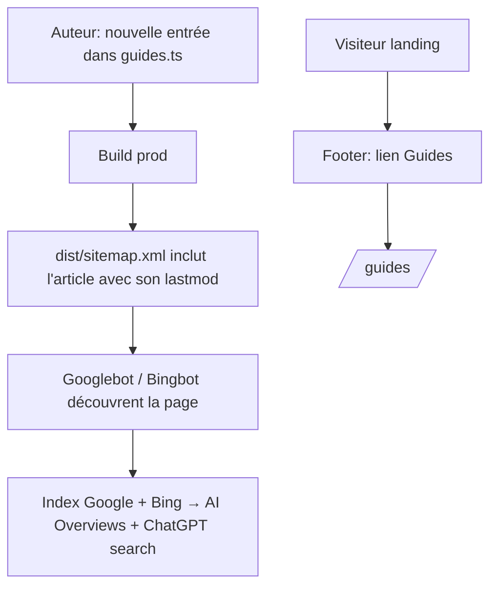
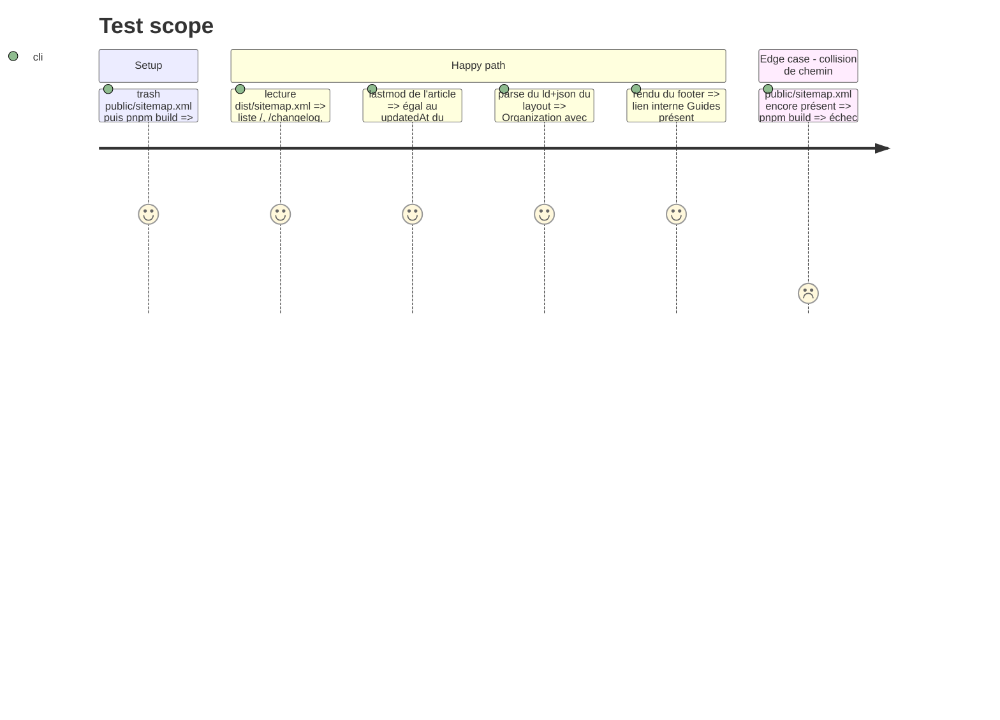

# Instruction: Découvrabilité — sitemap dynamique, entité Organization, maillage

## Architecture projection

> Tree of the final files. ✅ create · ✏️ modify · ❌ delete

```txt
landing/
├── app/
│   ├── sitemap.ts                        ✅ pages statiques + boucle sur GUIDES (lastmod = updatedAt)
│   └── layout.tsx                        ✏️ Organization (+ sameAs) dans le @graph existant, @id référencé par les articles
├── components/
│   └── sections/Footer.tsx               ✏️ lien interne "Guides"
└── public/
    └── sitemap.xml                       ❌ remplacé par app/sitemap.ts (collision de chemin sinon) — via `trash`
```

## User Journey



## Test Scope



## Tasks to do

### `1)` Sitemap dynamique

> Google et Bing découvrent chaque nouveau guide sans édition manuelle.

1. Créer `app/sitemap.ts` : entrées statiques (`/`, `/changelog`, `/support`, `/support/modeles-et-budgets`, `/guides`) + boucle sur `GUIDES` (`lastMod: updatedAt`).
2. Supprimer `public/sitemap.xml` via `trash`, même PR (CA2).
3. `robots.txt` : AUCUN changement — il pointe déjà vers `https://pulpe.app/sitemap.xml` et autorise tous les crawlers (posture GEO voulue, ne pas ajouter de blocages).

### `2)` Entité Organization

> Clarté d'entité pour les moteurs IA : une seule définition, référencée partout.

1. Dans le `@graph` de `app/layout.tsx`, ajouter `Organization` (`@id: https://pulpe.app/#org`, name, url, logo, `sameAs`: GitHub + App Store — reprendre les URLs de `lib/config.ts`).
2. Relier : `WebSite.publisher` et `SoftwareApplication.author` → `@id` de l'Organization ; le `publisher` d'`ArticleLayout` (phase 1) pointe sur ce même `@id`.

### `3)` Maillage

> Les guides sont atteignables depuis toutes les pages.

1. Ajouter `{ label: "Guides", href: "/guides", internal: true }` à `FOOTER_LINKS` dans `Footer.tsx`.

## Test acceptance criteria

| Task | Acceptance criteria                                                                                                          |
| ---- | ----------------------------------------------------------------------------------------------------------------------------- |
| 1    | `dist/sitemap.xml` liste les 5 pages statiques + l'article seed avec `lastmod` = `updatedAt` ; `public/sitemap.xml` n'existe plus |
| 2    | Le JSON-LD racine expose une `Organization` avec `sameAs`, et l'article la référence par `@id` sans dupliquer l'entité          |
| 3    | Le footer de toutes les pages contient le lien interne "Guides" menant à `/guides`                                              |
