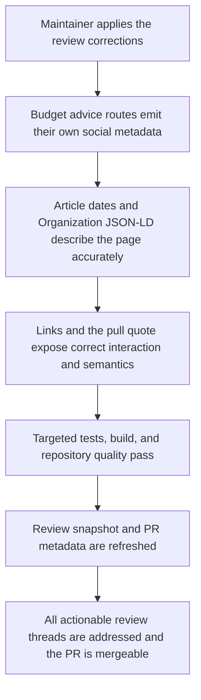
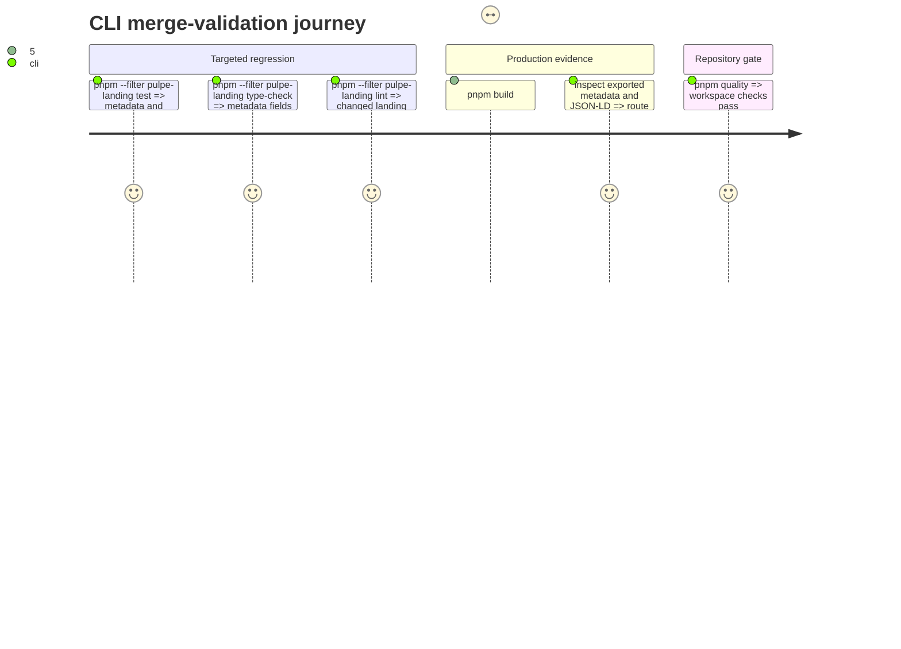

# Instruction: Review corrections and merge validation

## Architecture projection

> Tree of the final files. ✅ create · ✏️ modify · ❌ delete

```txt
landing/
├── app/
│   ├── globals.css                                      ✏️ explicit hover and focus-visible states for article links
│   ├── layout.tsx                                       ✏️ shared social constants; Organization without invalid sameAs
│   ├── conseils-budget/
│   │   ├── page.tsx                                     ✏️ route-specific Open Graph and Twitter metadata
│   │   └── comment-faire-son-budget-en-suisse/page.tsx  ✏️ semantic pull quote
│   └── support/modeles-et-budgets/page.tsx              ✏️ shared social preview constants
├── components/
│   └── guides/
│       ├── guides.ts                                    ✏️ shared social constants + Open Graph article dates
│       ├── ArticleLayout.tsx                            ✏️ shared social image import
│       └── ArticleLayout.test.tsx                       ✏️ accurate JSON-LD assertion and metadata regression coverage
└── lib/
    └── config.ts                                        ✏️ canonical social preview image and alt constants

aidd_docs/tasks/2026_08/2026_08_13_pul296-socle-seo-guides/
├── plan.md                                               ✏️ English final-route plan
├── phase-1.md                                            ✏️ English final-route phase
├── phase-2.md                                            ✏️ English final-route phase
├── phase-3.md                                            ✏️ English final-route phase
├── phase-4.md                                            ✅ review-correction phase
└── review.md                                             ✏️ rerun snapshot after corrections

aidd_docs/tasks/2026_07/2026_07_23_growth-seo-assets/
├── plan.md                                               ✏️ English final-route plan
└── phase-1.md … phase-5.md                               ✏️ English final-route phases

aidd_docs/tasks/2026_08/2026_08_14_pul304-mesure-seo/
└── notes.md                                              ✏️ English implementation notes
```

The PR title, description, and review threads are external artifacts updated after the code and documentation checks pass.

## User Journey



## Test Scope



## Tasks to do

### `1)` Correct and centralize social metadata

> Every route owns its identity while all routes reuse the same preview asset data.

1. Export the versioned social preview image path and alt text from the existing `landing/lib/config.ts`; import them in the root layout, support article, budget advice registry, and `ArticleLayout` instead of keeping copies.
2. Add complete route-specific `openGraph` and `twitter` metadata to `app/conseils-budget/page.tsx`, including the `/conseils-budget` URL, its title and description, and the shared image fields.
3. Add `publishedTime: guide.publishedAt` and `modifiedTime: guide.updatedAt` to article Open Graph metadata in `guideMetadata`.

### `2)` Correct structured data, interaction states, and semantics

> Markup should claim only what the page and entity can prove.

1. Remove the repository and App Store values from the root `Organization.sameAs`; omit `sameAs` until an unambiguous Pulpe organization/profile URL exists.
2. Add explicit `:hover` and `:focus-visible` feedback for links inside `.guide-prose`, preserving the existing underline and global accessible focus treatment.
3. Replace the self-authored article `<blockquote>` with a styled paragraph so the visual pull quote no longer claims an external quotation.
4. Change the JSON-LD test assertion to say that `ArticleLayout` emits one script; the root layout independently emits its own JSON-LD script.

### `3)` Refresh review and PR artifacts

> The review snapshot and hosted PR must describe the final implementation.

1. Translate every non-product document added by the PR into English, including the broader growth plan and PUL-304 notes; preserve French only for quoted product copy, and use `/conseils-budget` consistently wherever the final content route is meant.
2. Rerun the three-axis review and overwrite `review.md` with the current diff and final verdict.
3. Update PR #602 title and description to the final route and scope, reply to or resolve every actionable review thread with the corresponding change or evidence, and confirm GitHub reports the PR as mergeable.

### `4)` Run merge gates

> A correction is complete only when targeted behavior and repository gates pass.

1. Run `pnpm --filter pulpe-landing test`, `type-check`, and `lint`.
2. Run `pnpm build:landing`; inspect the exported `/conseils-budget` index and seed article metadata/JSON-LD without executing client JavaScript.
3. Run root `pnpm quality`, then push the correction commit only when every gate is green.

## Test acceptance criteria

| Task | Acceptance criteria                                                                                                                                                                                                    |
| ---- | ---------------------------------------------------------------------------------------------------------------------------------------------------------------------------------------------------------------------- |
| 1    | The index emits its own Open Graph and Twitter title, description, URL, and shared image; article Open Graph includes registry publication and modification dates; the preview image path and alt text have one source |
| 2    | Root Organization JSON-LD has no invalid `sameAs`; article links visibly react to hover and keyboard focus; the Pulpe pull quote is not a `blockquote`; the JSON-LD assertion names the layout's actual scope          |
| 3    | Every non-product document added by the PR is English and uses the final route where applicable; PR #602 metadata is current, all actionable threads are addressed, and the PR is mergeable                            |
| 4    | Landing tests, type-check, lint, production build, exported metadata/JSON-LD inspection, and root `pnpm quality` all pass before the correction commit is pushed                                                       |
