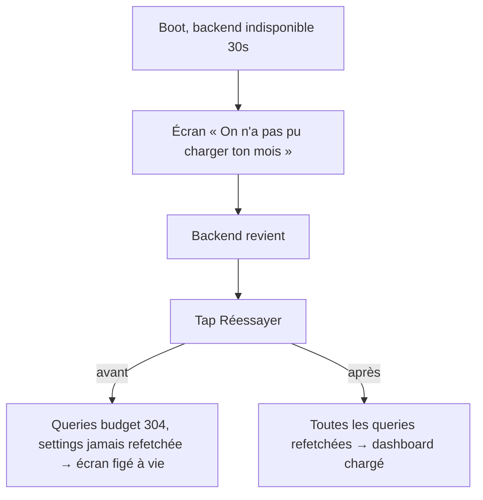

# Instruction: Réessayer réparé & vérité des erreurs

Bug vécu en live (preuve : log backend) : une panne transitoire au boot fait échouer la query settings ; « Réessayer » n'invalide que les queries budget (elles réussissent, 304), `settings.isError` reste vrai, l'écran d'erreur est **permanent** jusqu'au force-kill. Le message « Vérifie ta connexion » ment deux fois. S'ajoute un warning LogBox au boot (side-effect en render) à tracer.

## Architecture projection

```txt
android/src/
├── features/current-month/
│   └── current-month-queries.ts        ✏️ refresh invalide budget + settings (la cause)
├── core/user-settings/
│   └── user-settings-queries.ts        ✏️ export d'un invalidateUserSettings (ou clé exposée)
├── app/(main)/(tabs)/home.tsx          ✏️ (si besoin) le pull-to-refresh passe par le même refresh réparé
└── app/_layout.tsx                     ✏️ selon stack LogBox : le side-effect en render déplacé en useEffect
```

## User Journey



## Tasks to do

### `1)` Réparer le refresh

1. `current-month-queries.ts:74` : `refresh` invalide `budgetKeys.all` **et** `userSettingsKeys.all` (un `refreshCurrentMonth()` qui compose les deux invalidations, pour que home/pull-to-refresh/Réessayer partagent le même chemin)
2. Vérifier que `resolveStatus` (`:90-100`) sort bien de `failed` une fois les trois queries repassées vertes (TanStack remet `isError` à false au refetch réussi — le test le prouve)
3. Test : settings en erreur + budgets OK → `status === "failed"` ; après `refresh()` avec settings réparée → `ready`

### `2)` Tracer et corriger le warning LogBox

1. Cold start dev, lire la stack du LogBox « Can't perform a React state update on a component that hasn't mounted yet » (les `useEffect` de `_layout.tsx:53-72` sont déjà propres — le fautif est ailleurs, probablement un set de store synchrone pendant un premier render)
2. Déplacer le side-effect en `useEffect` (ou `queueMicrotask` si c'est un abonnement store) ; le warning ne doit plus apparaître au boot

## Test acceptance criteria

| Task | Acceptance criteria                                                                                                                   |
| ---- | ------------------------------------------------------------------------------------------------------------------------------------- |
| 1    | Scénario live rejoué (backend down au boot, up ensuite) : un seul tap sur Réessayer charge le dashboard ; spec unitaire du hook passe |
| 2    | Cold start sans LogBox ; la stack du warning est citée dans le commit qui le corrige (root cause, pas suppression du warning)         |
